# 018：使用scikit-learn处理表格数据（第2部分）📊

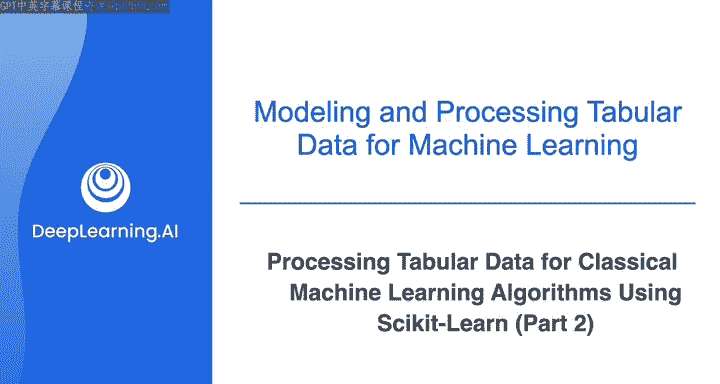

在本节课中，我们将学习如何使用scikit-learn库对表格数据进行预处理，具体包括将数据分割为训练集和测试集、对数值型特征进行标准化缩放、对分类型特征进行独热编码，并将处理后的数据保存为文件。这些步骤是为后续训练经典机器学习算法准备数据的关键环节。

## 数据分割

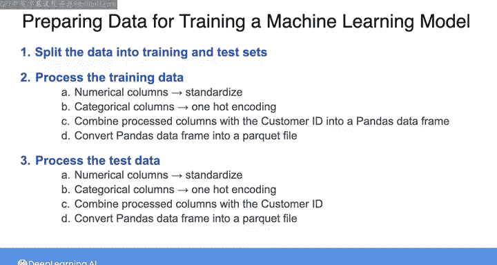

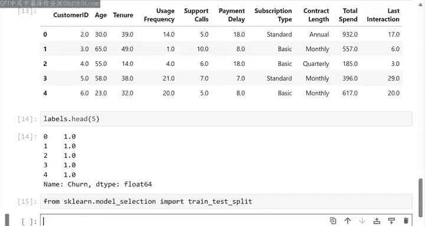

上一节我们介绍了数据预处理的整体计划，本节中我们来看看具体如何实施。首先，我们需要将原始数据集分割为训练集和测试集。这有助于我们在未见过的数据上评估模型的性能。

以下是使用scikit-learn的`train_test_split`方法进行数据分割的步骤：

```python
from sklearn.model_selection import train_test_split

X_train, X_test, y_train, y_test = train_test_split(features, labels, test_size=0.2, random_state=42)
```

*   `features`：代表特征的数据。
*   `labels`：代表标签的数据。
*   `test_size`：指定测试集所占的比例，例如0.2代表20%。
*   `random_state`：随机种子参数，设置为一个整数（如42）可以确保每次运行代码时都能得到相同的分割结果，这对于实验的可复现性至关重要。

该方法返回训练集和测试集的特征（`X_train`, `X_test`）与标签（`y_train`, `y_test`）。

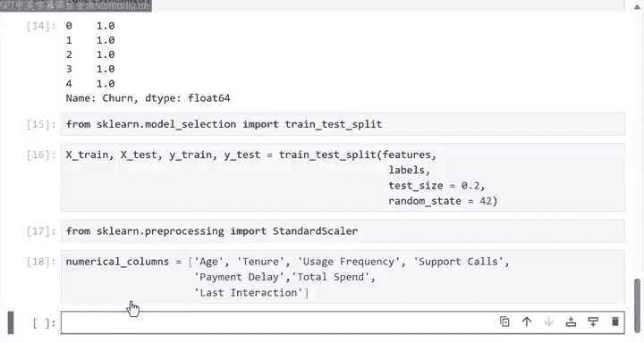

## 预处理训练集：数值型特征缩放

现在我们有了训练集和测试集，让我们首先专注于预处理训练数据集。在本节结束时，我们会将相同的处理步骤应用到测试集上。我们从数值型列开始，因为需要先对这些特征进行缩放。

以下是使用`StandardScaler`对数值型特征进行标准化的步骤：

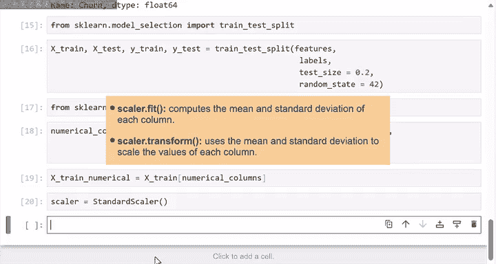

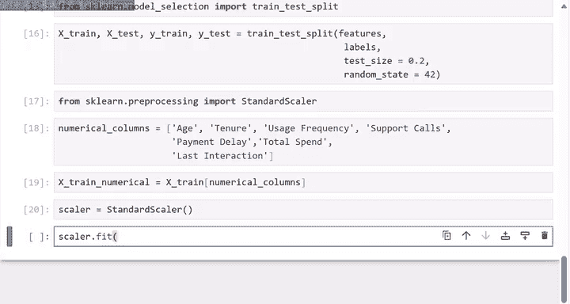

```python
from sklearn.preprocessing import StandardScaler

# 1. 指定数值型列
numerical_columns = ['age', 'tenure', 'usage_frequency', 'support_calls', 'payment_delay', 'total_spend', 'last_interaction']

# 2. 从训练特征中提取数值型列
X_train_numerical = X_train[numerical_columns]

# 3. 实例化StandardScaler对象
scaler = StandardScaler()

# 4. 在训练数据上拟合scaler（计算均值和标准差）
scaler.fit(X_train_numerical)

# 5. 使用拟合好的scaler转换训练数据
scaled_features = scaler.transform(X_train_numerical)

# 6. 将缩放后的NumPy数组转换回Pandas DataFrame，便于后续合并
X_train_scaled_df = pd.DataFrame(scaled_features, index=X_train.index, columns=numerical_columns)
```

*   `fit`方法：计算训练数据中每个数值列的均值和标准差。
*   `transform`方法：使用计算出的统计量（均值和标准差）来缩放数据，使每个特征的值都转换为均值为0、标准差为1的分布。

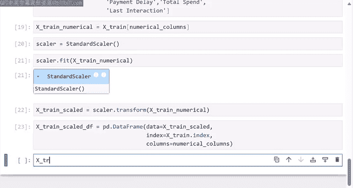

现在，我们得到了一个包含缩放后数值列的数据框，所有特征都处于相似的数值范围内。

## 预处理训练集：分类型特征编码

接下来，我们处理分类型列。我们需要将它们转换为数值形式，以便机器学习算法能够理解。这里我们使用独热编码。

以下是使用`OneHotEncoder`对分类型特征进行独热编码的步骤：

```python
from sklearn.preprocessing import OneHotEncoder

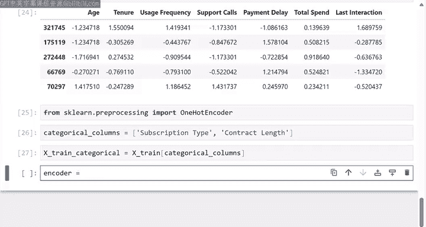

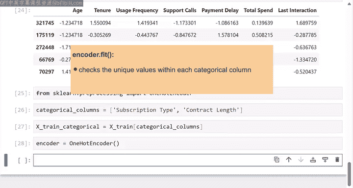

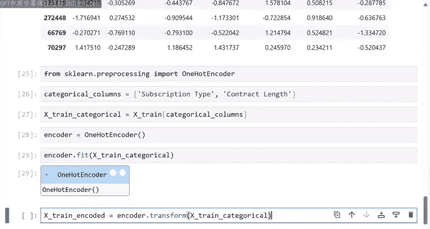

# 1. 指定分类型列
categorical_columns = ['subscription_type', 'contract_length']

# 2. 从训练特征中提取分类型列
X_train_categorical = X_train[categorical_columns]

# 3. 实例化OneHotEncoder对象
encoder = OneHotEncoder()

# 4. 在训练数据上拟合encoder（检查唯一值并准备输出列标签）
encoder.fit(X_train_categorical)

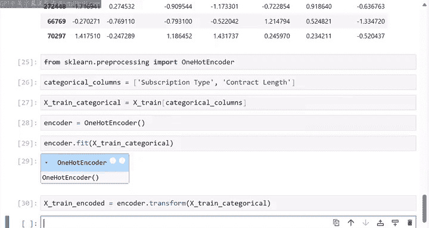

# 5. 使用拟合好的encoder转换训练数据
encoded_matrix = encoder.transform(X_train_categorical)

# 6. 获取编码后列的名称
encoded_column_names = encoder.get_feature_names_out(categorical_columns)

# 7. 将稀疏矩阵转换为常规矩阵，再转为DataFrame
X_train_encoded_df = pd.DataFrame(encoded_matrix.toarray(), index=X_train.index, columns=encoded_column_names)
```

*   `fit`方法：检查每个分类型列中的唯一值，以确定需要为每个特征创建多少列，并准备输出列的标签。
*   `transform`方法：执行编码，返回一个稀疏矩阵（CSR格式）。稀疏矩阵高效存储了大量零值（独热编码的典型结果）。
*   `toarray()`方法：将稀疏矩阵转换为常规的NumPy数组。
*   `get_feature_names_out()`方法：获取编码后各列所代表的原始类别名称。

现在，分类型特征已被转换为数值形式。

## 合并处理后的特征

最后一步，我们将客户ID、处理后的数值型特征和编码后的分类型特征合并成一个完整的数据集。

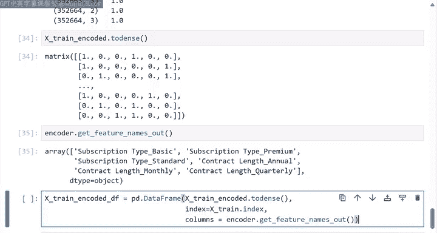

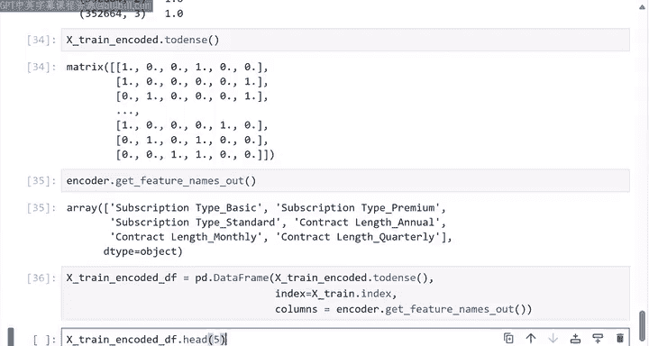

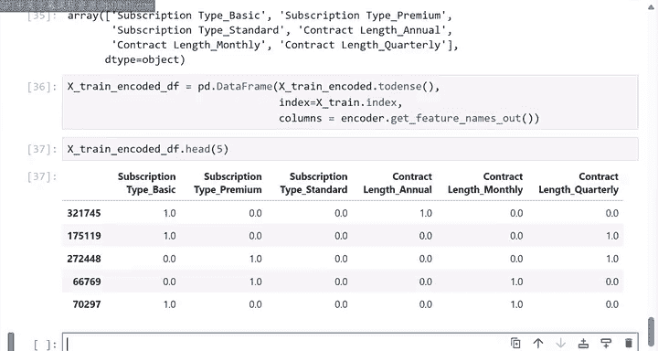

以下是使用Pandas的`concat`方法进行水平合并的步骤：

```python
# 假设customer_id是X_train中的一个列
processed_X_train = pd.concat([X_train[['customer_id']], X_train_scaled_df, X_train_encoded_df], axis=1)
```

参数`axis=1`指定了按列进行水平拼接。至此，我们得到了代表已处理训练数据的完整数据框。

## 应用相同步骤处理测试集

对于测试集，**关键点**在于我们**不能**重新拟合（`fit`）在训练集上使用的`scaler`和`encoder`。我们必须使用相同的、由训练集拟合好的对象来转换（`transform`）测试集数据。这确保了测试集数据与训练集数据使用相同的缩放标准（相同的均值和标准差）和相同的编码映射。

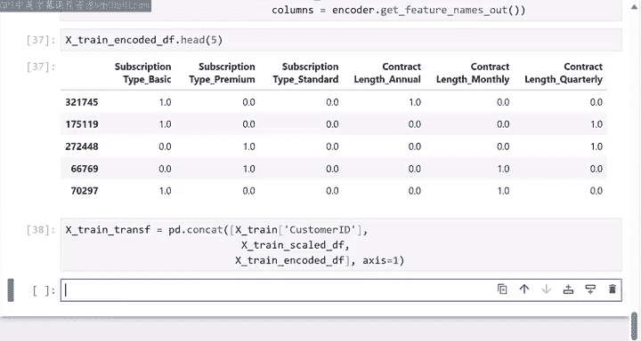

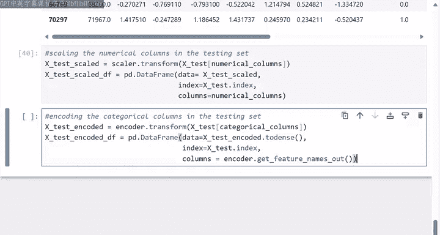

以下是处理测试集的简化流程：

```python
# 1. 缩放测试集的数值型特征（使用训练集拟合的scaler）
X_test_numerical = X_test[numerical_columns]
X_test_scaled = scaler.transform(X_test_numerical) # 注意：这里调用transform，不是fit或fit_transform
X_test_scaled_df = pd.DataFrame(X_test_scaled, index=X_test.index, columns=numerical_columns)

# 2. 编码测试集的分类型特征（使用训练集拟合的encoder）
X_test_categorical = X_test[categorical_columns]
X_test_encoded = encoder.transform(X_test_categorical) # 注意：这里调用transform
X_test_encoded_df = pd.DataFrame(X_test_encoded.toarray(), index=X_test.index, columns=encoded_column_names)

# 3. 合并测试集的特征
processed_X_test = pd.concat([X_test[['customer_id']], X_test_scaled_df, X_test_encoded_df], axis=1)
```

## 保存处理后的数据

处理完成后，可以将数据保存为高效的格式（如Parquet）以供后续使用。

```python
processed_X_train.to_parquet('train_features_processed.parquet')
processed_X_test.to_parquet('test_features_processed.parquet')
```

## 总结


本节课中我们一起学习了使用scikit-learn进行表格数据预处理的完整流程。我们首先将数据分割为训练集和测试集，然后对训练集的数值型特征进行标准化缩放，对分类型特征进行独热编码，并将处理后的部分合并。最重要的是，我们学习了如何将训练集上拟合的转换器正确地应用到测试集上，以确保数据转换的一致性。最后，我们将处理好的数据保存下来。这些处理后的数据集可以交付给机器学习工程师或数据科学家，用于训练和评估各种机器学习算法。