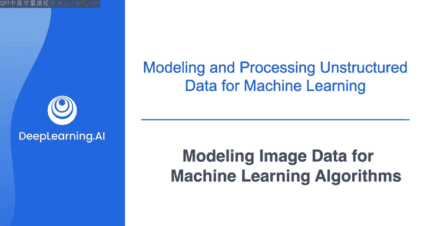
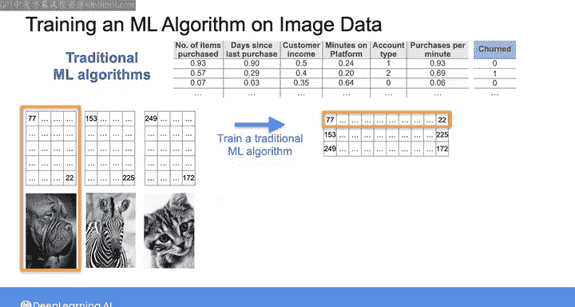
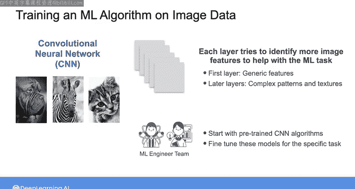
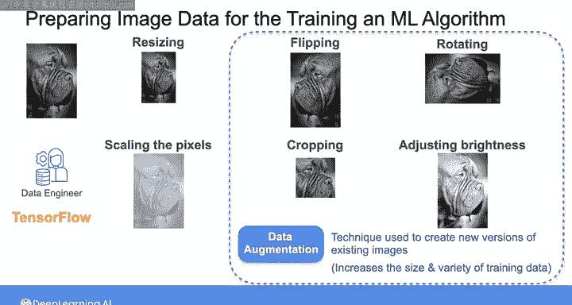
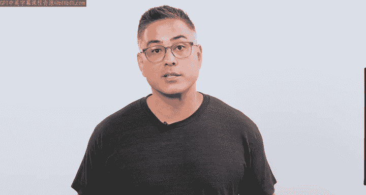
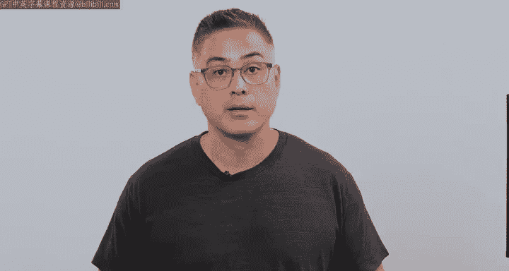

# 019：机器学习算法的图像数据建模 📸

在本节课中，我们将学习如何为机器学习算法准备图像数据。我们将探讨处理图像数据的不同方法，包括为传统算法和现代深度学习模型进行预处理的技术。

除了使用表格数据预测销售和细分客户，你也可以使用机器学习算法来识别图像中的模式。这类应用包括图像分类（例如从照片中识别植物种类）、目标检测（例如在十字路口照片中识别行人）以及像素分割（例如在X光图像中检测癌变区域）。在准备用于训练机器学习算法的图像时，你需要采取的措施取决于所使用的算法类型。

让我们来看看这些不同的情况。

## 为传统机器学习算法准备图像 📊

正如我们在上一课中讨论的，传统的机器学习算法甚至普通的神经网络都期望数据以表格形式呈现。例如，考虑这组灰度图像及其对应的像素表示。

假设机器学习团队希望使用一组图像来训练一个传统的机器学习算法，那么你需要将每张图像展平为一个长的像素值向量，然后将所有图像的向量连接成如下所示的表格形式，以供机器学习算法使用。

以下是此过程的关键步骤：
*   将每张图像展平为一个一维向量。
*   将所有图像的向量按行堆叠，形成一个二维表格。
*   表格中的每一行对应一张图像的展平像素值。

然而，这种方法存在局限性。当你展平图像时，会忽略图像的空间结构，从而丢失了可以从像素之间的相对位置提取的空间信息。此外，这种方法会为每张图像创建一个高维特征向量。例如，如果每张图像的大小是1000像素乘以1000像素，那么展平后你将得到一个大小为100万的向量。如果在一个普通的神经网络上进行训练，这将需要大量的计算和内存资源。在不深入过多技术细节的情况下，这也可能影响机器学习算法的性能，特别是当数据集包含的图像数量远少于100万张时。我在资源部分附上了吴恩达深度学习专项课程的链接，欢迎查看以获取更多细节。

## 为卷积神经网络准备图像 🧠

另一种方法是使用更先进的深度学习算法，例如卷积神经网络来训练这些图像。

卷积神经网络可以直接处理图像，而无需先将其展平。这类网络由若干层组成，每一层都试图识别图像中越来越多的、有助于机器学习任务的特征。第一层学习适用于任何图像的通用特征，例如线条、水平和垂直边缘以及简单的纹理。后面的层学习更复杂的特征，例如更复杂的图案和纹理，这些特征与手头的任务更相关。这就是为什么你会发现许多机器学习团队使用在大型图像集上预训练过的卷积神经网络算法，然后通过使用他们自己特定的图像集训练更深层的网络，来对这些模型进行微调以适应其特定任务。

因此，你可能需要负责向机器学习团队提供一组特定的图像，他们将用这些图像来微调卷积神经网络，甚至从头开始训练这些网络。无论如何，你仍然需要为训练算法准备图像。

以下是准备图像的关键预处理步骤：
*   **调整尺寸**：将图像调整为神经网络期望的形状。
*   **缩放像素值**：将像素值缩放到算法期望的数值范围内。
*   **数据增强**：通过应用几何变换（如翻转、旋转）或其他技术（如裁剪、调整亮度）来创建现有图像的新版本。数据增强有助于增加训练数据的大小和多样性，这通常有助于提升机器学习算法的性能。

你可以使用开源工具（如TensorFlow）来应用这些预处理步骤。TensorFlow是一个用于构建和部署深度学习模型的框架，它提供了可以直接应用于图像的预处理函数。在本视频后的阅读材料中，我包含了一个可选的代码示例，展示了如何使用TensorFlow来调整大小、缩放和增强一组图像。

以上简要概述了可用于预处理图像的技术。

## 处理其他非结构化数据 📄

除了预处理图像文件，你可能还需要预处理包含需要从中提取文本数据或表格的文档的PDF文件。同样有技术可以帮助你完成这项任务。更多信息，我附上了一个关于为大语言模型应用预处理非结构化数据的短期课程链接，其中展示了这些技术的示例。

在下一个视频中，我们将继续讨论如何为机器学习算法预处理非结构化数据，但重点将放在文本数据上。

## 总结

本节课中，我们一起学习了为机器学习算法准备图像数据的方法。我们首先了解了如何为传统算法将图像展平为表格形式，并讨论了其局限性。接着，我们探讨了为卷积神经网络准备图像的更优方法，包括调整尺寸、缩放像素值和数据增强等关键预处理步骤。最后，我们简要提及了处理PDF等其他非结构化数据的需求。掌握这些预处理技术是构建高效图像机器学习模型的重要基础。