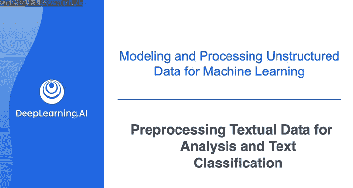
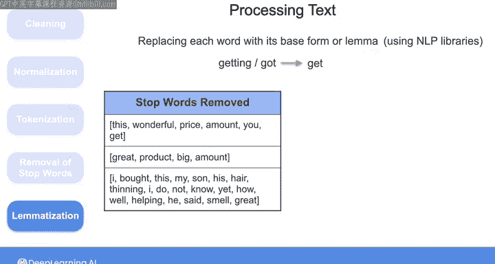
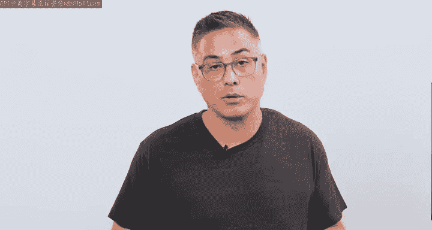

# 020：文本分析与分类的预处理 📝

在本节课中，我们将学习如何为文本分析和分类任务准备数据。我们将探讨一系列文本预处理技术，这些技术对于将原始文本转换为机器学习模型能够理解的格式至关重要。

随着组织生成和收集的文本数据日益增多，包括产品评论、社交媒体帖子和客户支持互动，从这些文本数据中提取洞察以做出关键业务决策变得至关重要。作为数据工程师，你的任务可能是预处理文本数据并将其提供给机器学习工程师，以便他们分析数据并训练机器学习系统，用于各种应用，例如产品评论的情感分析、新闻文章分类、聊天机器人和虚拟助手、垃圾邮件检测、客户细分、产品推荐等。

自然语言处理（NLP）是人工智能的一个子领域，它使计算机能够处理、理解和生成人类文本。NLP是一个已有50多年历史的领域，它包含了随时间演变的多种文本分析技术。虽然经典机器学习算法在文本分类、情感分析等NLP任务中很有效，但NLP的最新发展，即大语言模型（LLMs），已显著增强了计算机以卓越的准确性和流畅性解释和生成文本的能力。

在本视频中，我们将探讨一些文本预处理技术，你可以使用这些技术为NLP任务的机器学习系统训练准备文本数据。

## 预处理的重要性 🤔

假设你的公司希望进行情感分析，以分析客户评论是正面还是负面。这项技术通常依赖于使用预训练的机器学习系统，或在你的客户评论上训练一个机器学习系统。作为数据工程师，除了收集和存储这些评论，你还可以帮助将这些文本数据转换为机器学习算法能够理解的格式。

你需要应用的预处理程度将取决于所使用的机器学习算法的类型。经典机器学习算法无法直接处理句子。因此，在这种情况下，你需要应用预处理技术来首先清理文本，然后将其向量化。

另一方面，LLMs可以直接处理来自句子的标记或单词序列，而无需你首先将句子向量化为数值形式。

无论如何，我认为熟悉各种预处理策略对于准备文本数据进行进一步分析非常重要。这是因为文本数据可能包含拼写错误、不一致和重复，你需要解决这些问题，以便为训练机器学习模型提供干净、高质量的数据，并确保其性能，无论机器学习算法是经典的还是像LLM这样的先进模型。

此外，并非文本数据中的所有单词或字符都与给定的NLP任务相关，因此为了降低处理和存储成本，你需要删除任何对你的用例不携带相关信息的单词或字符。

最后，确实LLMs目前在许多NLP任务上表现出色，但训练这样的算法仍然昂贵且耗时，因此它们可能并非所有用例的最佳解决方案。与你合作的机器学习团队可能仍然倾向于使用经典机器学习算法，在简单解决方案足以满足用例要求的情况下。

还有一些用例需要你在训练数据中结合数值、分类和文本特征。基于所有这些原因，让我们来看看一些常见的预处理技术，用于准备文本数据。

## 文本清理 🧹

要清理你的文本，你可以从删除标点符号、多余空格或任何不增加文本含义的字符开始。

以下是三个原始文本评论示例，以及清理数据后你希望得到的结果。我已在视频后的阅读材料中包含了用于清理数据的Python代码，因此如果你不熟悉处理字符串，请随时查看该代码的解释。

**原始文本示例：**
1.  "The product is great! I love it."
2.  "AMT of features is good, but price is high."
3.  "I don't like the customer service."

**清理后目标：**
1.  "The product is great I love it"
2.  "AMT of features is good but price is high"
3.  "I don't like the customer service"

## 文本规范化 📏

清理数据后，你可以应用规范化，通过将文本转换为一致的格式来标准化文本。这可能包括将字符转换为小写、将数字或符号转换为字符，或扩展缩写词以减少同一单词的拼写变体。

例如，查看我们的三个示例评论，第二位客户将“amount”写为“AMT”，而另一条评论可能将“amount”中的“a”大写。当你应用规范化时，你可以通过用单词“amount”的小写拼写替换所有这些实例来解决这些不一致问题。在第三条评论中，你还看到了缩写“don‘t”，你可以将其替换为“do not”。

其他文本规范化的例子包括将常见单位如“KG”转换为“kilograms”或“LBS”转换为“pounds”，或者将缩写如“DE”替换为“data engineering”。同样，你可以在随后的阅读材料中查看执行此规范化的Python代码。

规范化数据后，你应该得到如下所示的文本：

**规范化后目标：**
1.  "the product is great i love it"
2.  "amount of features is good but price is high"
3.  "i do not like the customer service"

## 分词与停用词移除 ✂️

为了为进一步分析准备文本，然后对每个文本评论应用分词，这意味着你将每个评论拆分为单个单元或标记，这些标记通常是单词，但也可以是任何有意义的文本单元，如子词或短句。为简单起见，我将每个评论拆分为一个单词向量。

这可以使用Python字符串方法`split`来完成，你将在阅读材料中看到。

接下来，你可以删除频繁使用的单词，如“is”或“the”，这些单词通常不会为数据增加任何含义。这些单词被称为停用词。你可以定义自己的停用词列表，或使用带有内置停用词集的NLP库，如Spacy、NLTK、Gensim和TextBlob等。

以下是在我移除属于该集合的停用词后，示例评论的样子：

**移除停用词后目标：**
1.  ["product", "great", "love"]
2.  ["amount", "features", "good", "price", "high"]
3.  ["not", "like", "customer", "service"]

## 词形还原 🔄

最后，你可以使用一种称为词形还原的技术，将每个单词替换为其基本形式，即其词元。例如，“getting”和“got”的基本形式是“get”。因此，当你对文本应用词形还原时，你将所有这些变体替换为其词元，即单词“get”。同样，你可以使用NLP库来获取每个单词的词元。

以下是我对所有三条评论应用词形还原后得到的结果：

**词形还原后目标：**
1.  ["product", "great", "love"]
2.  ["amount", "feature", "good", "price", "high"]
3.  ["not", "like", "customer", "service"]

## 预处理步骤的灵活性 🔧

根据机器学习工程师或数据科学家的需求，你可能不需要应用所有这些步骤，或者可能需要应用其他预处理步骤。这取决于你的最终用户要应用的模型以及他们希望自己执行多少处理。我在资源部分包含了一些链接，指向讨论其他文本预处理步骤的课程，因此请随时查看它们，以了解更多关于为训练LLM或其他算法准备文本数据的信息。

无论如何，在你执行了必要的步骤来清理和预处理数据之后，接下来你可能需要做的事情，特别是与期望表格形式数值数据的机器学习算法一起工作时，就是将数据向量化。

因此，在下一个视频中，我将介绍一些常见的向量化技术，在这些技术中，你将干净且分词的文本转换为数字向量。

## 总结 📚

本节课中，我们一起学习了为文本分析和分类准备数据的关键预处理步骤。我们了解了文本清理、规范化、分词、停用词移除和词形还原等技术。这些步骤对于将原始、杂乱的文本转换为适合机器学习模型（无论是经典算法还是现代大语言模型）使用的结构化格式至关重要。掌握这些预处理技术是数据工程师在自然语言处理项目中提供高质量数据的基础。