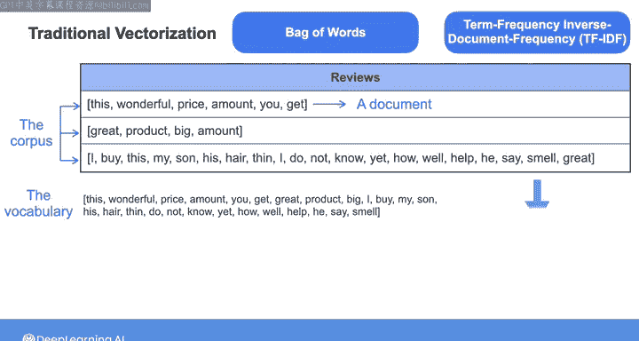
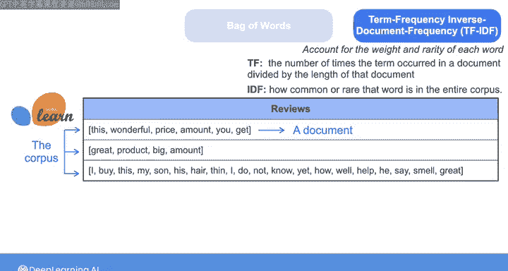
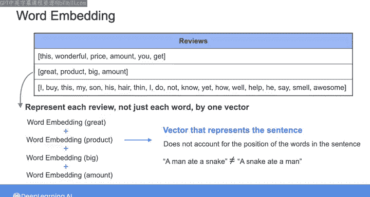
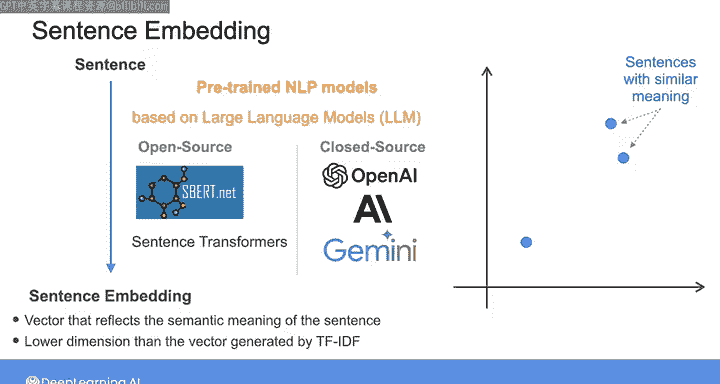
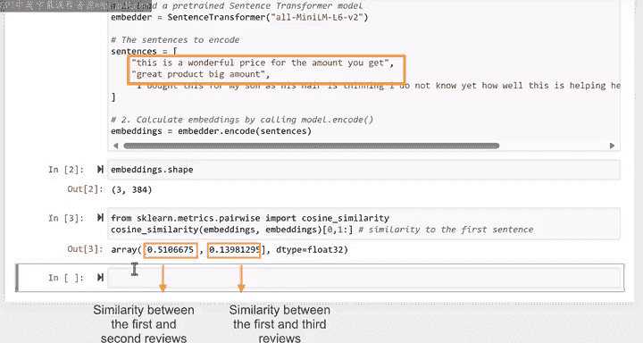
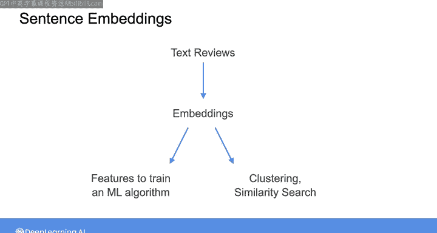

# 021：文本向量化与嵌入 📚


在本节课中，我们将学习如何将预处理后的文本数据转换为向量。我们将介绍传统的向量化方法，如词袋模型和TF-IDF，以及更先进的词嵌入和句子嵌入技术。这些技术是自然语言处理的基础，能够将文本转换为机器学习模型可以理解的数值形式。

---

## 从文本到向量：传统方法

上一节我们介绍了文本数据的常见预处理步骤。本节中，我们来看看如何将预处理后的文本数据转化为向量。

传统的文本向量化技术主要包括**词袋模型**和**词频-逆文档频率**方法。



*   **词袋模型**：将每个文档（例如一条客户评论）表示为一个向量，向量的长度等于整个语料库的词汇表大小。向量中的每个值对应词汇表中某个词在该文档中出现的次数。
*   **TF-IDF**：在词频的基础上，引入了**逆文档频率**，以降低在整个语料库中频繁出现但信息量较少的词的权重，提升稀有且重要词的权重。

以下是这两种方法的简要说明：

1.  **词袋模型向量化**：向量 `V_document` 的第 `i` 个元素是词汇表中第 `i` 个词在文档中出现的次数。
    *   公式：`V_document[i] = count(term_i in document)`

2.  **TF-IDF向量化**：向量值由词频和逆文档频率共同决定。
    *   词频公式：`TF(t, d) = (词t在文档d中出现的次数) / (文档d的总词数)`
    *   逆文档频率公式：`IDF(t, D) = log(语料库中文档总数 / (包含词t的文档数 + 1))`
    *   TF-IDF公式：`TF-IDF(t, d, D) = TF(t, d) * IDF(t, D)`

这些传统方法简单、易于理解和解释，适用于快速实验和小型数据集。它们在文档分类或关键词检测任务上可能表现良好。然而，它们忽略了词语的语义和句子结构，并且可能产生高维稀疏向量。

---

## 捕捉语义：词嵌入与句子嵌入

上一节我们了解了基于频率的向量化方法。本节中，我们来看看如何更好地捕捉文本的语义信息。

为了捕捉词语的语义，可以使用**词嵌入**技术。词嵌入将每个词映射为一个稠密向量，语义相近的词在向量空间中的位置也更接近。

例如，`有用` 和 `有帮助` 的嵌入向量之间的距离，应该比 `有用` 和 `树` 的向量之间的距离更近。流行的词嵌入算法如 **Word2Vec** 和 **GloVe**，通过在大规模文本中学习词的共现模式来生成这些向量。

但是，简单地将句子中所有词的嵌入向量相加，会忽略词语在句子中的顺序。例如，“人咬蛇”和“蛇咬人”会得到相同的向量，但含义截然不同。



这时就需要**句子嵌入**。句子嵌入是一个能反映整个句子语义的向量，它考虑了词序和每个词的含义。语义相似的句子，其嵌入向量在空间中也更接近。此外，句子嵌入的维度通常远低于TF-IDF等方法产生的向量维度。

你可以使用在大规模数据集上预训练的NLP模型来获取句子嵌入。既有开源的框架（如 **Sentence Transformers**），也有闭源的API服务（如 OpenAI、Anthropic、Google 提供的嵌入模型）。

---

## 实践：应用句子嵌入

以下是使用Python的Sentence Transformers库为文本评论生成句子嵌入的示例步骤：


1.  **初始化模型**：选择一个预训练的句子嵌入模型。
2.  **生成嵌入**：将清洗和标准化后的文本输入模型。
3.  **计算相似度**：使用余弦相似度等度量方法比较不同句子嵌入之间的相似性。

```python
# 示例代码
from sentence_transformers import SentenceTransformer, util

# 1. 初始化模型
model = SentenceTransformer('all-MiniLM-L6-v2')

# 2. 准备文本数据（假设reviews是预处理后的评论列表）
reviews = ["这个产品物超所值。", "我收到的产品数量不足。", "包装非常精美。"]

# 3. 生成句子嵌入
embeddings = model.encode(reviews)

# 4. 计算相似度（例如，比较第一条和第二条评论）
similarity = util.cos_sim(embeddings[0], embeddings[1])
print(f"评论1与评论2的余弦相似度: {similarity.item():.2f}")
```

计算出的相似度可以帮助我们理解不同文本之间的语义关系。例如，关于“产品数量”的评论彼此之间会比与关于“包装”的评论更相似。



---

## 嵌入向量的应用

生成这些嵌入向量后，可以将其用作机器学习算法的特征，应用于多种任务：

*   **产品推荐系统**
*   **文本聚类分析**
*   **语义相似度搜索**

在本周的第二个实验练习中，你将有机会把嵌入技术应用到真实的文本评论数据上，并结合元数据处理技术，完成一个完整的数据处理流程。



---

## 总结

本节课中我们一起学习了文本向量化的核心方法。

我们首先回顾了**词袋模型**和**TF-IDF**这两种传统技术，它们基于词频将文本转换为向量。接着，我们探讨了**词嵌入**技术，它能更好地捕捉词语的语义信息。最后，我们介绍了**句子嵌入**，它通过考虑词序和上下文，生成了能代表整个句子语义的稠密低维向量，并演示了如何使用开源库快速实现句子嵌入及其在相似度计算中的应用。






掌握这些向量化技术，是将非结构化的文本数据转化为可供机器学习模型使用的结构化数据的关键一步。