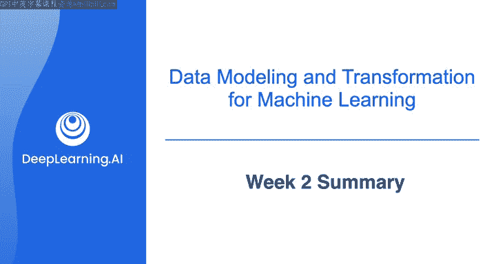
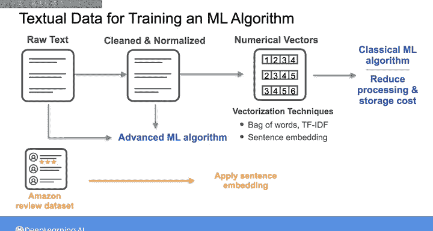

# 022：第2周总结 📊

在本节课中，我们将回顾第2周的核心内容，总结表格数据、图像和文本的建模与预处理方法，为机器学习用例做好准备。

## 概述

本周我们探讨了为机器学习用例准备表格数据、图像和文本的各种方法。你了解了机器学习项目生命周期的样貌，以及如何在项目的各个阶段为数据科学或机器学习团队提供所需的数据支持。

---

## 表格数据的处理

许多机器学习算法期望数据以数值表格形式存在，但真实数据往往并非如此。它可能包含缺失值或分类列。

以下是处理表格数据的关键步骤：

*   **处理缺失值**：可以应用**数据插补**技术，或在某些情况下直接删除空记录或列。
*   **转换分类列**：可以使用编码技术，如 **`独热编码 (One-Hot Encoding)`**、**`序数编码 (Ordinal Encoding)`** 或其他方法。
*   **特征缩放**：我们还讨论了缩放训练数据中数值特征的重要性，这有助于机器学习算法**更快地收敛**。

在本周的第一个实验中，我们使用 **`scikit-learn`** 库实现了这些处理步骤。

---

## 图像数据的处理

上一节我们介绍了表格数据的处理，本节中我们来看看图像数据。

如果你使用传统的机器学习算法，需要将图像展平为一长串像素序列。而更先进的神经网络技术，如**卷积神经网络 (CNN)**，可以直接处理图像，并在每一层中学习图像的特征。

虽然使用卷积神经网络时不需要展平图像，但你仍然可能需要对原始图像应用预处理技术，例如**图像重塑**和**归一化**。或者，你可能被要求通过应用**翻转**、**旋转**或**添加畸变**等技术来帮助**增强图像数据集**。

---

## 文本数据的处理

接下来，我们转向文本数据的处理。

你学习了如何预处理文本。如果最终用例涉及更先进的NLP模型，那么你可能只需向机器学习工程师或数据科学家提供原始数据或清洗后的文本数据。

然而，如果最终用例涉及训练传统的机器学习算法，或者你希望在将文本输入大语言模型 (LLM) 之前通过预处理来降低处理和存储成本，那么你需要执行额外的预处理步骤，将文本转换为数值向量。

你了解了两种传统的向量化技术：**`词袋模型 (Bag of Words)`** 和 **`TF-IDF`**。你还看到了一个更先进的技术：**`句子嵌入 (Sentence Embedding)`**。

在本周的第二个实验中，你将句子嵌入应用于亚马逊评论数据集，并将其与其他产品特征相结合。

---

## 总结

本节课中我们一起学习了表格、图像和文本数据的关键建模与预处理技术。对于构建机器学习系统而言，对机器学习工作原理有一个基本的理解，将帮助你向利益相关者提供高质量的数据，并为你的组织创造价值。

至此，我们已经涵盖了用于分析用例的建模技术，以及用于机器学习用例的处理技术。

---

## 下周预告

下周我们将讨论更多的转换技术，并了解如 **`Spark`** 这样的转换框架。我们下周见。