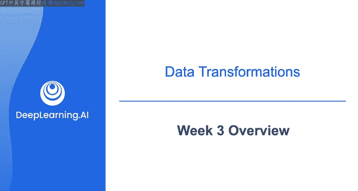
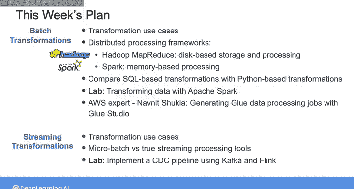

# 023：第3周概览 🗓️

在本节课中，我们将要学习数据工程生命周期中的“转换”阶段。我们将探讨如何为不同的数据处理需求选择合适的转换框架和技术，包括批处理和流处理场景。

---

## 课程概述

到目前为止，在本课程中，你已经通过定义规范化模式、星型模式和一个大表模式，为分析用例进行了数据建模。你也为机器学习用例建模了数据，并使用Pandas数据框架对小数据集进行了一些简单的转换。

然而，当你处理需要复杂转换的大规模数据时，仅使用Pandas数据框架可能无法提供你所需的可扩展性和性能。因此，本周我们将深入探讨转换的细节，并研究可用于转换数据的各种数据处理框架的技术考量。

## 转换阶段的核心价值

正如前面提到的，数据工程生命周期的转换阶段是你为下游利益相关者操作和增强数据的时候，也是你作为数据工程师能够真正为组织增加价值的地方。

以下是几个具体的例子：
*   你可以清理和组合来自多个来源的数据，然后将其存储在数据湖或数据仓库中，为你的组织创建一个单一的真相来源。
*   在数据仓库内部，你可以利用其大规模并行处理能力，将数据转换为星型模式或数据仓库模式，以便用户能更轻松地查询数据。
*   在数据湖内部，你可以通过将数据从原始区域移动到清理或转换区域，最后到丰富区域，来应用一系列转换，使其准备好供数据使用者使用。

## 转换框架的技术考量

要应用这些转换，你需要考虑诸如数据大小、可用硬件规格和性能要求等因素。这些考量将帮助你决定是仅在单台机器上处理数据，还是使用像Spark这样的分布式处理工具；以及是应该用SQL还是用Python等其他语言来编写转换逻辑。

你也可以对流数据进行转换，使你的利益相关者能够进行实时分析。在这种情况下，你需要考虑系统的延迟要求，并确保你的转换不会造成任何延迟。

## 本周学习路线图

上一节我们介绍了转换阶段的价值和基本考量，本节中我们来看看本周的具体学习内容。

以下是本周的学习安排：
1.  **批处理转换用例**：我们将从数据工程师可能遇到的一些批处理转换用例开始。
2.  **分布式处理框架**：我们将涵盖两个分布式处理框架：使用HDFS存储和处理数据的Hadoop MapReduce，以及内存处理框架Spark。许多数据工程师可能认为Hadoop由于其复杂性、高昂的扩展成本和显著的维护要求而是一项遗留技术。但理解MapReduce范式仍然很重要，因为它影响了当今许多分布式系统。
3.  **SQL与Python转换对比**：我们将比较基于SQL的转换与用Python等其他语言实现的转换。
4.  **实践练习**：在实验环节，你将有机会执行本课程之前用dbt做过的相同转换，但这次你将在数据仓库之外实现这些转换。
5.  **专家分享**：本周你还将听到来自AWS的高级解决方案架构师、AWS Glue服务专家Noni Chla的分享。他将向你展示如何使用Glue Studio生成用于处理数据的Glue作业。
6.  **流式转换**：在第二课中，我们将了解流式转换。你将使用Kafka和Flink实现一个变更数据捕获（CDC）管道，以捕获数据源中的更改并相应地更新系统中的数据。

## 总结

本节课中我们一起学习了数据工程第3周的核心内容——数据转换。我们概述了转换阶段的重要性、技术考量因素，并预览了本周将深入学习的批处理与流处理框架、工具及实践案例。这将是内容充实的一周，请在下一个视频中继续加入学习。