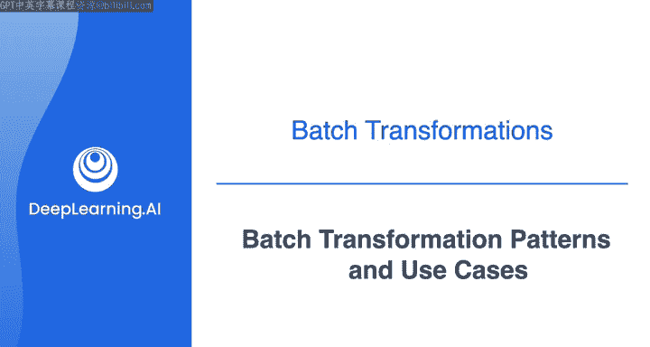
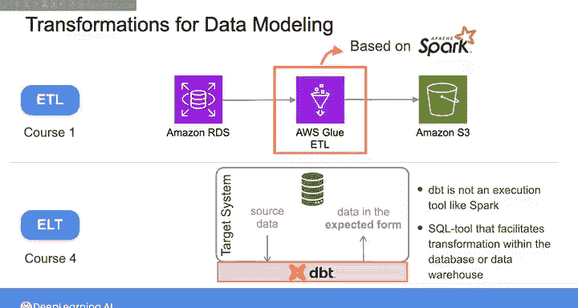
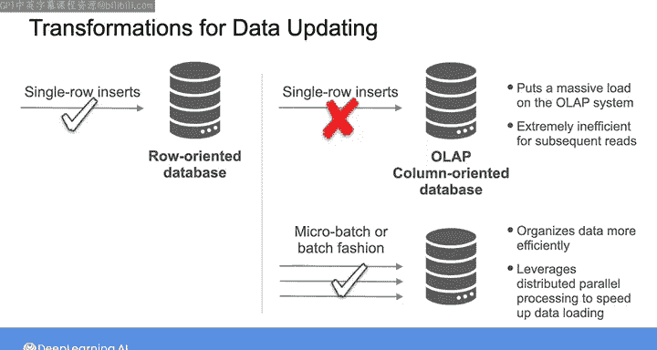

# 024：批处理转换模式与用例 📊

在本节课中，我们将学习批处理转换的核心模式及其典型应用场景。批处理是数据工程师处理离散数据块以支持分析报告和机器学习模型训练的关键工作。

## 概述

在与多家大型科技公司数据团队的交流中，我发现数据工程师的许多工作都涉及批处理。批处理转换是指在固定时间表（如每日、每小时或每15分钟）上操作离散数据块，以支持持续的报表、分析和机器学习用例。

## 批处理转换模式

上一节我们介绍了批处理的基本概念，本节中我们来看看几种常见的批处理转换模式。

假设你已经为数据创建了一个模型，它可能基于Kimball星型模式、数据仓库或其他数据建模方法。现在，你需要将数据摄入系统，并应用转换将源数据重构为预期形式。

以下是几种可选方案：

*   **ETL（提取、转换、加载）**：依赖外部转换工具，根据你创建的数据模型提取和转换数据，然后将转换后的数据加载到目标系统（如数据仓库）中。
*   **ELT（提取、加载、转换）**：从系统提取原始数据并直接导入数据仓库，然后利用仓库的存储和计算能力，在仓库内部清理和转换数据。
*   **ELT（混合方法）**：这里的“小t”指在将数据加载到数据仓库之前，为清理数据而应用的简单转换（如数据去重）。而“大T”指在数据仓库内部，根据你定义的模型重构数据所应用的转换。

事实上，你在之前的实验课中已经尝试过ETL和ELT两种方法。在课程1中，你使用AWS Glue ETL作为外部转换工具，在将数据加载到S3之前进行转换，实现了一个ETL管道。AWS Glue ETL基于一个名为Spark的分布式处理框架，可用于对更大规模的数据执行更复杂的转换。本周晚些时候我们将更详细地介绍Spark。

然后，在本课程的第一周，你使用DBT在数据库内部转换数据，实现了一个ELT管道。需要注意的是，DBT不像Spark那样是一个执行工具，它本身不提供计算资源。相反，它是一个SQL工具，你可以利用存储系统的计算资源，在数据库或数据仓库内促进转换任务的完成。

## 数据整理与清洗

除了将数据转换为目标模式外，你可能还需要应用转换来清理和规范化数据。例如，你提取的源数据可能存在缺失值、重复条目、异常值或其他不一致之处。

这个将混乱、格式错误的数据转化为干净数据的过程称为**数据整理**。你可以编写自己的代码来执行数据整理，就像上周为了将原始数据转化为可用于训练机器学习算法的形式所做的那样。但我强烈建议你使用数据整理工具，以避免重复繁重的工作。

以下是关于数据整理工具的说明：

*   有许多第三方数据整理工具可供选择。
*   许多主要云服务提供商通常也提供自己的此类工具版本。例如，AWS提供AWS Glue DataBrew作为一种可视化数据准备服务，用于在存储数据后对其进行清理、标准化和转换。

## 数据更新策略

将转换后的数据存储在数据管道中后，你可能需要定期或持续更新数据，以确保其与源系统中的数据同步。

你可以采用一种称为**截断并重新加载**的简单方法，即删除表中所有记录，然后从数据源重新加载数据，并重写任何必要的转换以使数据进入目标系统。当数据量较小且只需偶尔更新目标系统中的数据时，这种方法效果很好。

然而，如果你的数据量很大，这种方法可能会变得非常耗费资源。在这种情况下，你可能希望采用**CDC（变更数据捕获）** 方法，即首先识别源系统中发生的变更，然后仅基于这些变更来更新目标系统中的表。例如，你可以检查关系型源数据库中的“最后更新”列，或者检查数据库的事务日志。日志中的每一行都可以被标记为：I（如果行被插入）、U（如果行被更新）或D（如果行被删除）。

处理更新行时，你可以应用**仅插入模式**或**更新合并模式**来更新目标系统。

以下是处理更新和删除行的具体模式：

*   **仅插入模式**：插入新记录而不更改或删除旧记录，并在新记录中添加额外信息以区别于旧记录。
*   **更新合并模式**：获取一组源记录，并使用主键或其他逻辑条件在目标表中查找匹配项。当发生匹配时，用新记录替换目标记录来更新它。当不存在匹配时，则插入新记录。
*   **硬删除模式**：从目标系统中永久删除记录。
*   **软删除模式**：将记录标记为已删除。

出于性能原因（例如表太大），或者存在法律或法规原因时，你可能会使用硬删除。当你不想永久删除记录，但又想将其从查询结果中过滤掉时，可以使用软删除。你也可以以仅插入的方式删除记录，即插入一个带有删除标志的新记录，而不修改该记录的先前版本。

## 数据加载最佳实践

单行插入通常在面向行的数据库上执行。但我经常看到的一个问题是，一些数据工程师试图在面向列的OLAP数据库中执行单行插入。这是一种反模式，可能会给OLAP系统带来巨大负载。它还会导致数据被写入许多单独的文件中，这对于后续读取极其低效。

因此，我建议以**周期性微批或批处理**的方式加载数据。当你批量插入数据时，数据可以更有效地组织成行组并得到更好的压缩。如果OLAP系统是分布式的，你还可以利用分布式并行处理能力，而不是逐条加载记录。

## 总结与展望

本节课中我们一起学习了一些常见的批处理转换模式。正如前面提到的，如果你只处理简单的转换和小型数据集，或许可以在单台机器上完成转换。

然而，随着所需转换变得更加复杂且数据集变得更大，你将需要考虑使用分布式处理框架来满足可扩展性和性能要求。虽然云数据仓库利用了分布式处理能力，但你可能还需要在数据仓库外部或数据湖内部应用转换。

在下一个视频中，我们将开始讨论分布式处理框架。