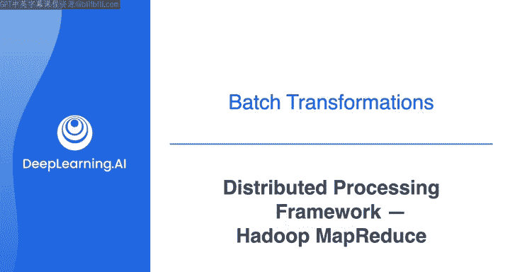
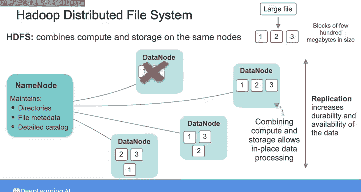
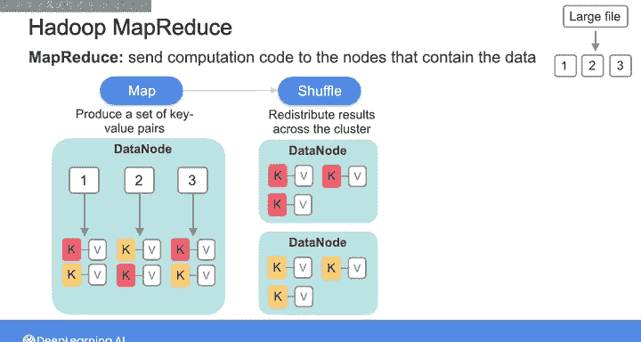
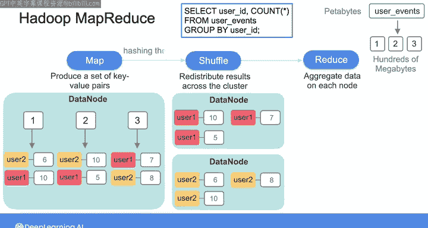
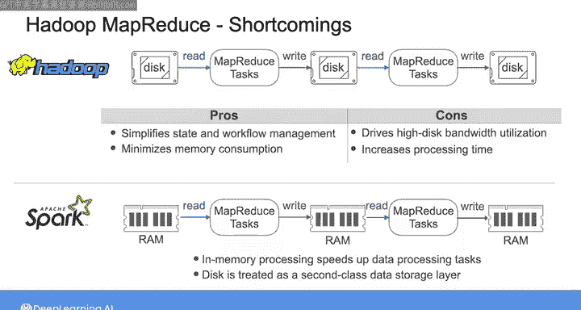

# 025：分布式处理框架Hadoop 🗂️

在本节课中，我们将要学习Apache Hadoop，这是一个用于处理海量数据集的早期分布式计算框架。我们将了解其核心组件、工作原理以及它在现代数据生态系统中的历史地位和影响。

---

多年来，工程师们开发了许多大数据工具来处理日益增长的数据量。

让我们花点时间来理解那些塑造了当今数据生态系统的关键工具和框架的演变过程。

在本视频中，我们将聚焦于Apache Hadoop，它是处理大型数据集最早的框架之一。

尽管是早期技术，但在2000年代初数据爆炸的背景下，它至今仍具有惊人的相关性。

在1990年代，传统的单体数据库和数据仓库无法以经济高效、可扩展、可用且可靠的方式处理海量数据。与此同时，服务器、内存、磁盘和闪存驱动器等商用硬件也变得廉价且无处不在。

这一时期，多项创新催生了我们今天所见的大规模分布式计算和存储集群。2003年，谷歌发表了一篇关于谷歌文件系统（GFS）的论文，该系统提供了一个跨多个商用硬件服务器集群的容错分布式文件系统。

不久之后，在2004年，谷歌又发表了一篇关于MapReduce的论文，这是一种用于在GFS上分布式处理大规模数据的全新并行编程范式。

谷歌的这些论文构成了数据技术和数据工程文化根源的“大爆炸”。

谷歌的论文启发了雅虎的工程师，他们在2006年开发了开源框架Apache Hadoop。谷歌的GFS论文为Hadoop分布式文件系统（HDFS）提供了蓝图，而MapReduce则成为了该框架的一部分。

尽管Hadoop在今天不被视为尖端技术，但我仍然认为理解Hadoop背后的概念非常重要，因为MapReduce仍然影响着当今数据工程师使用的许多分布式系统，并且HDFS仍然是许多当前大数据引擎（如Amazon EMR和Spark）的关键组成部分。

---

上一节我们介绍了Hadoop的历史背景，本节中我们来看看它的核心组件之一：Hadoop分布式文件系统。

Hadoop分布式文件系统与对象存储类似，但有一个关键区别：Hadoop将计算和存储结合在相同的节点上，而对象存储通常对内部处理的计算支持有限。

Hadoop将大文件分解成数据块。每个数据块保存着大小通常小于几百兆字节的数据块。

文件系统由一个称为名称节点的组件管理，它维护文件元数据和一个详细的目录，描述文件块在集群中的位置。

在一个典型配置中，你会将每个数据块复制到三个称为数据节点的节点上。这既提高了数据的持久性，也提高了可用性。如果某个磁盘或节点发生故障，导致某些文件块的复制因子低于三，名称节点将指示其他数据节点复制这些文件块，使其再次达到正确的复制因子。

---

通过将计算资源与存储节点结合，Hadoop允许就地数据处理。这最初是通过MapReduce编程模型实现的。

在MapReduce编程模型中，你将计算代码发送到包含数据的节点，优先考虑数据本地性，而不是将数据移动到你的应用程序。

以下是MapReduce作业的核心步骤：

1.  **Map阶段**：计算代码由一组Map任务组成，这些任务读取单个数据块并生成一组键值对。
2.  **Shuffle阶段**：随后进行Shuffle操作，将结果在集群中重新分发，使得具有相同键的值被收集到同一个节点上。
3.  **Reduce阶段**：最后是Reduce步骤，在每个节点上聚合数据。

---

为了更具体地理解这个过程，让我们通过一个SQL查询的例子来演示MapReduce是如何工作的。

假设你想运行一个SQL查询：`SELECT user_id, COUNT(*) FROM user_events GROUP BY user_id`。结果将是所有用户ID及其关联的记录数量。

在HDFS中，用户事件表中的数据被分解成数据块并分布在许多节点上。让我们放大一个包含三个数据块的数据节点。

MapReduce作业为每个数据块生成一个Map任务。每个Map任务本质上在其对应的数据块上运行查询，并生成键值对，其中键代表出现在该块中的用户ID，值是该用户ID在该块内对应的记录计数。

例如，在第一个块中，有6条记录与user2关联，10条记录与user1关联，依此类推。虽然整个表可能包含PB级的数据，但每个块可能只包含几百MB。因此，在单个数据块上运行查询比在整个表上运行要快得多。

然后，你通过键（在本例中是用户ID）重新分发结果，使得每个键最终只落在一个节点上。例如，所有user1的键值对最终在一个数据节点，所有user2的键值对在另一个数据节点。这就是Shuffle步骤，通常使用键的哈希算法来执行。

一旦Map结果经过Shuffle，你就对每个键的结果进行求和。键及其计算出的总计数可以写入它们被计算的节点的本地磁盘。最后，你收集存储在各个节点上的结果，以查看完整的查询结果。

---

这个模型非常强大，但它也有一些缺点。它利用了大量短暂存在的MapReduce任务，这些任务从磁盘读取数据并将中间计算结果写入磁盘。具体来说，没有中间状态保留在内存中，所有数据都通过存储在磁盘上或通过网络推送在任务之间传输。

这简化了状态和工作流管理，并最小化了内存消耗，但也可能导致较高的磁盘带宽利用率，并增加处理时间。

因此，工程师们开发了其他数据处理框架，这些框架仍然包含Map、Shuffle和Reduce的一些元素，但放宽了MapReduce的限制，允许进行内存缓存。

由于RAM在传输速度和寻道时间上都比SSD和HDD快得多，即使将少量选定的数据持久化在内存中，也能显著加快特定的数据处理任务。

例如，我们将在下一个视频中讨论的Spark，就是围绕内存处理设计的。在Spark中，你将数据视为驻留在内存中的分布式集合，并将磁盘视为用于处理的二级数据存储层，只有在数据溢出可用内存时才会使用。

---

如今，Hadoop已不再是热门的前沿技术，MapReduce也未被数据工程师广泛使用。我认为，在可预见的未来，利用内存进行数据转换的进步将继续带来收益。

在下一个视频中，请与我一起了解更多关于Apache Spark的知识，这是一个分布式内存处理框架，你将在接下来的实验中使用它。

---

本节课中我们一起学习了Apache Hadoop框架。我们回顾了其诞生的历史背景，深入探讨了其核心组件HDFS和MapReduce编程模型的工作原理，并通过一个具体例子理解了MapReduce的执行流程。最后，我们分析了Hadoop的局限性，并引出了后续更先进的、利用内存计算的新框架（如Spark）的出现。理解Hadoop是理解现代大数据处理技术演进的重要基础。