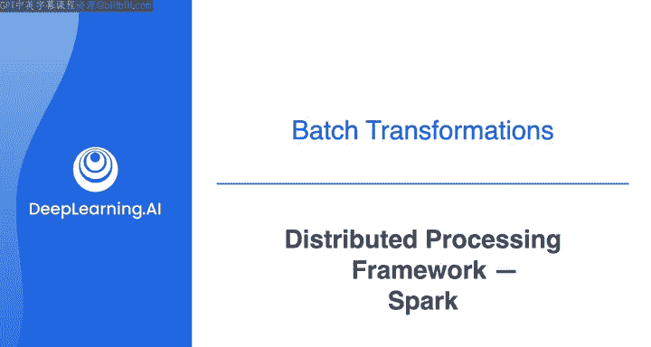
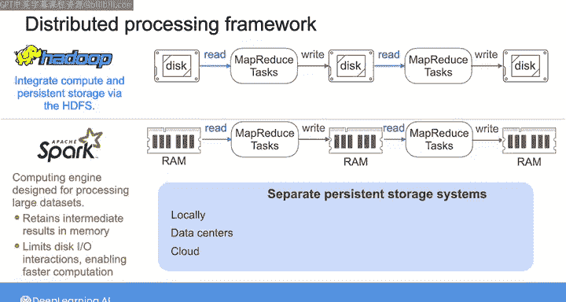
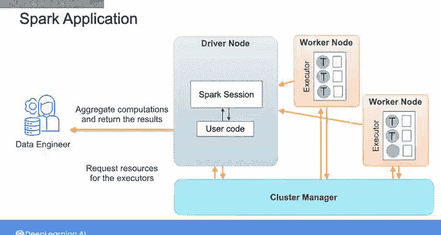

# 026：分布式处理框架Spark 🚀

在本节课中，我们将要学习分布式处理框架Apache Spark。我们将了解Spark的设计目标、核心架构、工作原理以及其丰富的生态系统。通过学习，你将理解Spark如何克服Hadoop MapReduce的局限性，并成为一个统一、高效的大数据处理平台。

---

为了应对Hadoop MapReduce的不足，加州大学伯克利分校的研究人员于2009年启动了Spark项目。

其目标是构建一个借鉴MapReduce思想，但更简单、更快速的分布式框架。它支持中间结果的**内存存储**和数据的**交互式处理**。此后，Spark不断发展，已支持流处理、机器学习和图计算库。Apache Spark社区也在持续开发和为这个框架添加新功能。

我认为你获得一些Spark实践经验至关重要。与Hadoop通过HDFS集成计算和持久化存储不同，Spark只是一个**计算引擎**，专为处理分布式大数据集而设计。使用Spark，你可以执行并行计算，并将中间结果保留在内存中，这减少了磁盘I/O交互，使得计算速度比Hadoop MapReduce**显著更快**。你可以在本地、数据中心或云端使用Spark。你可以从独立的关系型数据库、键值数据库、对象存储甚至Hadoop文件系统等持久化存储系统加载数据并存储最终结果。

Spark提供了一个**统一平台**，允许你在一个处理引擎上以自包含的Spark应用程序形式运行不同类型的分析工作负载。例如，你可以使用Spark执行SQL查询、加载数据、训练和测试机器学习算法，并在同一计算引擎上对数据应用流式转换。你可以使用Spark核心API，用Python、Java、Scala和R编写工作负载。Spark还提供了内置库，例如用于编写SQL查询的**SparkSQL**、用于机器学习应用的**MLlib**、用于处理实时数据的**Spark Structured Streaming**以及用于图处理的**GraphX**。除了这些标准库，你还可以使用开源社区发布和维护的外部第三方库。这些库包括允许你连接到各种外部数据源和存储系统、监控性能等的连接器。

让我们深入了解一下Spark应用程序的底层组件，看看它们如何协同工作。

一个Spark应用程序由一个节点集群组成。它包含一个**驱动节点**，这是Spark应用程序的中央控制器；一个**集群管理器节点**，它与驱动节点通信，以在集群中分配计算和内存资源并管理这些资源；以及一组**工作节点**，每个节点包含一个Spark执行器，用于执行驱动节点分配给它们的任务。Spark在从磁盘加载数据时应用一种**分区方案**将数据分解为多个分区，并将网络中最接近每个Spark执行器的分区分配给它。因此，每个执行器的CPU核心都会处理一个数据分区。

当你编写Spark应用程序时，首先实例化一个**SparkSession**对象，它代表了访问所有Spark功能的单一统一入口点。通过这个入口，你可以定义数据帧、从数据源读取数据以及执行SQL查询。驱动节点将你用Python、Scala或其他语言编写的指令翻译成Spark作业，这些作业将根据优先级一个接一个地执行。

为此，驱动节点将每个作业转换为一连串的**阶段**，并将这些阶段表示为一个**有向无环图**。例如，这里的这个作业有三个阶段，并用这个DAG表示。每个DAG就像是相应作业的**执行计划**。每个阶段进一步分解为可以用Spark代码编写、能够并行运行的**任务**。这里，阶段1有四个可以并行运行的任务，阶段2和阶段3各有三个也可以并行运行的任务。你将**串行**运行具有共享依赖关系的阶段，而**并行**运行那些没有依赖关系的阶段。例如，在这个DAG中，阶段2和阶段3依赖于阶段1的结果，因此它们必须等到阶段1完成后才能开始。但阶段2和阶段3之间没有共享依赖关系，可以并行运行。因此，为了执行这个作业，Spark将从阶段1开始，并行运行所有四个任务。一旦这些任务完成，阶段2和阶段3将同时启动，每个阶段中的三个任务将并行运行。

回到我们的Spark应用程序，一旦DAG执行计划制定完成，驱动节点会与集群管理器通信，为执行器请求计算和内存资源。每个任务被分配给执行器内的单个核心，每个执行器处理单个数据分区。执行器执行任务，并将计算结果传回驱动节点。最后，驱动节点聚合这些计算，并将结果返回给你。

在与Spark交互时，你无需担心所有这些底层细节。因此，无论你是使用最喜欢的编程语言还是任何标准库编写应用程序，在幕后，你的代码都会被分解成任务并分配到各个Spark执行器上。

关于Spark，我们可以涵盖很多内容，但我想重点介绍**PySpark**，它是Apache Spark的Python API。PySpark支持所有Spark功能，包括SparkSQL、Spark数据帧、机器学习和结构化流处理。在实验环节，你将使用Spark数据帧和SparkSQL处理结构化数据。

因此，在下一个视频中，我将向你展示如何创建和使用Spark数据帧。在之后的视频中，我们将详细介绍Spark的SQL功能。

---

**总结**

本节课我们一起学习了Apache Spark分布式处理框架。我们了解到Spark是为了克服Hadoop MapReduce的局限性而设计的，它通过内存计算和统一的编程模型实现了更高的性能。我们探讨了Spark应用程序的核心架构，包括驱动节点、集群管理器、工作节点以及任务执行的DAG模型。最后，我们介绍了PySpark作为使用Spark的Python接口，为后续的实践操作奠定了基础。