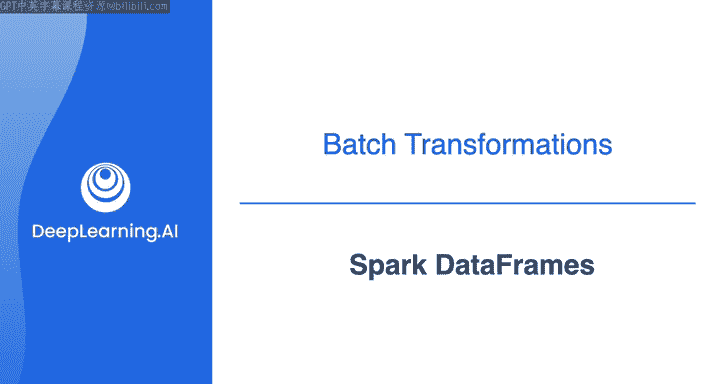
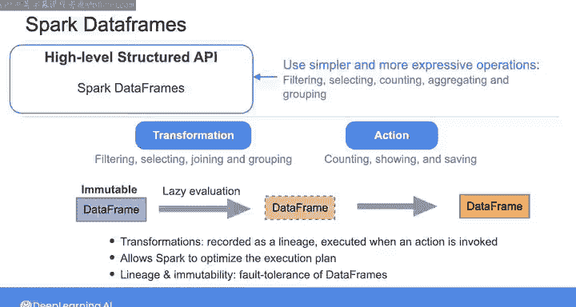

# 027：Spark数据框 🚀

在本节课中，我们将要学习Apache Spark的核心数据结构——Spark数据框。我们将了解它与之前学习的Pandas数据框有何不同，其底层架构是什么，以及它如何通过惰性求值和容错性来处理大规模分布式数据。

---

上一周，你使用Pandas数据框在一个小型表格化的客户流失数据上执行了简单的转换。而使用Spark数据框，你可以处理分布在多个Spark执行器后端的、规模大得多的表格数据集。但Spark为你抽象了这些细节，因此你可以像与单个表格交互一样查看和操作数据。

Spark数据框实际上是构建在一个名为**弹性分布式数据集**的低级数据结构之上的，其英文为**Resilient Distributed Dataset (RDD)**。RDD代表了可以并行操作的实际分区记录集合。如果直接使用RDD，你需要手动定义和优化所有想在数据上执行的操作。但有了Spark数据框，你可以使用更简单、更具表现力的高级操作来与数据交互，例如：

以下是Spark数据框支持的一些常见高级操作：
*   **过滤** (`filter`)
*   **选择** (`select`)
*   **计数** (`count`)
*   **聚合与分组** (`groupBy`, `agg`)

Spark会在后台将这些操作编译到RDD级别。Spark数据框及其底层的RDD都被认为是**不可变**的数据结构，这正是它们具有**弹性**（即容错性）的原因。

---

上一节我们介绍了Spark数据框的基本概念和高级操作。本节中，我们来看看对分布式数据的操作分类。

我们可以将对分布式数据的操作分为两种类型：**转换**和**行动**。

**转换**（例如过滤、选择、连接和分组）会从现有数据框创建新的数据框，而不会修改原始数据。这就是为什么数据框及其底层的RDD被认为是不可变的。

**行动**（例如计数、显示和保存）则会触发这些转换的执行。实际上，Spark的所有转换都是**惰性求值**的，这意味着它们不会立即执行。相反，它们被记录为一个**血统图**，只有在调用一个行动时才会执行。这种惰性求值允许Spark通过重新排列转换操作来优化执行计划，以提高效率。

此外，血统图和不可变性属性确保了容错性，因为这些属性允许你在发生故障时重现原始状态。

---

在下一个视频中，我将为你快速演示Spark数据框，并向你展示一些可以执行的常见数据框操作。当在Apache Spark中处理数据时，我们那里见。

---

本节课中，我们一起学习了Spark数据框。我们了解到它是用于处理大规模分布式数据的高级抽象，构建在RDD之上。我们区分了**转换**（惰性操作，创建新数据框）和**行动**（触发实际计算）两种操作类型，并理解了**惰性求值**和**不可变性**如何共同作用，为Spark带来了强大的优化能力和容错性。