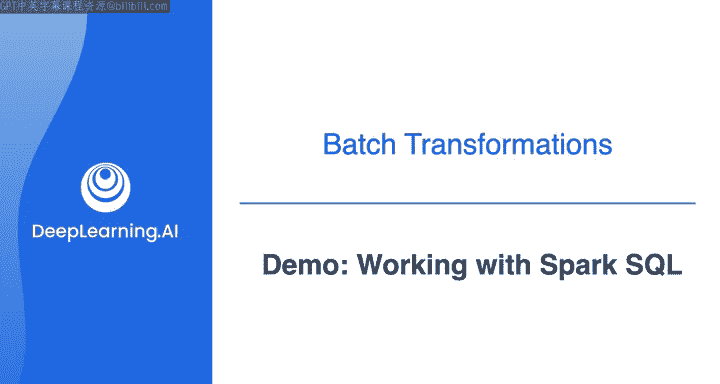
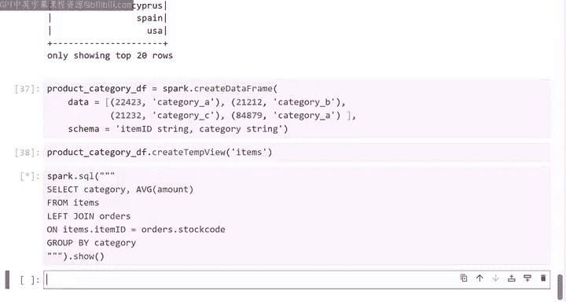

# 029：数据工程（数据建模、转换和服务）第4课 - 使用Spark SQL 🚀



## 概述

在本节课中，我们将学习如何在PySpark环境中使用SQL代码来探索和处理数据。你将了解如何创建临时视图、执行SQL查询、注册自定义函数，以及如何通过SQL进行多表连接操作。

---

## 从DataFrame到SQL查询

上一节我们介绍了如何使用Spark DataFrame和Python代码处理数据。本节中我们来看看如何通过SQL与相同的数据进行交互。

在PySpark中，你可以选择使用SQL代码、Python代码或两者混合的方式来操作数据。这两种类型的代码都运行在相同的计算引擎上，并最终编译为相同的底层代码。


以下是使用SQL查询数据的基本步骤：

1.  **创建临时视图**：要从DataFrame执行SQL查询，你需要先基于DataFrame创建一个临时视图。临时视图是一个虚拟表，它本身并不存储数据。只要Spark会话在运行，这个视图就会一直存在，并为你提供了一个使用SQL代码操作表数据的接口。
    ```python
    # 基于transaction_df创建一个名为'orders'的临时视图
    transaction_df.createOrReplaceTempView("orders")
    ```

2.  **执行SQL查询**：创建视图后，你可以通过Spark会话对象的`.sql()`方法执行SQL查询。该方法接收一个包含SQL查询语句的字符串，并返回一个表示查询结果的DataFrame。
    ```python
    # 查询每个订单的总金额，并按总金额降序排列
    result_df = spark.sql("""
        SELECT ID, SUM(amount) AS total
        FROM orders
        GROUP BY ID
        ORDER BY total DESC
    """)
    result_df.show()
    ```

---

## 在SQL查询中使用自定义函数

与在DataFrame中类似，你也可以在SQL查询中使用自定义函数。但在SQL中，你需要先将函数注册到Spark会话中。

以下是注册和使用自定义函数的步骤：

1.  **定义并注册函数**：首先定义一个Python函数，然后使用`spark.udf.register`方法将其注册为一个可以在SQL中调用的UDF（用户自定义函数）。
    ```python
    # 定义一个将字符串转换为小写的函数
    def to_lower(word):
        return word.lower()

    # 将该函数注册为SQL可用的UDF，命名为'udf_to_lower'
    spark.udf.register("udf_to_lower", to_lower)
    ```

2.  **在SQL查询中调用**：注册后，你就可以在SQL语句中使用这个函数了。
    ```python
    # 查询orders表中所有不重复的国家，并将国家名称转换为小写
    spark.sql("""
        SELECT DISTINCT udf_to_lower(country)
        FROM orders
    """).show()
    ```

---

## 多表连接查询

你可以创建多个临时视图，并在SQL查询中对它们进行连接操作，这在进行复杂数据分析时非常有用。

以下是进行多表连接查询的示例：

1.  **创建第二个视图**：假设我们有一个包含产品代码和类别的DataFrame，我们可以为其创建第二个临时视图。
    ```python
    # 假设 product_category_df 是另一个DataFrame
    product_category_df.createOrReplaceTempView("items")
    ```

2.  **执行连接查询**：现在，我们可以编写SQL查询来连接`orders`表和`items`表。
    ```python
    # 连接两个表，计算每个产品类别的平均订单金额
    spark.sql("""
        SELECT i.category, AVG(o.amount) AS avg_amount
        FROM items i
        LEFT JOIN orders o ON i.code = o.stock_code
        GROUP BY i.category
    """).show()
    ```
    这个查询通过`items`表的`code`字段和`orders`表的`stock_code`字段进行左连接，然后按类别分组并计算平均金额。



---

## 总结

本节课中我们一起学习了在PySpark中使用SQL的核心技能。我们掌握了如何将DataFrame转换为临时视图以便执行SQL查询，如何在SQL中注册和使用自定义函数，以及如何进行多表连接来回答更复杂的业务问题。这些技能为你提供了处理数据的灵活性，你可以根据场景选择最合适的编程范式（SQL或Python）或混合使用它们。


在接下来的实验中，你将有机会使用PySpark将数据转换为星型模式。而在实验之后，我们将深入探讨数据转换过程中的技术考量。