# 030：深入理解Amazon EMR 🚀

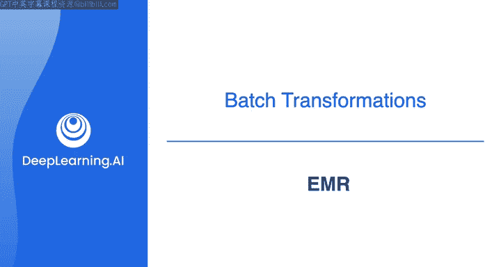

在本节课中，我们将深入学习Amazon EMR，这是一个支持多种处理框架的大数据处理工具。我们将探讨其工作原理、核心特性，并通过一个简单的示例演示如何在EMR Studio笔记本中运行Spark作业。

---

## 概述：什么是Amazon EMR？

在第一门课程中，我们曾将Amazon EMR介绍为一种支持广泛处理框架的大数据工具。在即将进行的实验中，你将使用EMR在Amazon EMR Studio笔记本中运行Spark作业。

本视频旨在帮助你更深入地理解在Amazon EMR上运行Spark作业时后台发生的过程，以及EMR的其他一些特性。

---

## EMR的工作原理：并行处理的力量

如果你还记得我们之前关于Amazon Redshift的课程，你了解到它如何利用大规模并行处理来处理大数据分析。EMR以类似的方式工作，它包含一个拥有多个节点的集群，每个节点负责处理一部分工作。

当你使用EMR提交一个作业时，该作业会在这些节点上并行运行，每个节点处理一部分数据。由于这种并行化，作业完成的速度比单台机器所能达到的要快得多。

你的集群规模会影响作业的运行速度。在EMR中，集群是弹性的，这意味着它可以根据需要扩展或收缩。

作业完成后，结果会存储在你指定的目的地。这可以是Amazon S3、HDFS或其他数据存储选项。然后，你可以分析这些结果，或将它们输入到另一个应用程序或工作流中进行进一步处理。

---

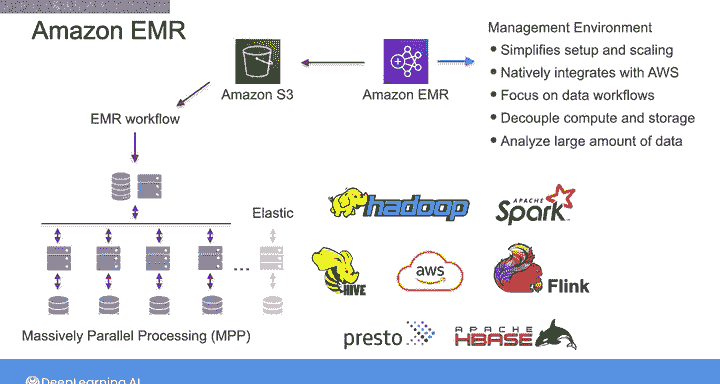

## EMR支持的大数据框架

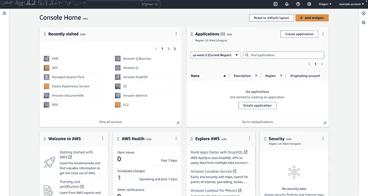

EMR支持众多流行的大数据框架，包括Apache Spark、Hadoop、Hive、Presto、Flink、HBase以及许多其他支持数据分析任务的工具和框架。

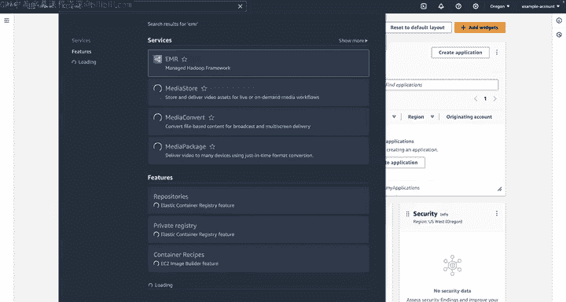

EMR提供了一个托管环境，简化了这些框架的设置和扩展，并原生集成了其他AWS服务。因此，使用EMR，你可以更专注于数据工作流，而不是底层基础设施。

---

## 与AWS服务的集成

例如，如果你想使用Hadoop分析存储在S3中的数据，你可以利用S3和Amazon EMR文件系统之间的集成来实现。这允许你将计算和存储解耦，并分析可能无法容纳在本地存储上的大量数据。

其工作方式是，当你启动集群时，EMR会将数据从S3流式传输到集群中的每个实例，并开始处理。

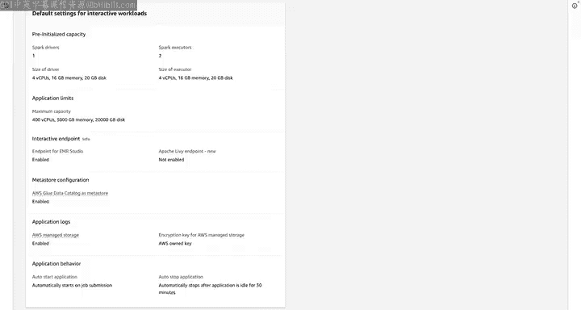

将数据存储在S3的另一个优势是，你可以使用多个EMR集群以不同方式处理相同的数据。EMR还可以与其他AWS数据源集成，例如Amazon DynamoDB、Amazon RDS和Amazon Redshift。

---

## 实践：在EMR Studio中运行Spark作业

在即将进行的实验中，你将使用Amazon EMR Studio，这是一个基于浏览器的Jupyter笔记本IDE，运行在EMR集群上。你将使用一个笔记本来运行Spark作业。

让我们通过一个使用笔记本的基本示例，为你完成实验做好准备。

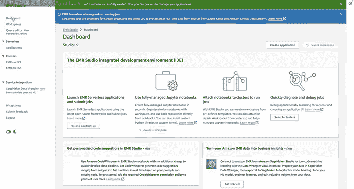

以下是使用EMR Studio运行Spark作业的基本步骤：

1.  **创建EMR集群**：首先，在AWS控制台中导航到EMR仪表板，创建一个EMR集群。对于本例，我们将启动一个无服务器集群。
2.  **创建EMR Studio和工作空间**：你需要一个EMR Studio来管理工作空间。创建一个工作空间，并为其命名。
3.  **配置工作空间**：创建工作空间后，需要对其进行配置以连接到计算资源。这包括选择之前创建的EMR无服务器应用程序，并设置交互式运行时角色。
4.  **创建并运行笔记本**：在工作空间中，创建一个新的笔记本，并选择PySpark作为内核。然后，你可以编写并运行Spark脚本。

例如，你可以运行一个简单的PySpark脚本来分析S3桶中的数据。以下是一个计算特定日期范围内出租车行程平均费用的示例代码片段：

```python
from pyspark.sql import SparkSession
from pyspark.sql.functions import avg

# 初始化Spark会话
spark = SparkSession.builder.appName("TaxiFareAnalysis").getOrCreate()

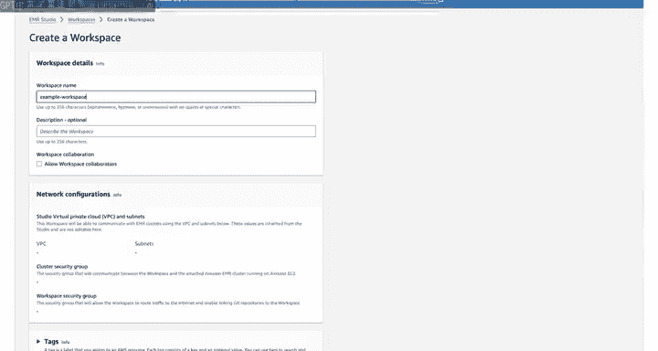

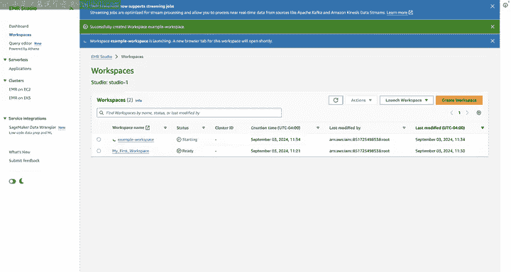

# 从S3读取数据
df = spark.read.csv("s3://your-bucket-name/taxi_data.csv", header=True, inferSchema=True)

# 过滤特定日期范围并计算平均费用
filtered_df = df.filter((df["date"] >= "2023-01-01") & (df["date"] <= "2023-01-31"))
average_fare = filtered_df.select(avg("fare_amount")).collect()[0][0]

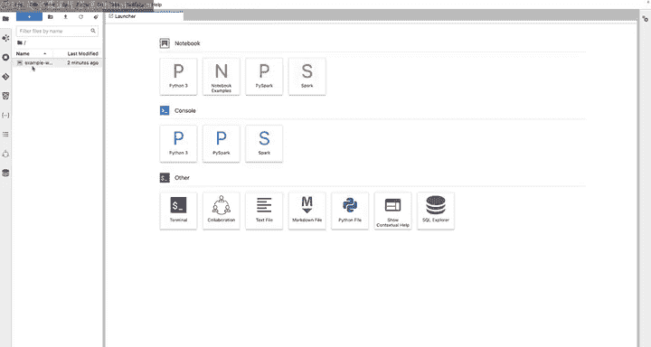

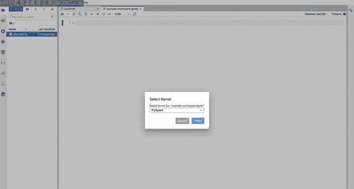

print(f"平均费用为: ${average_fare:.2f}")
```

运行此脚本后，作业将在EMR无服务器集群上执行，结果将显示在笔记本中。

---

## 总结

本节课中，我们一起深入探讨了Amazon EMR。我们了解了其利用并行处理处理大数据的核心工作原理，认识了它支持的各种流行框架，并学习了它如何与S3等其他AWS服务无缝集成。

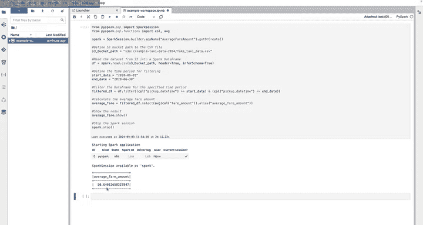

通过一个在EMR Studio中创建集群、配置工作空间并运行简单Spark作业的实践示例，我们直观地体验了EMR的使用流程。希望这能帮助你更好地理解EMR，并为你在接下来的实验中自己进行更有趣的数据分析做好准备。祝你实验顺利！