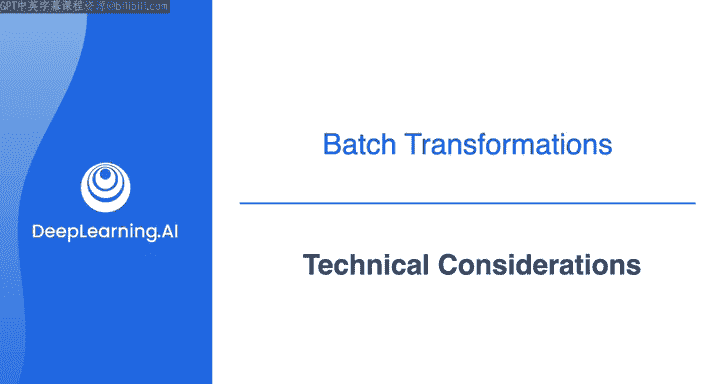
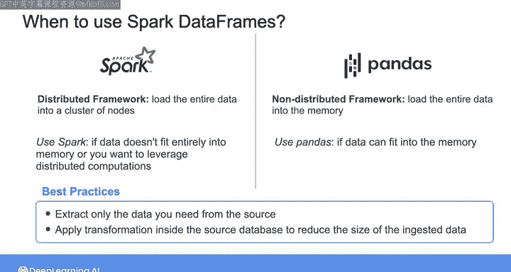

# 031：技术考虑因素 🧠

在本节课中，我们将学习在使用PySpark进行数据转换时，如何根据具体场景在Spark SQL和Python DataFrame API之间做出选择。我们还将探讨何时应该使用分布式计算框架（如Spark），以及如何通过优化数据提取来提升处理性能。

---

## 在Spark SQL与Python DataFrame之间选择

上一节我们介绍了使用PySpark进行数据转换的两种主要方式。本节中，我们来看看在选择使用Spark SQL还是直接在Spark DataFrame上使用Python时，需要考虑哪些技术因素。

使用PySpark转换数据时，你可以通过SparkSQL执行SQL查询，也可以直接使用Python操作Spark DataFrame。在选择这两种方式时，应考虑转换的复杂性、代码的可重用性与可测试性，以及团队的技术背景和技能。

以下是选择时需要考虑的几个关键点：

*   **转换复杂性**：对于简单的转换操作，例如过滤、分组和聚合，直接在Spark DataFrame上使用Python或将其编写为SQL查询，通常能获得相近的性能。这是因为两种方法最终都会被转换为相同的执行计划，并由底层的Spark计算引擎执行。然而，如果转换操作更为复杂，你可能无法用SQL实现，或者实现起来不够直接。例如，要对表格进行转置操作（交换行和列），你可以简单地调用`.T`方法：`df.T`。但SparkSQL不支持转置操作。
*   **代码质量**：使用DataFrame有助于编写更易于测试、维护和模块化（或可重用）的代码。在Spark中创建可重用的库更容易，而SparkSQL对于更复杂的查询组件缺乏良好的可重用性概念。
*   **团队技能**：你可能会发现，对于团队而言，编写SQL查询比使用Python操作Spark DataFrame更简单、更容易。

因此，根据你的具体转换用例，你可能会发现其中一种方法比另一种更合适。你甚至可以尝试结合使用Spark DataFrame和SparkSQL方法，以兼得两者之长。

---

## 何时使用Spark分布式框架

既然我们已经讨论了使用SparkSQL与Python DataFrame的考量，现在让我们花点时间讨论一下，在什么情况下你会考虑使用像Spark这样的分布式框架。

正如上周所见，除了使用Spark DataFrame，你也可以直接使用Pandas DataFrame来处理数据。然而，Pandas不是一个分布式框架，它会将所有数据加载到运行Python代码的机器的内存中。

以下是选择工具时的考量：

*   **数据量小**：如果你的数据量不大（即整个数据集可以放入内存），那么你可以使用Pandas而不是Spark。事实上，对小数据使用Spark可能有些大材小用，因为你还需要管理节点集群。
*   **数据量大或需高性能**：如果你的数据量非常大，无法完全放入内存，或者你想利用分布式计算来提升处理性能，那么你应该选择Spark，并可能在云端的集群上运行它。

---

## 最佳实践：优化数据提取

无论如何，无论你是在单机上工作还是在节点集群上工作，最佳实践是**仅从数据源提取你需要的数据**。

你提取的数据越少，代码消耗的资源就越少，性能也就越高。因此，你可能需要在将数据提取到处理引擎之前，在数据库内部应用诸如连接、分组和过滤等转换操作，以减少需要处理的数据量。

---

## 总结与下节预告

本节课中我们一起学习了如何为批处理转换选择正确的编码方法，这需要在SQL编码的简洁性与使用Python等非声明性语言编码的灵活性和模块化之间取得平衡。选择正确的批处理转换工具取决于你想要转换的数据大小以及运行代码的硬件规格。请务必理解这些不同方法之间的权衡。

现在我们已经讨论了批处理转换，下一节课我们将一起学习流式转换，以及流式处理工具如何影响你系统的延迟。