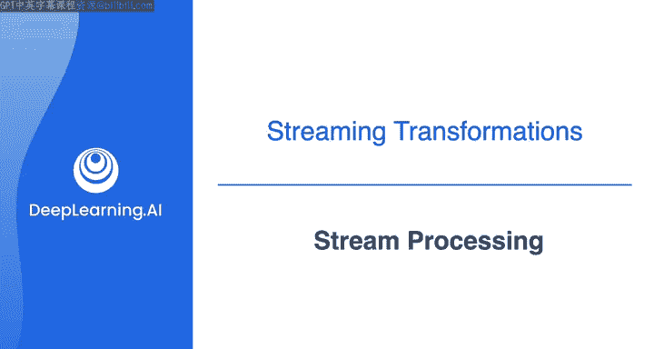
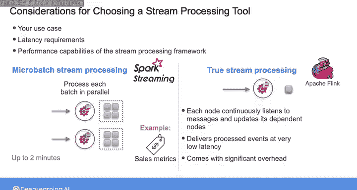

# 032：流处理 🚀

在本节课中，我们将要学习流处理的核心概念，了解如何对实时数据流进行查询和转换，并比较不同的流处理工具。我们将探讨流处理的应用场景、技术选型，并最终通过一个实践项目来巩固所学知识。

---

## 流处理概述

在第三门课程中，我们讨论了如何对数据流应用查询，并使用 Flink 练习编写这些查询。

这些流式查询可以帮助利益相关者对数据流进行实时分析，同时也可以用于对数据流进行转换。

## 流式转换的目的

流式转换旨在通过将事件流转换为另一个流，为其添加额外信息或将其与另一个流连接，从而为下游消费准备数据。

例如，您可能有一个来自物联网（IoT）源的事件流。这些 IoT 事件携带设备 ID 和事件数据，您可能希望使用存储在单独数据库中的设备元数据动态地丰富这些事件。您可以使用流处理引擎查询包含此元数据的单独数据库，然后通过将此元数据添加到现有的 IoT 事件中来生成一个新的事件流。

事实上，在之前的实验中您已经有过一些经验。您应用了流式 ETL 来转换用户会话事件流，通过为每个事件添加一个表示处理时间的时间戳以及从每个用户数据计算出的额外指标来丰富事件。

## 流式转换的更多示例

作为流式转换的另一个例子，您可以使用窗口查询动态计算窗口上的汇总统计信息，然后将输出发送到目标流。

在连接两个流方面，例如，您可以使用流式转换将包含网站点击流数据的流与另一个包含 IoT 数据的流结合起来，以获得用户活动的统一视图。

在这些例子中，事件通常由 Kafka 或 Kinesis Data Streams 等流平台传输给您，然后您可以使用流处理器处理这些事件。

## 流处理工具

与批处理类似，当您拥有大型数据集时，可以使用 Spark Streaming 和 Flink 等分布式流处理工具。这两种工具都是开源的，允许您编写 Python 代码或 SQL 查询来处理大型数据流。

选择流处理工具时，了解您的用例、延迟要求以及相关框架的性能能力非常重要。

## 微批处理与真流处理

其中一些工具，如 Spark Streaming，以微批处理方式处理数据，提供近实时性能。它累积从几分钟到几秒不等的小批量输入数据，然后使用分布式任务集合并行处理每个批次，类似于批处理作业的执行。

另一方面，像 Flink 这样的真流系统被设计为一次处理一个事件。系统中的每个节点持续监听来自其他节点的消息，并向其依赖节点输出新的更新。真流系统可以以比微批处理系统更低的延迟处理事件。

然而，这会带来显著的开销。因此，根据您的用例和可接受的延迟，您可以选择其中之一。

如果您收集的是每隔几分钟发布一次的销售指标，只要设置了适当的微批处理频率，微批处理可能就足够了。

另一方面，如果您的运维团队需要每毫秒计算一次指标以检测恶意攻击，您可能需要真流处理。

## 深入学习与实验

为了了解更多关于 Spark Streaming 和 Flink 底层差异的信息，课程包含了一些可选材料，比较了两种工具的架构，并提供了展示如何使用 Spark Streaming 的代码示例。

之后，您将完成本周的最后一个实验。您将通过实现一个流式变更数据捕获（CDC）管道来练习执行流式转换。您将使用 Debezium 作为工具从源数据库捕获变更，然后将这些变更推送到一个 Kafka 流，并使用 Flink 处理变更。

要了解此实验的概览，您可以查看实验演练，或者直接进入实验。

---

## 总结

本节课中，我们一起学习了流处理的基本概念和应用。我们了解了流式查询和转换如何为实时分析和数据准备提供支持，比较了微批处理（如 Spark Streaming）与真流处理（如 Flink）在架构和适用场景上的差异，并介绍了通过实验来实践流式变更数据捕获（CDC）管道的构建。掌握这些知识将帮助您根据具体的延迟和性能需求，为数据工程项目选择合适的流处理工具。