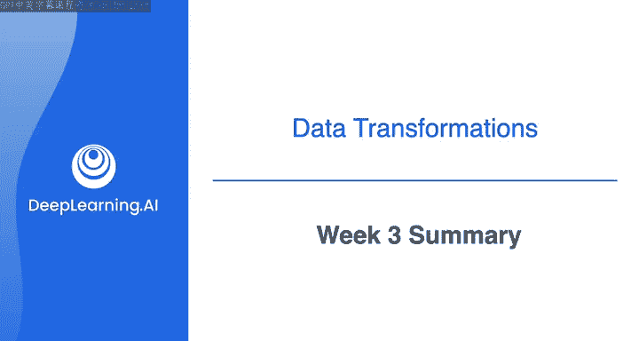
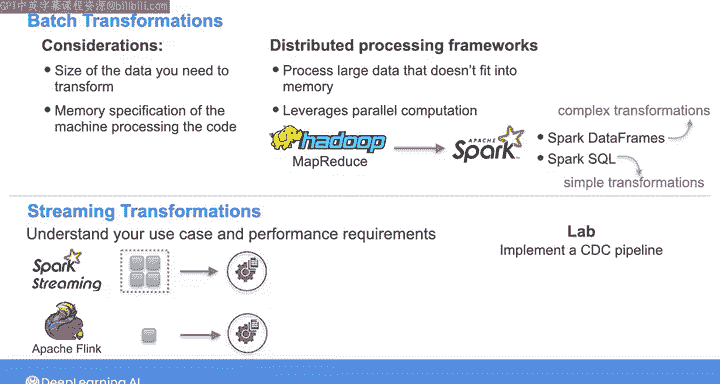

# 033：第3周总结 📊



在本节课中，我们将回顾并总结第3周学习的核心内容，重点聚焦于数据转换的细节、不同数据处理框架的技术考量，以及如何将原始数据转化为对下游应用有价值的信息。

---

## 概述

本周我们深入探讨了数据转换的细节，以及可用于转换数据的各种数据处理框架的技术考量。我们了解到，数据转换不仅是为了根据目标模式对数据进行建模，还可以通过清洗、丰富数据以及在数据管道中保持其更新来提升数据的价值与质量。

上一节我们介绍了数据转换的基本目标，本节中我们来看看实现这些目标的具体技术框架和考量因素。

## 批处理转换的考量

在批处理转换方面，我们讨论了几个关键考量因素，包括需要转换的数据量大小以及运行代码的机器的内存规格。

以下是选择批处理框架时的主要考量点：
*   **数据规模**：需要处理的数据集大小。
*   **内存规格**：执行转换任务的机器的内存容量。
*   **计算模式**：是否需要利用并行计算来提升效率。

你了解到，如果需要处理的数据无法完全装入内存，或者希望利用并行计算，可以使用分布式处理框架。同时，你也学习了像 **Spark** 这样的大数据工具是如何从 **Hadoop MapReduce**（其中间结果存储在磁盘上）演化而来的。

## Apache Spark 实践

你概览了 Spark 在后台的工作原理，并有机会练习使用 **Spark DataFrames** 和 **SparkSQL** 进行编码。

虽然对于简单的转换任务，编码和 SQL 可能很方便，但使用 DataFrames 进行编码能帮助你实现更复杂的转换，并使你的代码更具模块化。其优势可以用以下伪代码结构表示：
```python
# 模块化的DataFrame操作示例
transformed_df = (raw_df
                  .filter(condition)   # 步骤1：过滤
                  .select(columns)     # 步骤2：选择列
                  .groupBy(key)        # 步骤3：分组聚合
                  .agg(functions))
```
因此，代码更易于维护和测试。


## 流处理转换的选择

当涉及流处理转换时，理解你的用例和系统的性能要求将帮助你在微批处理框架（如 **Spark Streaming**）和真正的流处理系统（如 **Flink**）之间做出选择。

选择依据可归纳为：
*   **微批处理（如 Spark Streaming）**：适合对延迟要求不极端严格，但需要与批处理代码库保持一致的场景。
*   **真流处理（如 Apache Flink）**：适合需要极低延迟和精确一次（exactly-once）处理保证的场景。

## 实践项目：变更数据捕获（CDC）

在本周最后的实验中，你实现了一种基于日志的变更数据捕获方法，使用 **Debezium** 和 **Apache Kafka** 来捕获数据库变更，并利用 **Flink** 来处理这些数据库更新流。

这个项目综合应用了流处理、消息队列和CDC技术，是数据管道中实现实时数据同步的典型模式。

---

## 总结

本节课中我们一起学习了数据工程生命周期中关键的转换阶段，在这里你将数据转化为对下游用例有用的信息。我们探讨了批处理与流处理框架的技术选型，并动手实践了使用现代工具链（Spark, Flink, Kafka, Debezium）进行复杂数据转换和实时处理。

随着转换阶段的讨论结束，整个数据工程的核心流程已清晰呈现。下一周，你将学习如何将转换后的数据提供给下游的利益相关者，这是数据服务的环节。作为整个项目的最后一周，你还将有机会在一个顶点项目中，综合运用在整个课程中学到的许多数据工程概念。




我们下周课程再见。