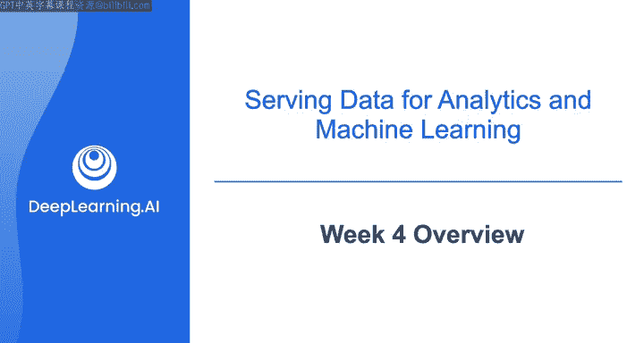
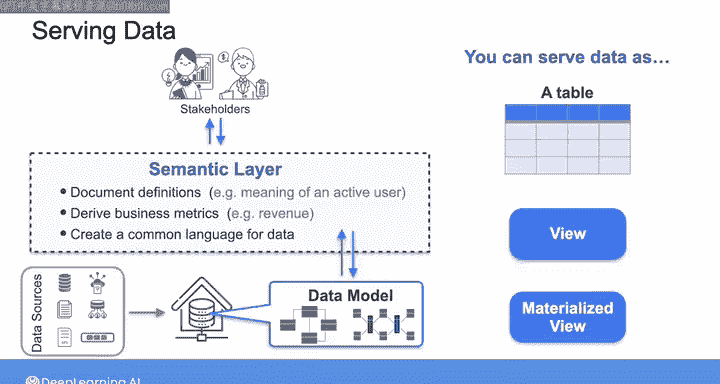
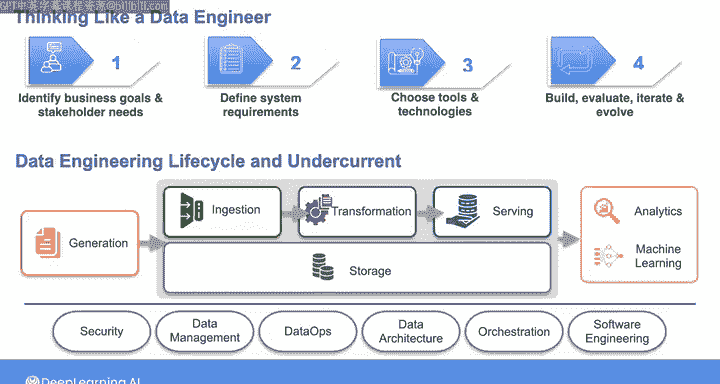

# 034：数据工程（数据建模、转换和服务）第4课，完结 🎯

## 概述

在本节课中，我们将学习数据服务的核心概念，了解如何为不同的分析和机器学习应用场景提供数据。我们将探讨数据服务的多种形式，并回顾在整个课程中学到的数据工程知识框架。

---

恭喜你完成本课程的最后一周学习。在整个课程中，你已经学习了如何为分析和机器学习用例进行数据建模，以及在转换数据时应考虑的工具和技术因素。

在最后一周，我们将探讨如何为各种分析和机器学习用例提供数据。

例如，在商业分析用例中，你可能需要从数据仓库或数据湖中提供数据，以便最终用户可以使用这些数据创建仪表板、报告或进行临时分析。

你也可以为运营分析提供数据，在这种场景下，最终用户需要监控数据的即时趋势以指导立即行动。对于运营分析，你需要确保在要求的延迟时间内提供数据。

最后，你还可以为嵌入式分析提供数据，最终用户将数据输入面向客户的数据产品或仪表板。

在为机器学习应用提供数据方面，这在各类公司中正被广泛采用。你很可能需要与数据科学家或机器学习工程师合作，以获取、转换和交付模型训练所需的数据，并以适合目标应用的格式呈现。

在课程早期，我们看了一些为构建客户流失模型和推荐系统提供数据的例子。

此外，你可以通过在数据建模后构建的语义层来整合业务定义和数据逻辑。在语义层中，你可以记录诸如“活跃用户”含义等定义，并推导出“收入”等业务指标，从而为你所提供的数据创建一种通用语言。

你也可以将数据以表、视图或物化视图的形式提供。我们将在本周后续内容中详细讲解所有这些概念，并且在第一个实验课中，你将通过使用DBT创建视图获得大量实践。

在详细讲解数据服务之后，我将为你总结在本课程中学到的数据工程概念，回顾如何像数据工程师一样思考的框架，以及数据工程生命周期的所有阶段和潜在因素。

最后，你将在毕业项目中看到所有这些概念是如何结合在一起的。

---

在下一个视频中，请与我一起探讨为分析和机器学习用例提供数据的不同方式。