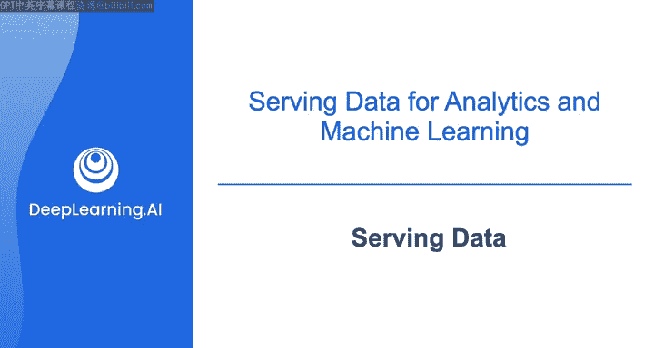
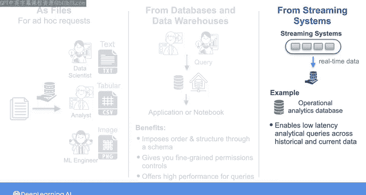
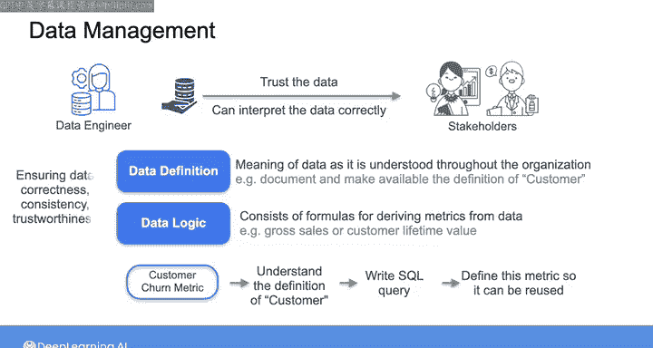
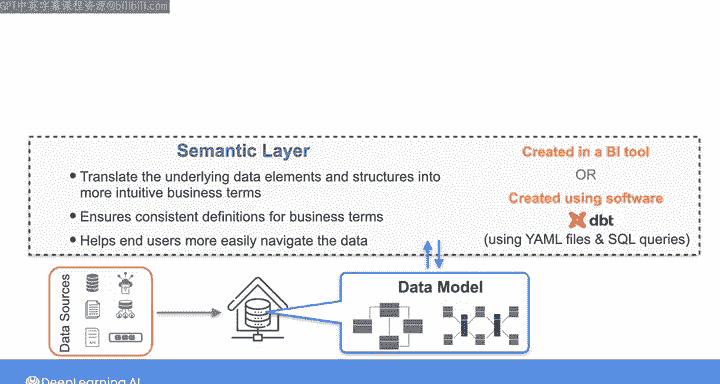

# 035：为分析和机器学习提供数据服务 📊

在本节课中，我们将学习如何将数据有效地提供给最终用户，以支持分析和机器学习任务。我们将探讨多种数据服务方式，包括文件共享、数据库查询、流式数据服务，并介绍确保数据一致性和可理解性的关键概念，如数据定义、数据逻辑和语义层。

---

## 通过文件共享数据 📁

向最终用户提供数据有多种方式。将数据作为文件共享是一种常见且直接的数据服务方法。

例如，数据科学家可能需要客户评论的文本文件来进行情感分析；分析师可能需要发票的CSV格式数值数据来进行统计分析；机器学习工程师则可能使用产品图像来开发产品分类系统。

当然，在某些情况下，你可以使用数据库或对象存储来提供文本、数值或图像数据。有时，你也可以直接通过电子邮件等方式共享单个文件。但这种方式难以管理文件的版本控制。

使用数据共享平台可以帮助你确保与最终用户共享的文件版本具有一致性和连贯性。

对于某些临时性需求，一次提供单个文件可能就足够了。但这种做法很难扩展。如果你需要共享半结构化或非结构化的大型文件，则需要通过对象存储或数据湖来扩展，而不仅仅是共享单个文件。

---

## 从数据库提供数据 🗄️

上一节我们介绍了文件共享，本节中我们来看看从数据库直接提供数据的方式。

你可以选择直接从你的OLAP数据库或数据仓库提供数据。在这种情况下，分析师或数据科学家可以使用SQL或其他查询语言查询存储系统，然后将结果导出到下游应用程序，或在笔记本中分析结果。

从数据库提供数据有其优势。数据库通过强制实施模式，为数据带来了秩序和结构。数据库在表、列和行级别提供了细粒度的权限控制，允许你为不同角色制定复杂的访问策略。此外，现代的OLAP数据库和查询引擎可以为复杂、计算密集型的查询提供高性能。

---

## 处理流式数据服务 ⚡

如果你正在处理流式数据，通过文件和数据库提供服务可能不切实际或无法实现，而数据库本身可能不具备你所需的功能。在这种情况下，你需要使用流式系统来实时提供数据。

例如，操作型分析数据库正变得越来越流行，因为它们允许最终用户以低延迟对大量历史数据以及最新的实时数据（精确到秒级）执行分析查询。当你从这些数据库提供数据时，你实际上是将OLAP数据库的功能与流处理系统的功能结合了起来。

---

## 确保数据定义与逻辑 📝

在数据管理方面，你需要确保利益相关者信任你提供的数据，并且他们能够正确解释并以一致的方式使用它。因此，你需要确保数据包含适当的数据定义和逻辑。

数据定义指的是在整个组织内被理解的数据含义。例如，“客户”一词的定义应被记录并可供所有使用该数据的人查阅。

数据逻辑包含从数据中推导指标的公式，例如增长率、销售额或客户生命周期价值。正确的数据逻辑依赖于正确的数据定义，并包含统计计算的细节。

以下是计算客户流失率指标的例子：
1.  首先，需要理解“客户”对最终用户意味着什么。
2.  然后，你可以编写一个SQL查询来定义该指标，该定义可以在整个组织内复用。

这有助于避免出现混乱且难以维护的SQL代码蔓延。

在组织内正式声明数据定义，对于确保数据的正确性、一致性和可信度大有裨益。

---

## 构建语义层 🔍

虽然你可以通过数据建模来帮助捕获数据定义和逻辑，但你也可以在数据模型之上构建一个语义层，将底层数据元素和结构转换为对最终用户来说更直观、更有用的业务术语。

语义层确保每个业务术语都有单一、一致的定义，并帮助你的最终用户更轻松地浏览数据以找到所需内容。

语义层可以存在于BI工具中，或者你也可以使用像DBT这样的工具来创建这个层。使用DBT，你可以使用YAML文件和SQL查询来定义标准的业务指标。

---

## 最终用户的数据使用 🛠️

一旦最终用户收到数据，他们可能会使用可视化工具或商业智能平台（如Amazon QuickSight、Apache Superset或Looker）来创建分析仪表板。数据科学家则可能使用笔记本来探索数据或训练模型。

作为数据工程师，你可能还需要负责帮助设置和管理专为处理云端数据科学工作负载而设计的云平台，例如Amazon SageMaker、Google Cloud Vertex AI和Microsoft Azure Machine Learning。

---

## 总结 ✨

本节课中，我们一起学习了为分析和机器学习提供数据服务的多种方式。我们探讨了通过文件共享、从数据库查询以及处理流式数据来服务数据的方法。我们还深入了解了确保数据质量与可用性的关键要素，包括数据定义、数据逻辑以及构建语义层的重要性。这些方法共同构成了一个健壮的数据服务体系，能够支持组织内各种分析和机器学习需求。

在下一个视频中，我们将深入探讨从数据库提供数据的具体方法，特别关注使用视图和物化视图。