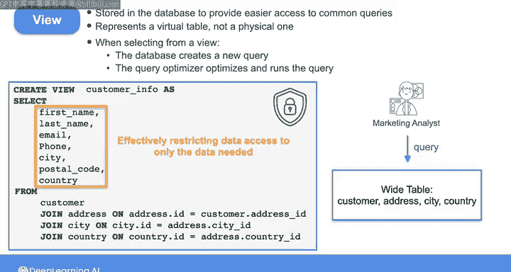
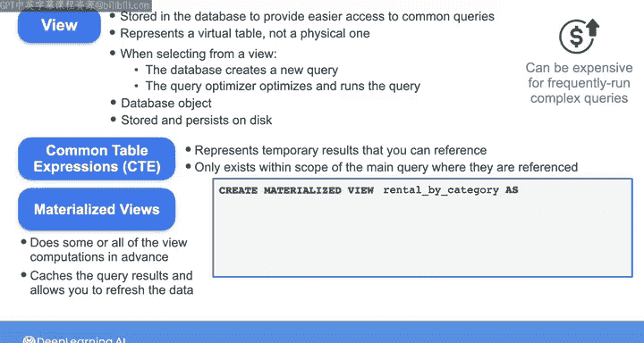

# 036：视图与物化视图 👁️‍🗨️


在本节课中，我们将要学习两种重要的数据库对象：视图和物化视图。你将了解它们的定义、创建方法、使用场景以及它们之间的核心区别。掌握这些知识将帮助你更高效地为下游用户提供数据服务。

## 概述

当为下游利益相关者提供数据库直接访问权限时，除了以表的形式提供数据，你还可以使用视图和物化视图这类类似表的对象来提供数据。

你可以在数据管道的转换阶段，或在数据消费层将数据提供给最终用户之前，创建这些对象。

## 什么是视图？🔍

上一节我们介绍了为下游用户提供数据的不同方式，本节中我们来看看视图的具体概念。

视图本质上是一个可以存储在数据库中的查询。它为开发者和利益相关者提供了访问常用查询的便捷途径，并能帮助简化复杂查询的编写过程。

以下是创建视图的语法示例：

```sql
CREATE VIEW customer_info AS
SELECT first_name, last_name, email, phone, address
FROM customer, address, city, country;
```

视图代表一个虚拟表，而非物理表。最终用户可以像查询普通表一样从视图中进行选择。当你从视图中选择数据时，数据库会创建一个新查询，将视图定义与引用它的查询结合起来，然后查询优化器会对整个查询进行优化和执行。

假设一位营销分析师需要频繁地对连接`customer`、`address`、`city`和`country`表的结果运行查询。创建这个`customer_info`视图后，你就将四个表连接成了一个宽表。这样，营销分析师就可以简单地编写在此视图上进行过滤和聚合的查询，而无需每次都编写连接这些表的查询。

## 视图的安全与组织作用 🛡️

除了简化查询，视图还可以在提供数据时应用安全原则。

例如，你可以创建一个只选择特定列和行的视图。当你向下游利益相关者提供此视图时，你实际上将他们的数据访问权限限制在了他们所需的数据范围内。

你在课程3中学到的CTE（公共表表达式）是一个与视图类似的SQL概念。回忆一下，你可以使用`WITH`子句创建CTE，后跟CTE的名称和一个用括号括起来的查询。但该查询代表了你希望在后续SQL查询中引用的一些临时结果。

因此，CTE和视图都能通过使代码更清晰、更易于遵循来帮助组织代码。

然而，CTE仅存在于引用它们的主查询范围内。一旦主查询执行完毕，CTE就会被丢弃，并且无法在其他查询中被引用。



另一方面，视图是一个实际的数据库对象，可以被外部数据库用户访问。代表视图的查询主体实际上存储在数据库磁盘上，并且可以一直保留在数据库中，直到你显式地删除它。因此，视图可以被最终用户在不同的会话和查询中引用和使用。

## 视图的局限性 ⚠️

现在，如果使用视图，你无法执行和存储任何预计算。这意味着每次引用视图时，都需要执行视图所代表的查询。

因此，使用视图来存储最终用户需要频繁运行的复杂查询，其计算成本可能极其高昂。

## 什么是物化视图？⚡

为了解决视图的性能问题，我们来看看物化视图。

物化视图则不同，它会提前执行部分或全部的视图计算。然后，它会缓存查询结果，并允许你定期刷新数据。

以下是创建物化视图的语法示例：

```sql
CREATE MATERIALIZED VIEW rental_by_category AS
SELECT category.name, SUM(payment.amount)
FROM payment, rental, inventory, film, film_category, category
GROUP BY category.name;
```

该查询被执行，六个表连接的结果被保存在缓存中。当用户引用这个`rental_by_category`物化视图时，他们查询的是预先连接好的数据。

当你能够容忍刷新之间存在一定程度的延迟时，物化视图非常有用。

## 本周实验与课程总结 📋

在本周的第一次实验中，你将使用本课程第一周见过的星型模式模型。

你将使用DBT在该模型之上创建分析视图。

在此之后，你将准备好投入到下一课的顶点实验项目中。在下一课中，我将为你总结在整个课程中学到的所有关键概念。然后，在你开始进行那些实验之前，我会带你快速浏览一下顶点项目的内容。



我们下一课再见。

## 总结

本节课中我们一起学习了视图和物化视图。视图是存储的虚拟查询，用于简化访问和增强安全，但每次查询都会重新计算。物化视图则通过预先计算和缓存结果来提升频繁复杂查询的性能，但数据存在延迟。理解两者的区别和适用场景，对于设计高效的数据服务层至关重要。