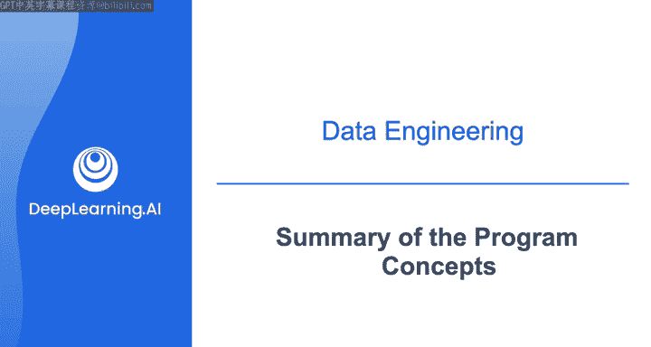
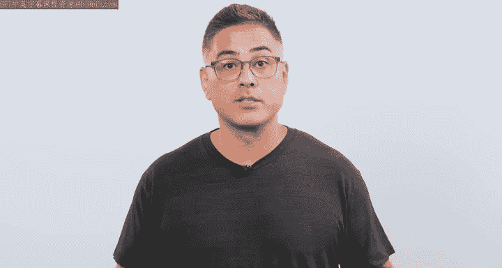
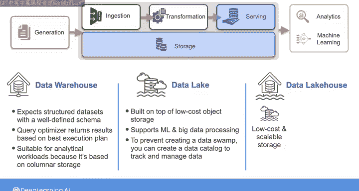
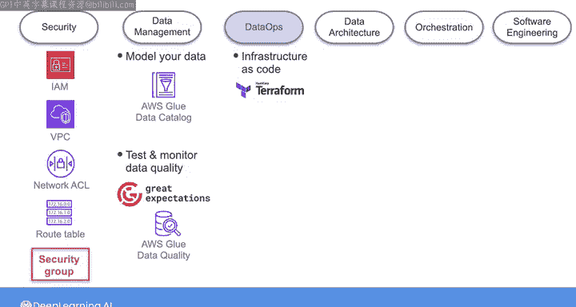
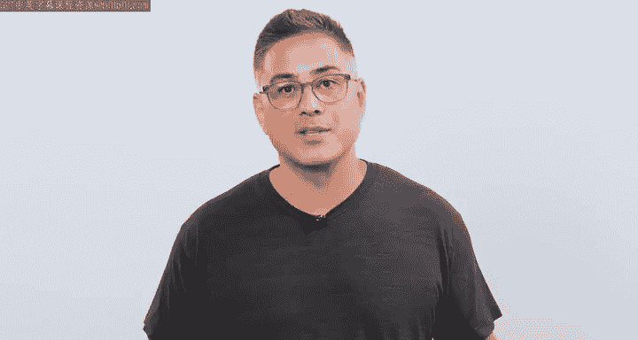

# 037：数据工程基础概念总结 🎯

在本节课中，我们将回顾数据工程基础课程中涵盖的核心主题与概念。课程围绕数据工程生命周期及其底层支柱展开，探讨了在云端构建数据解决方案的技术与最佳实践。通过实验练习，你已亲手实践了这些概念。现在，我们将所有内容整合起来，为最终的顶点实验做好准备。

---

## 数据工程师的思维方式 🧠

上一节我们介绍了课程的整体框架，本节中我们来看看数据工程师的思维方式。启动新数据项目时，应始终采用逆向工作法。

以下是具体步骤：
1.  首先识别利益相关者的需求，以及他们如何从你提供的数据中获取价值。
2.  将这些需求转化为系统要求。
3.  选择能够满足这些要求的合适工具与技术。
4.  开始构建并迭代你的数据系统。

当你专注于最终用户及其数据需求时，你就能为组织创造价值。

---

## 数据系统的构建：摄取与处理 🔄

上一节我们介绍了如何从需求出发，本节中我们来看看如何构建数据系统。构建数据系统通常从从源系统摄取数据开始。

摄取方式取决于源系统的类型，例如：
*   **数据库**
*   **文件系统或对象存储中的文件**
*   **流式系统**
*   **API**

你可以通过**批处理摄取**模式从文件或数据库摄取历史数据，也可以使用**流式摄取**从流式系统中实时摄取数据。虽然批处理和流式摄取常被分开讨论，但它们实际上存在于一个连续体中，范围从**低频次、大批量**的数据摄取到**实时、逐条消息**的流式传输。在这两者之间，存在广泛的**微批处理**和**流式**方法。摄取方法的选择应由利益相关者的需求和系统要求来指导。

批处理和流式摄取都可以作为**ETL**（提取、转换、加载）或**ELT**（提取、加载、转换）流程中的提取阶段。在ETL中，你在将数据加载到目标系统之前进行转换；而在ELT中，你在将数据加载到目标系统之后进行转换。这两种模式的选择取决于：
*   要对数据应用何种转换。
*   处理工具和目标系统的硬件规格。
*   数据的大小。

---

## 数据转换与建模 ⚙️

上一节我们讨论了数据摄取，本节中我们来看看数据的转换与建模。数据转换包括清理和合并来自多个源的数据，以及将数据转换为目标模式。

目标模式取决于你创建的数据模型。如果为分析服务数据，你可能会选择**星型模式**或**单一大表**模型。这些模型可以帮助最终用户更轻松、高效地编写分析查询。

如果为数据科学或机器学习服务数据，处理数据的方式和程度将取决于你的组织以及最终用户是想探索数据、使用数据训练机器学习模型、进行预测还是其他目的。

应用转换时，你可以执行简单的**SQL查询**，也可以用像**Python**这样的非声明性语言编写灵活、复杂的代码。根据数据量的大小，你可以使用**非分布式处理工具**（如`pandas`）或**分布式框架**（如`Spark`）来处理数据。

你还了解到，对于分析用例，可以在**云数据仓库**内部处理大量数据，以利用云计算的大规模并行处理能力。像**DBT**这样的工具也促进了数据仓库内部的数据建模。

---

## 数据存储：数据仓库、数据湖与湖仓一体 🏗️

上一节我们介绍了数据转换，本节中我们来看看不同的数据存储解决方案。与关系数据库类似，数据仓库期望具有明确定义模式的结构化数据集。当最终用户向数据仓库发出分析查询时，其查询优化器会寻找最佳执行计划，然后基于此计划返回结果。

数据仓库更适合分析工作负载，因为它们基于**列式存储**，这使得其在聚合查询方面比面向行的**事务型数据库**更高效。

另一方面，你可以使用构建在低成本对象存储之上的**数据湖**来支持需要海量结构化和非结构化数据的应用，例如**机器学习**和**大数据处理**。为防止数据湖变成无法使用的“数据沼泽”，你可以创建**数据目录**来跟踪和管理数据湖中的数据存储。

你还了解了**湖仓一体**架构，它结合了数据湖的低成本、可扩展存储与数据仓库的卓越结构化查询性能和数据管理功能，为提供低延迟分析和机器学习服务提供了一个统一平台。随着数据仓库采用类似数据湖的特性，数据湖融入类似数据仓库的能力，数据仓库、数据湖和湖仓一体之间的界限正变得模糊。

---

## 数据工程的底层支柱 🔐

上一节我们探讨了数据存储方案，本节中我们来看看支撑数据工程的底层支柱。在**安全**方面，你使用**IAM**来确保云上数据系统的安全，防止未经授权的用户访问你的数据和资源。**VPC、路由表、网络ACL和安全组**等网络概念也有助于保护资源。

在**数据管理**方面，你通过以下方式实践良好的管理：
*   对数据进行建模。
*   使用数据目录。
*   合理组织数据存储，使最终用户更容易找到数据。

你的最终用户也需要信任你的数据。通过在数据管道中使用像**Great Expectations**和**Glue Data Quality**这样的工具来测试和监控数据质量，确保你提供的数据能为利益相关者带来价值。

你还应用了**DataOps的自动化**支柱，使用像**Terraform**这样的**基础设施即代码**工具来自动化数据管道资源的创建和管理，并使用**Airflow**来编排整个数据管道。

---

## 课程总结与顶点实验 🚀

现在，你已经了解了如何设计和构建涵盖数据工程生命周期每个阶段并融合数据工程关键底层支柱的数据工程解决方案。

在本课程的最终实验中，你将有机会使用一个端到端的数据管道，将所有概念整合起来。顶点实验包括两部分：
1.  在第一部分，你将创建并配置数据管道的资源。
2.  在第二部分，你将把数据质量检查和编排集成到数据管道中。

为帮助你准备顶点实验，请在下一个视频中与我一起查看一些示例代码和补充材料，这些将有助于你完成实验。之后，你可以自由开始实验，或者如果你想在开始前了解实验任务概览，可以观看实验讲解视频。

---

本节课中我们一起学习了数据工程的核心生命周期阶段（摄取、转换、存储、服务）、关键数据存储架构（数据仓库、数据湖、湖仓一体）以及支撑整个流程的底层支柱（安全、数据管理、DataOps）。这些知识为你构建可靠、高效且有价值的数据解决方案奠定了坚实基础。