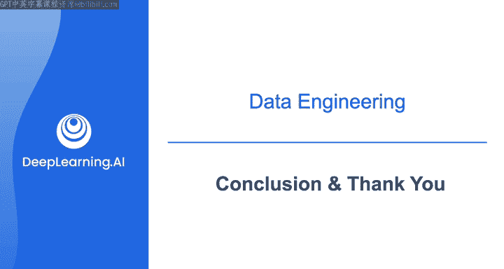
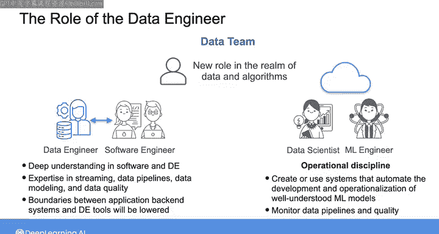
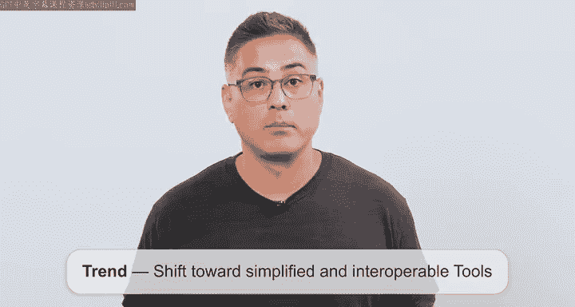
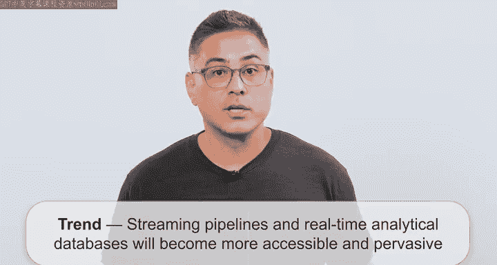

# 038：第4课 - 完结篇 🎓

在本节课中，我们将回顾整个数据工程专业证书课程，并探讨数据工程领域的未来发展趋势。课程最后，吴恩达老师将分享他对行业变化的见解，并为你的持续学习提供个人建议。

## 课程回顾与框架介绍

恭喜你完成了数据工程专业证书课程。希望你已经爱上了数据工程，并对在工作中应用所学知识充满信心。

在之前的课程中，我们一直在Matt H.和我所著的书中描述的“生命周期”和“潜流”背景下学习数据工程。

我们定义生命周期阶段和潜流的目标，是提供一个能够经受时间考验的框架。即使支撑生命周期每个阶段的基础工具和技术在不断变化和演进，这个框架依然有效。

## 数据团队的角色演变

在整个课程中，我们一直在数据团队的背景下审视数据工程师的角色，例如与软件工程、数据科学和机器学习等角色的关系。

然而，随着数据日益紧密地嵌入每一个业务流程，软件工程、数据工程、数据科学和机器学习之间的界限正变得越来越模糊。数据和算法领域将会出现新的角色。

虽然无法预测未来，但一种可能性是：随着机器学习工具集变得更易于使用和管理，云机器学习服务能力不断增强，数据工程和机器学习工程将融合在一起。机器学习正从临时的探索和模型开发，转变为一门运营学科。

这个融合角色的主要目标将是**创建或利用能够自动训练模型、监控性能并使整个机器学习流程投入运营的系统**。对于已被充分理解的模型类型，他们还将监控数据管道和质量，这与当前数据工程的领域有所重叠。

今天的机器学习工程师可能会变得更加专业化，专注于研究性质更强、尚未被充分理解的模型类型。

## 软件工程与数据工程的交汇

另一个职称可能发生变化的领域是软件工程和数据工程的交叉点。融合了传统软件应用与分析功能的“数据应用”将推动这一趋势。

因此，工程师需要对数据工程有更深入的理解。他们将发展在**流式数据管道、数据建模、数据质量**等方面的专业知识。数据工程师将被整合到应用开发团队中，而软件开发人员也将掌握数据工程技能。

应用后端系统和数据工程工具之间的界限也将被打破，通过流式和事件驱动实现深度集成。

## 数据工程的未来工具与技术趋势

在数据技术以令人疲惫的速度持续演进之际，数据工程的工具和技术将走向何方？

我认为数据工程领域将持续的一个主要趋势是：向简化易用的工具发展，并追求跨应用和系统的互操作性。抽象化可以简化开发流程，让工程师能更专注于解决复杂的、高附加值的问题，而不是管理底层基础设施和代码。

因此，如果工具变得更易用，数据工程师将向价值链上游移动，专注于更高层次的工作。

我还认为，**流式管道和实时分析数据库**将变得更易获取和普及。虽然这些技术已存在一段时间，但随着快速成熟的托管云服务，以及对流数据业务用例的清晰聚焦，你将能更轻松地部署它们。

当然，批处理转换不会完全消失。批处理对于模型训练、季度报告等场景仍然有用。但流式转换将成为常态。

## 人工智能与数据工程工作流的整合

现在，谈谈将人工智能整合到数据工程师工作流中的热门话题。似乎每家公司都想做人工智能（无论那具体意味着什么）。

当我深入研究那些能产生实际影响的人工智能用例时，像 **GitHub Copilot** 这样的工具浮现在脑海中。对许多公司来说，它是从人工智能中获取价值的“入门途径”。这就像为你的工程团队配备实习生和初级工程师，他们非常有说服力，但常常需要重写他们的代码。不过大多数时候，代码输出是过得去的，或者至少最终是可用的。

但有一个问题：我不认为人工智能辅助的工作流会很快取代手写代码，因为工程师仍然更喜欢编写代码。工程师想要“工程”。敲击键盘对工程师来说是一种非常具体且宣泄的体验。人工智能编码助手和智能体工作流，在大多数时候只是让完成工作变得更容易。

以上是我预计在不久的将来会在数据工程领域看到的一些趋势。

## 给学习者的建议与鼓励

最后，我想给你一些建议，供你在独自探索这个领域、努力构建数据工程技能和基础时参考。

我鼓励你**着手进行自己的数据工程项目**。在课程资源部分，你可以找到一些数据工程项目示例的链接，它们可以作为灵感来源，还有一些你可以深入阅读的博客，以继续自我教育。

同时，我鼓励你**作为社区的一部分继续交流**。参加线下聚会，提出问题，并分享你自己的专业知识。你还应该通过阅读书籍、博客文章、论文，以及聆听领域专家的演讲来了解最新发展，这能帮助你发现热门技术和实践的优势与陷阱。

课程到此结束，你已经完成了！

但如果你有兴趣听取行业专家的更多见解和职业建议，请查看本课程的最后一个可选课时。在那里，你会找到我与一些朋友（包括Jack Wilson, Carly Taylor和Ben Rojan）录制的访谈，他们谈论了如何开启数据领域的职业生涯，并提供了个人的技巧和建议。

感谢你与我一同踏上这段数据工程之旅。我祝愿你在职业生涯中一切顺利，并迫不及待想看到你运用在本课程中学到的知识所构建的成果。

## 总结

本节课中，我们一起回顾了整个数据工程课程，探讨了数据工程、软件工程、数据科学和机器学习等角色界限的模糊化趋势，以及未来工具向易用性、互操作性和流式处理发展的方向。我们还讨论了人工智能在工程工作流中的辅助作用，并获得了持续学习和参与社区实践的建议。希望这些内容能为你的数据工程之路提供清晰的指引和持续的动力。