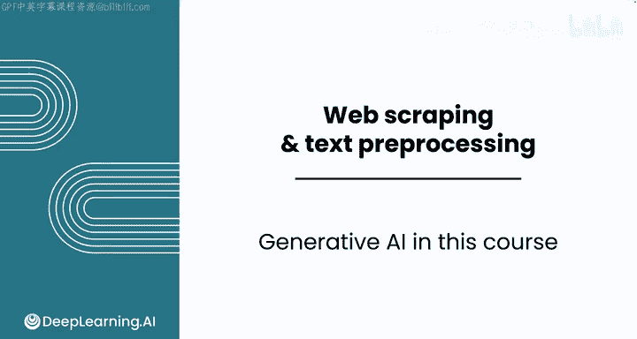
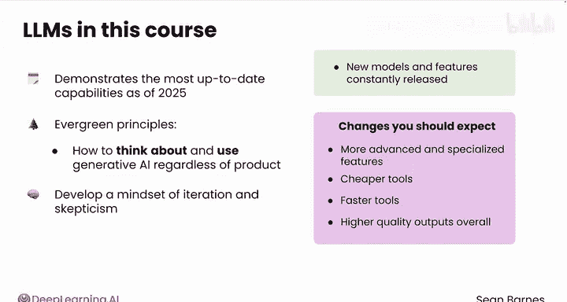
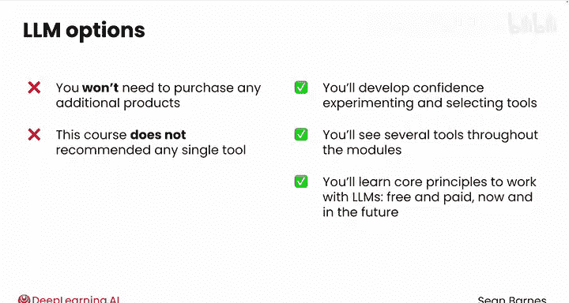

#  002：生成式AI在本课程中的角色 🧠

在本节课中，我们将要学习生成式人工智能（特别是大语言模型）在本课程中的核心作用、教学理念以及如何将其作为提升数据分析技能的辅助工具。

本课程的一个关键要素是学习如何与生成式人工智能，特别是大语言模型（LLMs）协同编程。有效使用LLMs将帮助你简化工作流程，并在职场中脱颖而出。

## 生成式AI作为技能补充 🔧

上一节我们提到了LLMs的重要性，本节中我们来看看团队关于在课程中使用生成式AI的核心哲学。

首先，LLMs是你作为数据分析师技能的**补充**，而非**替代品**。它们是一个优秀的编程伙伴，可以帮助你编写代码和修复错误。然而，只有在你自身懂得如何编码的前提下，你才能最大化利用LLM的潜力。

在本课程中，你将学习编码和与LLM协作的基础知识。你将建立代码解读能力，并培养对LLMs擅长何种任务以及可能在何处出错的直觉。你还将使用Coursera平台内置的实验聊天机器人来辅助你的代码编写。

## 课程的时效性与核心原则 🧭

本课程展示了截至2025年初的最新功能，我们预计在未来数月和数年内会有变化。本课程旨在传授**经久不衰的原则**，即如何在工作中思考和使用生成式AI，无论你使用何种具体产品。

你将培养一种**迭代**和**怀疑**的思维模式。新的模型和功能在不断发布，以下是你近期可以预期的一些变化：

以下是未来LLMs可能的发展方向：
*   **更先进和专门化的功能**：例如能够替你使用应用程序的生成式AI工具。
*   **更便宜、更快速、更高质量**的工具和输出。

总体而言，跟上这个领域的快速发展是具有挑战性的，但无需担心。在本课程中，你将发展所需的元认知技能，以便在工作中驾驭这些技术进步。

## 工具选择与课程实践 💻

本课程也展示了一些LLMs的付费功能，但你无需购买任何额外产品即可完成作业。让你了解现有的选项（包括付费选项）非常重要，这样你才能建立信心，在工作中尝试并选择最佳工具。

本课程不推荐任何单一工具。你将在各个模块中看到多种工具。请记住，你将学到的**核心原则**将使你准备好与现在和未来的免费及付费LLMs协同工作。

你将在接下来的几个视频中遇到第一个LLM演示。现在，请与我一起进入下一个视频，了解本模块所有令人兴奋的主题。我们那里见。😊