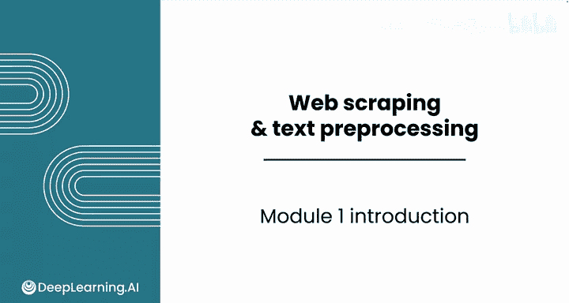
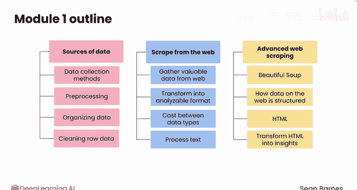

#  003：网络爬虫与文本处理入门 🕸️📝

在本课程中，我们将学习如何从真实世界的网站中获取数据，并对其进行处理，为后续分析做好准备。我们将探索不同的数据来源、学习基础的网络爬虫技术，并掌握关键的文本预处理方法。

## 概述

本模块将为你提供处理从真实网站获取数据的基础工具，重点在于数据的收集与分析前的准备工作。

## 第一课：数据来源与预处理的重要性

在第一课中，你将了解各种数据来源，并看到不同的数据收集方法如何服务于独特的业务需求。你还将探索预处理、组织和清理原始数据在为有效分析准备数据集时所扮演的关键角色。

## 第二课：从网络抓取结构化数据

上一节我们介绍了数据来源，本节中我们来看看如何从网络获取数据。

在第二课中，你将学习如何从网络上抓取结构化数据。你将编写代码从网络收集有价值的数据，并将其转换为可分析的格式。

以下是本课将涉及的核心技能：
*   学习如何在不同的数据类型之间进行转换。
*   使用 `contains`、`replace`、`split` 和 `strip` 等常用方法处理文本。

## 第三课：使用BeautifulSoup进行高级网页抓取

在掌握了基础抓取后，我们将面对更复杂的挑战。

在第三课，也是最后一课中，你将使用名为 **BeautifulSoup** 的出色Python模块来处理更高级的网络抓取挑战。你将探索网络上的数据是如何使用HTML构建的，以及如何将原始的HTML转化为可操作的见解。

## 总结

本节课中我们一起学习了从网络获取数据并对其进行处理的基础技能。到本模块结束时，你将掌握从网络获取数据并处理数据以为分析做好准备的基础技能。让我们在下一个视频中开始学习。