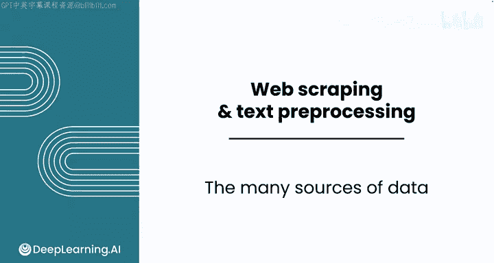
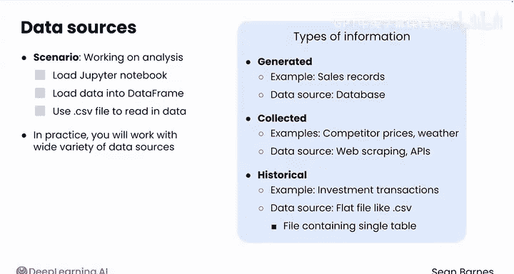
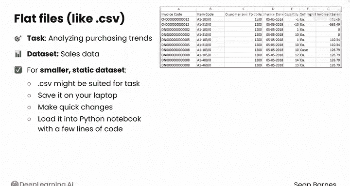
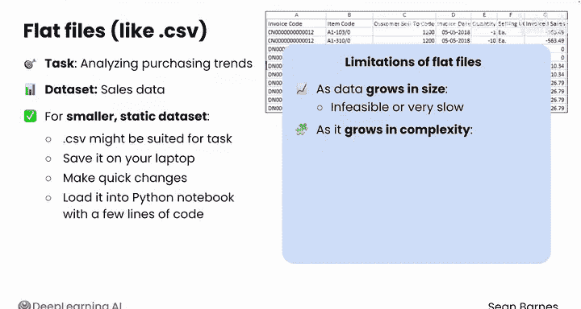
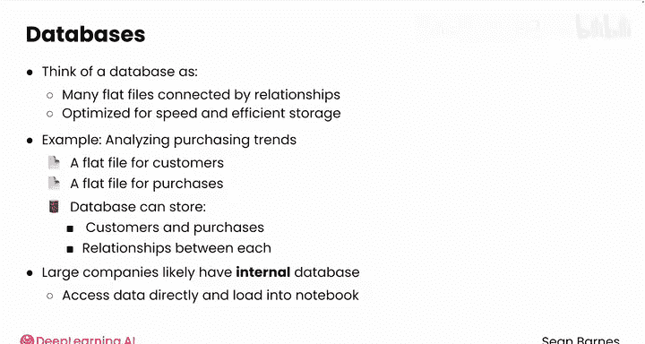
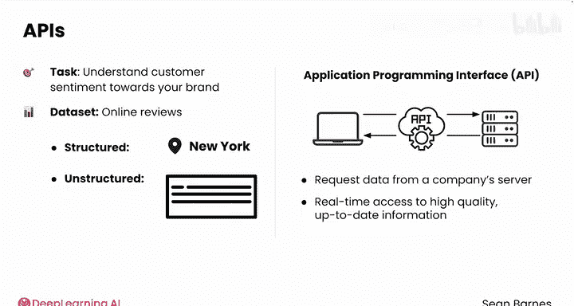
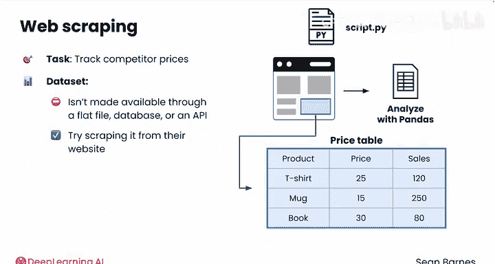

#  004：多样化的数据来源 📊

## 概述

在本节课中，我们将要学习数据分析师在日常工作中可能遇到的各种数据来源。你将了解到，数据不仅来自简单的CSV文件，还可能来自数据库、API接口以及网页。理解这些来源的特点和适用场景，是进行有效数据获取和预处理的第一步。

---

企业每天都在生成和收集大量信息。

根据你作为分析师需要解决的问题，你会遇到来自不同来源的数据。

假设你即将开始某项分析工作，并打开了你的Jupyter笔记本。

你的第一步通常是将数据加载到一个数据框中。到目前为止，你一直使用CSV文件来读取数据，这对于许多应用场景是可行的。但在实践中，你将处理各种各样的数据源，而不仅仅是CSV文件。

思考一下你可能用于分析的不同类型的信息。

首先，是你自己生成的信息，例如销售记录。CSV文件似乎不是存储这类信息的合适场所，因为一旦有人完成一笔销售，你的CSV文件就过时了。在接下来的模块中，你会看到这类数据通常是从数据库中加载的。

其次，是你实时收集的信息，例如监控竞争对手的价格或跟踪天气。这类信息可以通过网络爬虫获取（你将在本模块中学习），或者通过应用程序编程接口（API）获取（你将在下一个模块中遇到）。

最后，是历史信息，例如你去年的投资交易记录。这类信息很可能从一个平面文件（如CSV）中加载，因为它不会再被更新。平面文件指的是包含单行列表格的文件。

让我们来探讨几种常见场景，在这些场景中你可能会处理来自这些常见来源的数据：平面文件、数据库、API和网络爬虫。

---

## 平面文件 📄

如果你正在分析客户的购买趋势，你很可能会依赖销售数据。

这些数据是结构化的，意味着它们可以存储在行和列中。当你只处理一个较小的静态数据集时，CSV文件可能非常适合这项任务。你可以将它保存在笔记本电脑上，进行快速修改，并用几行代码将其加载到你的Python笔记本中。

但是，随着数据量的增长，将其存储在单个电子表格中可能会变得不可行或处理速度非常慢。随着数据复杂性的增加，你可能需要将数据存储在具有关系的多个表中。你可能还需要存储和处理非结构化数据。随着越来越多的人需要使用和编辑文件，你将需要管理访问权限。

---

## 数据库 🗃️

数据库解决了平面文件的大部分缺点。你可以将数据库视为许多通过关系连接起来的平面文件，它们针对速度和高效存储进行了优化。

例如，假设你仍在分析客户的购买趋势。你可能有一个客户信息的平面文件和一个购买记录的平面文件。数据库可以存储这些客户和购买记录，以及每个客户与其所做购买之间的关系。一个规模更大、更成熟的公司很可能拥有某种内部数据库系统。你可以直接从数据库访问数据并将其加载到你的Python笔记本中，以便进行分析。

---

## 应用程序编程接口（API） 🔌

现在，假设你想扩展你的购买趋势分析，以更好地了解客户对你品牌的情绪。这类客户情绪信息可能最好从你公司的在线评论中找到。这些评论混合了结构化和非结构化数据，例如评论者所在的城市（结构化）和他们评论的原始文本（非结构化）。在线评论网站通常会为你和其他愿意付费的人提供一种方式，通过应用程序编程接口（API）直接访问这些评论数据。

API允许你直接通过公司的服务器请求数据，这是他们为此目的提供的。API对你很有用，因为它提供了对另一个平台收集的、高质量且最新的信息的实时访问。

---

## 网络爬虫 🕸️

现在，假设你想将跟踪竞争对手价格作为你购买趋势分析的一部分。这些数据通常不会由你的竞争对手通过平面文件、数据库或API直接提供。他们不会让你轻易获取。如果其他方法都不可用，你可以尝试从他们的网站上抓取数据。

网络爬虫的过程包括编写代码来访问该网站，识别你需要的部分（如价格表），并将该数据保存为结构化格式。然后，你可以像处理任何其他数据一样，通过将其加载到Pandas数据框中来分析这些数据。

---

## 总结

本节课中，我们一起学习了数据分析中四种主要的数据来源：**平面文件**、**数据库**、**API**和**网络爬虫**。来自所有这些来源的数据都可以加载到你的Python笔记本中进行处理和分析。根据其来源，数据将需要不同级别的预处理，即你在分析之前采取的步骤。请跟随我进入下一个视频，看看如何进行这些预处理步骤。