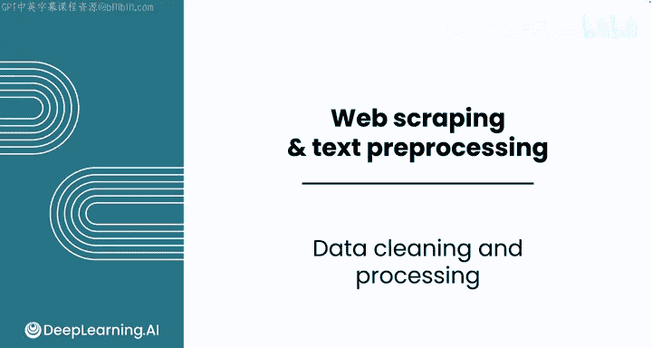
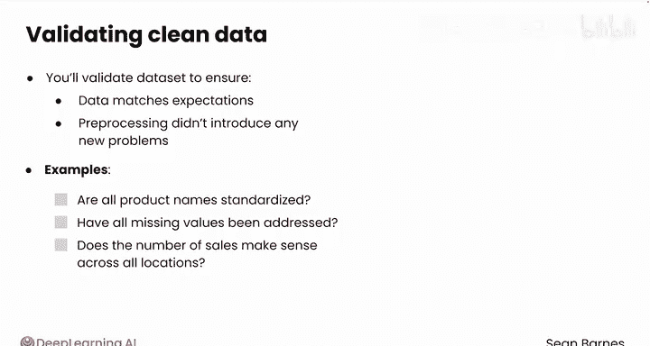

#  005：数据清洗与处理 🧹

在本节课中，我们将要学习如何将原始、混乱的数据转化为适合分析的形式。我们将了解数据预处理和数据清洗的核心概念、常见步骤以及它们之间的区别。

收集到的数据很少能直接用于分析。

## 为什么需要预处理？🤔

上一节我们介绍了数据分析的起点是数据。本节中我们来看看，为什么原始数据通常不能直接使用。

如果你学习过之前的数据分析基础课程，你探索过“Ask a Manager”薪资数据集。该数据集包含了数千份回复，每个人分享了其职位、行业和薪资的详细信息。虽然这个数据是一个极好的资源，但它也存在许多不一致之处。

以下是2019年“Ask a Manager”薪资调查结果的另一个视图。每一行代表一份调查回复，每一列是调查中的一个特征或问题。

想象一下，你想计算所有回复的平均薪资。这似乎是一个简单的问题。然而，如果你查看E列（你的年薪），会发现许多不同的格式。第一行没有逗号，而第二行和第三行有。第15行包含一个尾随的美元符号和空格，而不是逗号。从其在单元格左侧对齐的方式可以看出，Google Sheets实际上将其视为文本而非数字。需要一些工作来确保这些数据格式一致，以便正确分析所有结果。

假设你想分析参与调查者的所在地点。查看G列（“你位于哪里？”）。这是一个非常模糊的问题，自由文本回复导致了多种不同类型的答案。前三行是美国城市，格式良好。但第6行是英国的一个城市。下一行也在英国，但包含一个更广泛的区域，可能是因为回复者想保护其身份。分析“回复者来自哪里”这类看似简单的问题，实际上非常具有挑战性。

## 什么是数据预处理？🔧

上一节我们看到了原始数据中的不一致性。本节中，我们将正式定义数据预处理。

你需要对此数据执行一些预处理，为分析做准备。预处理总是从原始数据开始，原始数据是处于原始形式的未处理信息。然后，你将采取措施确保数据更适合分析。

以下是常见的预处理步骤：
*   **删除重复项**：移除完全相同的数据行。
*   **处理缺失值**：处理数据中的空白或缺失信息。
*   **处理异常值**：识别和处理与大多数数据显著不同的极端值。
*   **修复不一致的格式**：统一日期、货币、文本等格式。
*   **选择特征子集**：仅保留与分析相关的列。
*   **将值缩放到共同范围**：例如，将不同尺度的数值归一化。
*   **编码分类变量**：将文本类别（如“男”、“女”）转换为数字形式（如0, 1）。

可以看到，预处理是一个广义的术语。有时你在转换数据，有时你只是在选择与当前业务问题最相关的内容。你采取的预处理步骤将始终取决于具体的业务问题。

## 预处理 vs. 数据清洗 🧽

上一节我们列出了预处理的常见步骤。本节中，我们来区分两个密切相关的概念：数据预处理和数据清洗。

你可能听过“数据清洗”这个术语，其含义与数据预处理相同。确实，许多专业人士交替使用这些术语，尽管它们的含义略有不同。

**数据预处理** 指的是你为准备原始数据进行分析而采取的所有步骤。这包括从过滤、转换和组织数据到使其与特定分析目标保持一致的一切。它也包括数据清洗。

**数据清洗** 是预处理的一个子集，专门侧重于修复数据中的问题，例如纠正错误、修复不一致性和删除重复项。例如，修复产品名称中的拼写错误就属于数据清洗，因为你明确地在纠正原始数据。

因此，虽然这些术语在实践中有所重叠，但数据清洗指的是更大预处理过程中的一个特定步骤。

## 预处理后的步骤：验证与分析 ✅

在完成预处理之后，还需要进行验证，才能进入最终的分析阶段。

预处理后，你需要验证数据集，以确保数据符合你的预期，并且预处理没有引入任何新问题。例如：所有产品名称都标准化了吗？所有缺失值都处理了吗？所有地点的销售数量都合理吗？

一旦你对数据的有效性有信心，就可以进入分析步骤，开始寻找一些有价值的见解。

## 总结 📝

本节课中我们一起学习了数据预处理的重要性。我们了解到原始数据通常包含不一致、错误和多种格式，无法直接分析。数据预处理是一个涵盖数据清洗、转换和组织的广泛过程，旨在使数据适合分析。数据清洗是其中的一个关键子步骤，专注于修复具体问题。预处理完成后，必须进行验证以确保数据质量，然后才能进行深入分析，获得可靠的洞察。

现在你已经了解了为什么数据预处理是分析前至关重要的一步，请跟随我进入下一个视频，在那里你将看到预处理可以在何时发生。希望你能继续学习。

