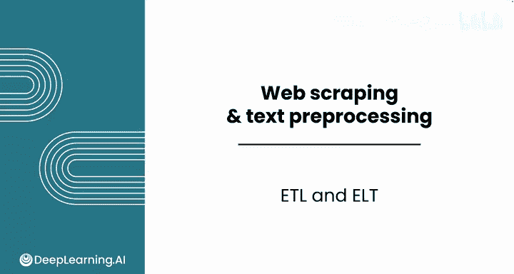
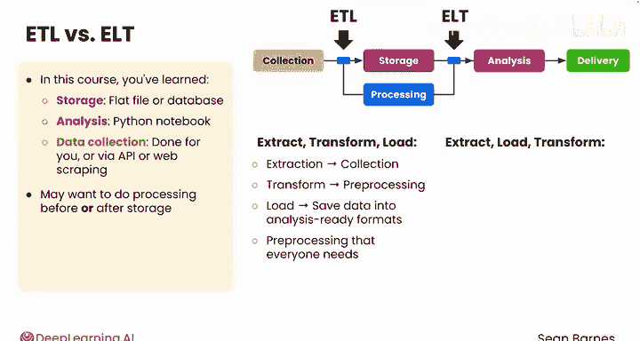
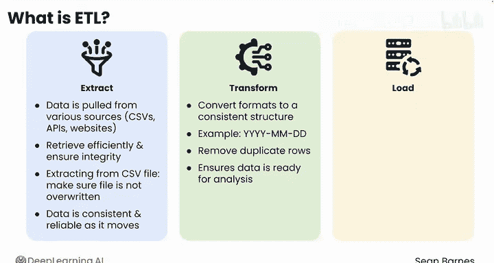
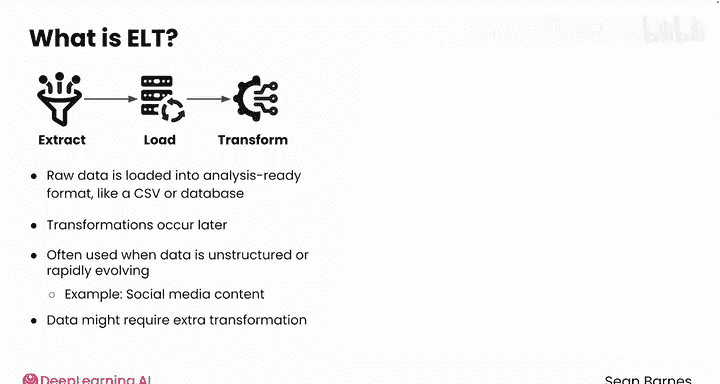
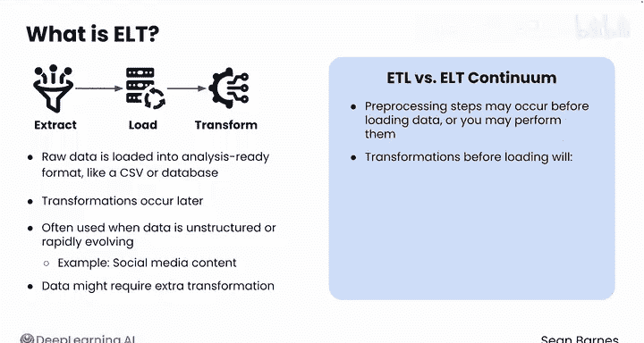
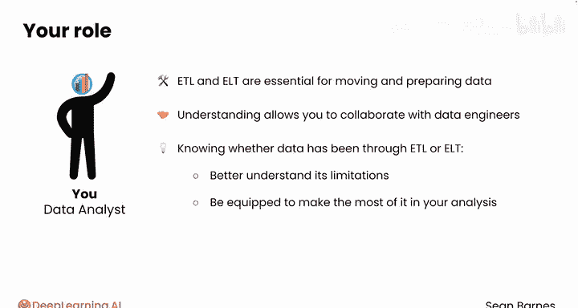

#  006：ETL 与 ELT 🔄

在本节课中，我们将要学习数据在分析前通常需要经历的两种核心预处理流程：ETL 和 ELT。理解这两种模式的区别，能帮助你更好地与数据团队协作，并明确你手头数据的处理状态。

数据在准备好进行分析之前，通常会经历许多预处理步骤。

根据所需的预处理类型，这些步骤可能发生在数据生命周期的不同节点。如果你学习过之前的数据分析基础课程，可能会记得这张从数据收集、处理、存储、分析到交付的生态系统图。在本课程中你已经了解到，这里的“存储”通常指像 CSV 这样的平面文件或数据库，而“分析”通常在 Python Notebook 中进行。数据收集可能由他人完成，也可能根据你的用例，通过 API 或网络爬虫自行完成。请注意，此图在多个阶段包含了预处理。根据你的业务问题，你可能希望在存储之前或之后进行处理。

## ETL：提取、转换、加载

在数据存储之前进行处理，称为 **ETL**（提取、转换、加载），即图中左侧的模块。

*   **提取** 本质上是收集数据。
*   **转换** 指的是预处理。
*   **加载** 是指将数据保存为可供分析的格式，例如数据库或 CSV。

你可以将 ETL 中的转换视为每个人都需要的预处理。例如，如果你的公司有来自不同门店的销售数据，数据团队可能会标准化数据格式、清理客户姓名、移除明显的重复项等。

## ELT：提取、加载、转换

如果在数据存储之后进行处理，则称为 **ELT**（提取、加载、转换），即图中右侧的模块。数据被收集后，先加载到你的 Python Notebook 中，然后再进行预处理和分析。这种方式相对不那么常见，数据团队会按原样加载数据，或将部分预处理留到后期进行。这通常在数据下游使用者有不同需求时采用。例如，如果团队定期收集在线评论，他们可能就按原样保存，以防不同的分析师（比如你自己）想对这些评论进行不同类型的分析。

上一节我们介绍了 ETL 和 ELT 的基本概念，本节中我们来详细看看 ETL 流程的每一步。

## 深入 ETL 步骤

以下是 ETL 流程的三个核心步骤：

**提取**
ETL 流程的第一步是提取，即从 CSV 文件、API 或网站等各种来源拉取数据。提取的目标是高效地检索数据，同时确保数据源的完整性。例如，当从 CSV 文件中提取数据以在 Python Notebook 中分析时，你需要确保文件在此过程中不会被覆盖或编辑，这样数据在流程中才能保持一致和可靠。

**转换**
提取之后，数据被转换。例如，你或数据团队的其他成员可能将所有数据格式转换为一致的结构（如 年-月-日），或移除重复行。这种转换确保了数据已准备好进行分析。

**加载**
最后，转换后的数据可以被加载到可供分析的格式中，如平面文件或数据库。然后，你可以使用像 Python Notebook 这样的工具读入数据进行分析。这一步将数据带入你已经熟悉的格式，让你无需执行大量预处理即可开始分析。

## ELT 流程的特点

在 ELT 中，原始数据首先被加载到可供分析的格式（如 CSV 或数据库）中，转换可以稍后进行。企业通常在数据是非结构化或快速变化（如社交媒体内容）的情况下采用这种方法。但使用 ELT 流程也意味着，数据在使用前可能需要在 Python 或其他工具中进行额外的转换步骤。

在实践中，ETL 和 ELT 之间存在一个连续谱。

一些预处理步骤可能发生在将数据加载到数据库或 CSV 之前，而另一些步骤可能由你个人执行。正如你刚才看到的，在加载前发生的转换将确保数据完整性并支持一致的分析，且不应阻碍后续分析。例如，你的数据工程师可能会标准化来自不同地区的数据格式，但他们不太可能从时间戳中移除毫秒，即使这些数据对许多应用来说似乎不必要。这些数据通常会被保留，以防万一有用。

## 总结与回顾

本节课中我们一起学习了 ETL 和 ELT 这两种移动和准备数据以供分析的重要流程。虽然你可能不直接负责建立这些流程，但理解它们的工作原理将使你能够与数据工程师有效协作。更重要的是，了解你的数据是经过了 ETL 还是 ELT，意味着你能更好地理解其局限性，并有能力在你的分析中充分利用它。

在第一课中做得很好！接下来你将完成练习作业以测试所学知识。完成后，请加入下一课，我们将动手实践网络爬虫和数据清理。

