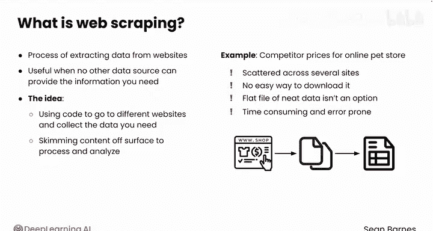
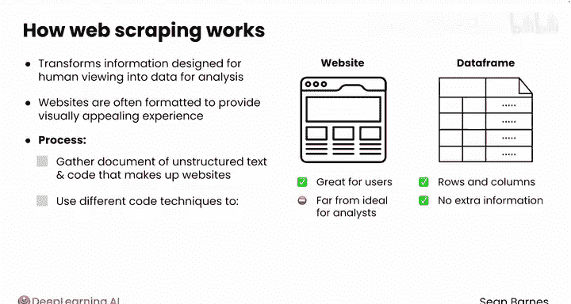
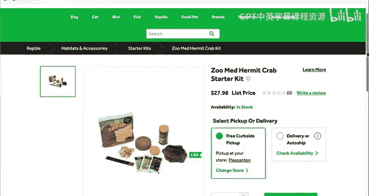
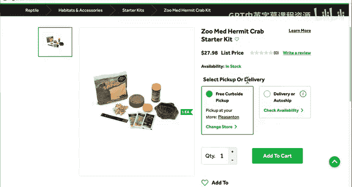
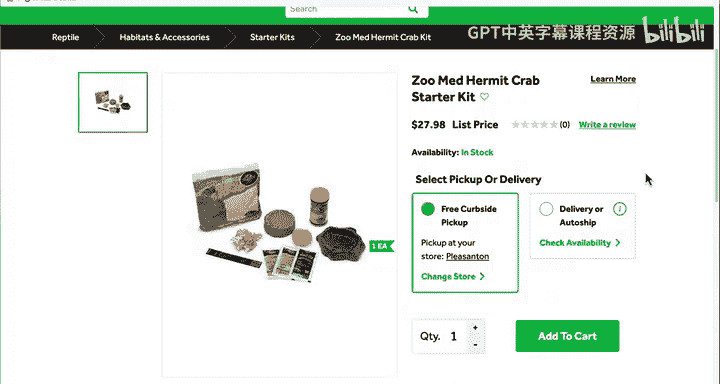
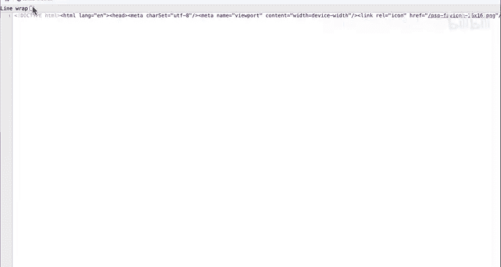
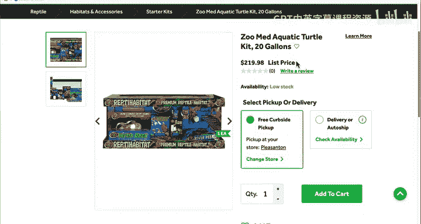
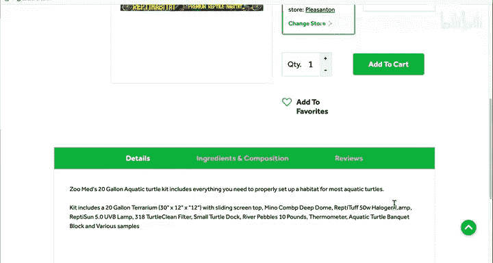
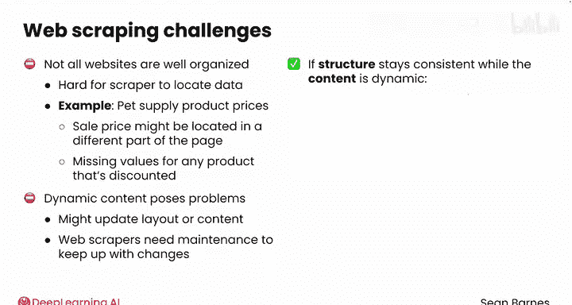

#  007：网络爬虫介绍 🕷️

在本节课中，我们将要学习网络爬虫的基本概念、工作原理及其在数据分析中的价值。网络爬虫是一种从网站提取数据的技术，尤其适用于当其他数据源无法提供所需信息时。

## 什么是网络爬虫？

上一节我们介绍了数据收集的多种方法，本节中我们来看看网络爬虫的具体定义。网络爬虫是从网站提取数据的过程。在之前的课程中你了解到，当没有其他数据源能提供所需信息时，网络爬虫通常非常有用。

例如，假设你作为一名数据分析师，正在为一家在线宠物商店研究竞争对手的价格。你所需的数据可能分散在多个电子商务网站上，且没有简单的下载方式。在本课程中你已经遇到的数据收集方法，即下载所需数据的平面文件，在这里并不适用。

你可以手动访问不同的竞争对手网站，复制每个产品的价格，并将这些信息输入电子表格，但这将是一个耗时且容易出错的过程。为何不让计算机为你完成这项工作？这就是网络爬虫背后的理念：使用代码访问不同网站并收集你所需的数据。

如果你将网站想象成一个平面，那么网络爬虫本质上就是从该平面上“刮取”内容以进行处理和分析，因此得名“爬虫”。

## 网络爬虫如何工作？

网络爬虫本质上将设计供人类查看的信息转换为适合分析的数据。网站通常被格式化为人们提供视觉上吸引人的体验，包含菜单、图像等。虽然这对用户来说很好，但对分析师来说远非理想。事实上，这与数据框几乎相反，在数据框中你希望所有内容都整齐地排列成行和列，没有额外信息。

在网络爬虫中，你需要浏览构成网站的一大堆非结构化文本和代码，然后使用不同的编码技术仅提取你需要的数据，通常以行和列等结构化格式呈现。

以下是一个快速示例：假设你正在网上爬取寄居蟹入门套件的价格，以帮助你更好地为自己的产品定价。这是来自宠物用品商店的一个示例产品页面，显示了你感兴趣的寄居蟹入门套件。你感兴趣的是产品名称、价格，可能还有描述（此处称为“详细信息”）。

这里有很多不相关的信息。事实上，比表面上看到的要多。如果你右键单击此页面，然后选择“查看页面源代码”，你可能需要开启开发者工具，实际上可以看到这里有大量信息。

## 网络爬虫的挑战与优势

网络爬虫涉及编写计算机程序来解析所有这些非结构化的文本和代码以找到价格。价格大约在页面三分之一的位置。不用担心所有这些代码，你将看到使用Python，这项任务会变得更容易管理。

酷的是，一旦你编写了爬取此页面的程序，你很可能可以重复使用它。这是另一个水龟套件的产品页面。请注意，标题、价格和描述都位于相同的位置。一个常见的网络爬虫范式是拥有一个你想要收集信息的所有网站的列表，并使用相同的代码爬取每个网站。

网络爬虫为数据分析师带来了许多挑战。首先，并非所有网站都组织良好，这使得你的爬虫难以定位你需要的数据。例如，假设你正在爬取宠物用品的产品价格，如果产品正在促销，价格可能位于页面上与通常不同的位置，这可能导致你的数据中任何打折产品的价格缺失。

动态内容也给爬虫带来了问题。即使一个网站有清晰的结构，它也可能更新其布局或内容，这可能导致你的爬虫程序失效。网络爬虫通常需要维护，以确保它们能跟上这类变化。但是，如果网站结构保持一致，而内容是动态的，你的网络爬虫将真正发挥作用。

例如，你之前看到产品页面通常以一致的方式格式化。你可以编写一个爬虫来查找宠物网站上每个产品的价格。网络爬虫将非结构化信息转化为有价值的数据集，为你节省大量时间。

## 总结

本节课中我们一起学习了网络爬虫的基本概念。我们了解到网络爬虫是一种从网站提取数据的技术，尤其适用于没有现成数据源的情况。它通过解析网站的HTML代码，将非结构化的网页内容转换为结构化的数据，如行和列。虽然网络爬虫面临网站结构不一致、动态内容等挑战，但它能极大地提高数据收集的效率。在接下来的视频中，我们将学习如何使用Python编写代码来爬取表格数据。