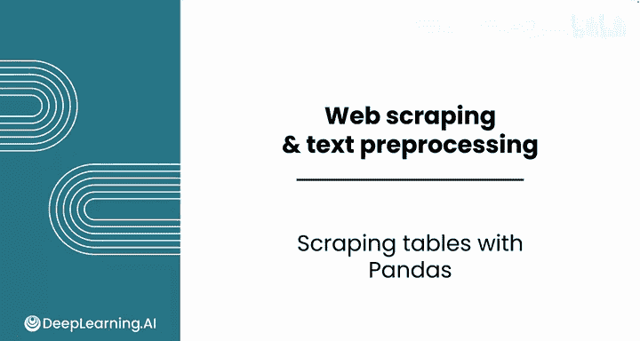
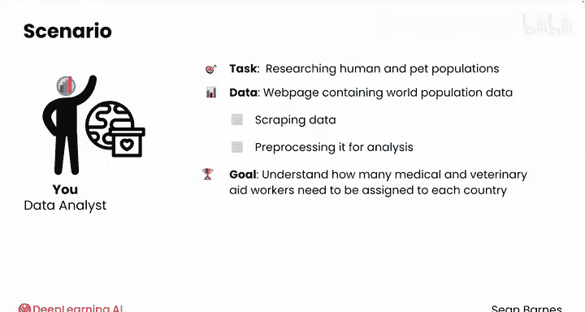
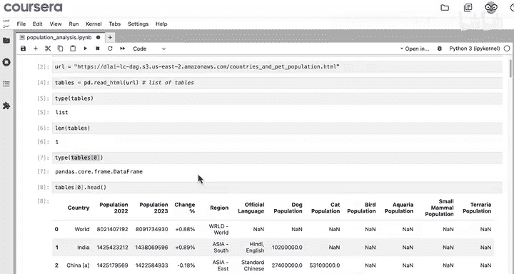
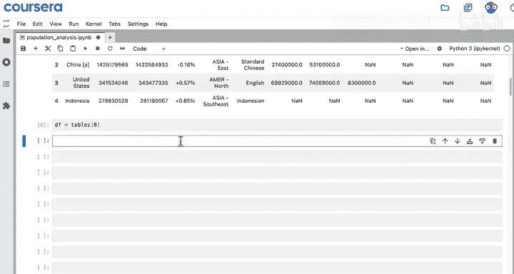
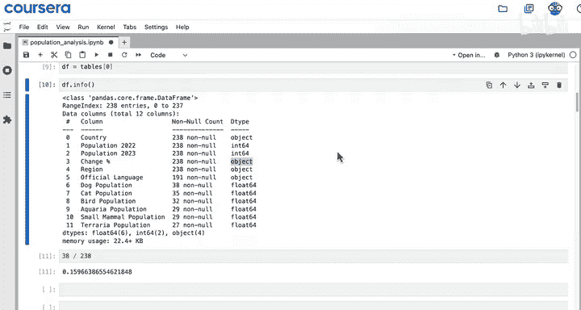
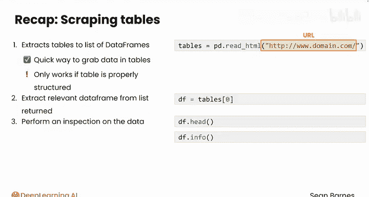

#  008：使用Pandas抓取表格数据 📊

在本节课中，我们将学习如何使用Pandas库从网页中抓取表格数据，并将其转换为适合分析的结构化格式。我们将通过一个实际案例——为国际援助组织研究全球人口和宠物数量——来掌握这一技能。

## 概述

在上一节视频中，我们了解到网络爬虫可以将非结构化的网页内容转换为适合分析的数据。本节中，我们将动手实践，学习如何使用Pandas的`read_html`函数来抓取网页上的表格数据。

## 熟悉网页内容

在从任何网页抓取数据之前，需要先熟悉其内容。我们使用的网页改编自维基百科的“农村人口”页面。该页面以表格形式呈现数据，每一行代表一个国家或地区，每一列代表该国家或地区的某个特征，例如2022年或2023年的人口、狗的数量、所属区域、官方语言等。

这种表格格式与DataFrame非常相似。如果数据已经在DataFrame中，我们就可以计算人均狗的数量，进行排序，并执行其他分析。

需要注意的是，数据中存在大量缺失值。例如，我们有印度的狗数量，但没有猫或鸟的数量。在分析时需要留意这一点。

## 开始抓取数据



让我们打开一个新的Python笔记本来开始抓取这个页面。你可以使用练习实验室项目来跟随演示。



首先，导入Pandas库，这是我们在之前课程中已经熟悉的操作。

```python
import pandas as pd
```

接下来，将目标网页的URL保存为一个字符串变量。

```python
url = ‘网页URL地址‘
```

Pandas提供了一个名为`read_html`的函数，它可以将网页中存储的表格数据转换为DataFrame。这个过程比较复杂，因此并不总是完美运行，并且只适用于以特定方式存储的表格。

```python
tables = pd.read_html(url)
```

运行这行代码后，Pandas会访问该网址，查找所有格式正确的表格，并将它们存储在一个列表`tables`中。

## 检查抓取结果

现在检查`tables`变量的类型，它是一个列表。

```python
type(tables)
```

检查这个列表的长度，确认其中只有一个表格，这与网页上只有一个表格的情况相符。

```python
len(tables)
```



要显示这个表格，需要获取列表中的第一个元素。

```python
df = tables[0]
```

检查`df`的类型，确认它是一个DataFrame。



```python
type(df)
```

因为是DataFrame，所以可以使用`.head()`方法查看前五行数据。

```python
df.head()
```

这前五行数据与我们之前在网页上看到的表格完全一致。为了在本节课后续操作中更方便，我们将其保存在变量`df`中。

最后，使用`.info()`方法查看数据的摘要信息。

```python
df.info()
```

结果显示有238行和12列。“非空计数”列显示，只有38行有狗的数量数据，这意味着我们只有大约15%的国家有相关数据。此外，Pandas自动检测到了许多数值列，但“变化百分比”这一列虽然应该是数值，却被表示为“object”类型。在Pandas中，“object”通常代表文本，当Pandas不确定如何安全地将数据转换为整数或浮点数时，会默认将其视为文本。

## 本节总结



在本节中，我们一起学习了如何使用`pd.read_html()`从网页抓取表格数据。



*   `pd.read_html()`函数提取网页中的表格，并将其存储在DataFrame列表中。
*   该函数接受一个参数，即要抓取的网页URL（字符串形式）。
*   `read_html`是快速获取表格数据的方法，但要求表格结构正确。
*   从函数返回的列表中提取出相关的DataFrame后，就可以使用`.head()`、`.info()`以及之前课程中学过的任何其他DataFrame函数和方法来检查数据。

做得很好！你已经看到，使用`pd.read_html`是提取网站所有表格的快捷方法。请跟随我进入下一个视频，在那里你将学习如何清理字符串数据以进行分析。