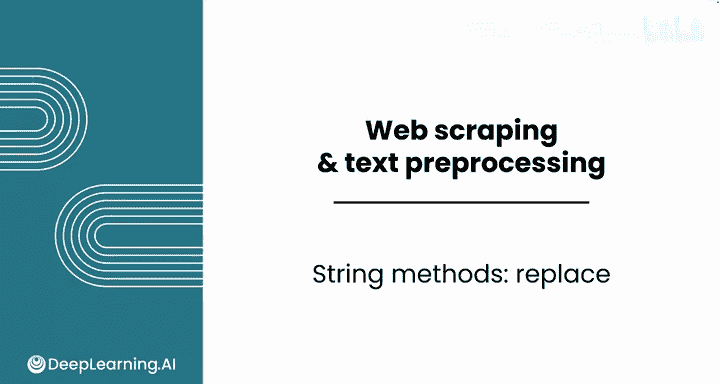
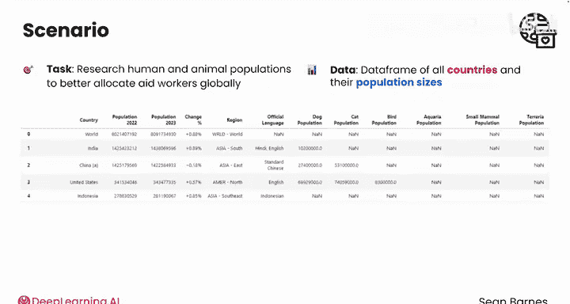
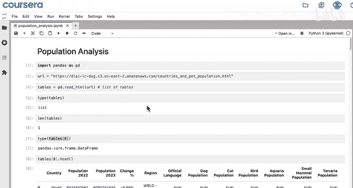
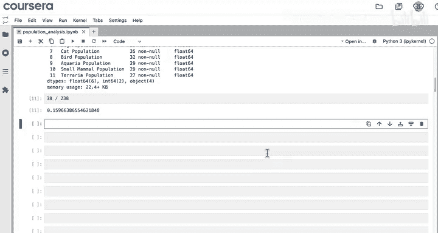
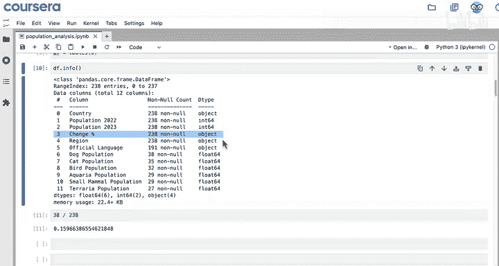
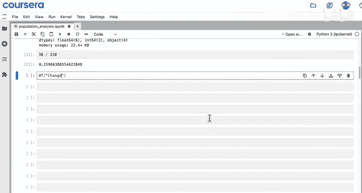
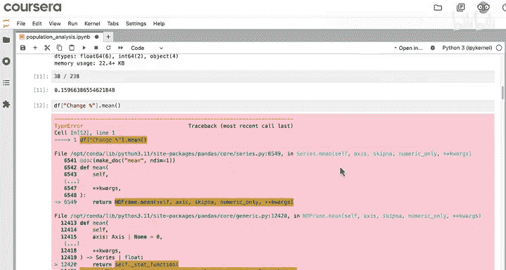
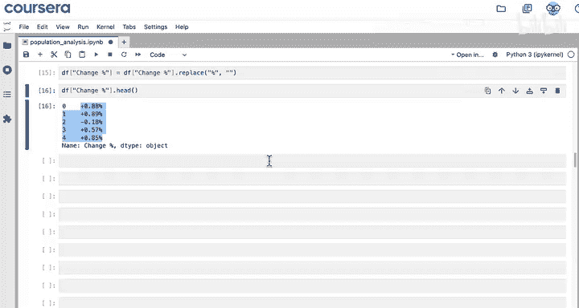
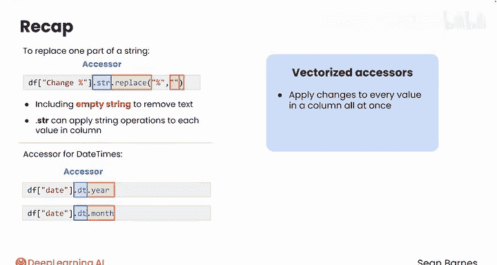

#  009：替换方法 📝

在本节课中，我们将学习如何使用Python中的字符串替换方法，来清理从网页抓取的数据。数据常常包含不需要的字符（例如百分号），这会影响后续的数值计算。我们将重点学习`.replace()`方法以及如何在Pandas数据框中正确应用它。

---

## 概述

上一节我们介绍了从网站抓取的数据可能存在混乱或不完整的情况。本节中，我们来看看如何使用文本处理方法进行数据清洗。具体来说，我们将学习如何移除字符串中不需要的字符，例如百分比符号，以便将文本数据转换为可用于计算的数值类型。

## 数据背景回顾

作为国际援助组织的数据分析师，你的任务是研究全球人口数据，以便更合理地分配援助人员。你抓取了一个包含世界各国及其人口规模的数据框。在分析过程中，你发现“年度人口变化百分比”这一列被存储为文本（对象类型），而不是数值类型（浮点数）。这给计算带来了不便。

例如，如果你尝试使用`.mean()`方法计算全球所有国家的平均增长率，会遇到错误。

```python
# 尝试计算平均增长率会导致错误
df['Percent Change'].mean()
```



错误信息显示：“无法将字符串（如‘+0.88%’）转换为数值”。这表明，在自动将这些对象转换为浮点数之前，需要先移除百分号。







## 字符串替换方法介绍





`.replace()`方法允许你将字符串的一部分替换为另一部分。它还可以用于完全移除某些字符，例如百分号。



### 基本替换示例

假设你有一个包含四个国家名称的列表，并希望将“United States”替换为“USA”。

```python
countries = ["China", "India", "United States", "Indonesia"]
countries_replaced = [country.replace("United States", "USA") for country in countries]
print(countries_replaced)
# 输出：['China', 'India', 'USA', 'Indonesia']
```

### 移除字符示例

要移除字符串中的百分号，你可以将百分号替换为空字符串。

```python
value = "+0.88%"
clean_value = value.replace("%", "")
print(clean_value)
# 输出：'+0.88'
```

**注意**：空字符串不是空格，它不包含任何字符。

## 在Pandas数据框中应用替换

现在，我们希望在整个数据框的列上执行此操作，移除每个单元格中的百分号。

### 初次尝试（常见错误）

直接对列使用`.replace()`方法可能不会按预期工作。

```python
df['Percent Change'].replace("%", "")
```

运行后，该列看起来与之前完全相同。这是因为Pandas的`.replace()`方法旨在替换整个单元格的值，而不是值的一部分。当列被当作一个整体字符串处理时，此方法无效。

### 正确方法：使用`.str`访问器

要解决这个问题，我们需要使用`.str.replace()`方法。`.str`是一个访问器，它允许我们将字符串方法应用于Series（列）中的每个元素。



以下是正确的操作步骤：

```python
# 使用.str.replace()移除百分号
df['Percent Change'] = df['Percent Change'].str.replace("%", "")
```

现在，再次查看该列的前五个值：

```python
df['Percent Change'].head()
```

你应该会看到正负浮点数，不再包含百分号。

## 关键概念总结

以下是本节课的核心概念：

1.  **`.replace()`方法**：用于替换字符串中的特定部分。
    *   **公式/代码**：`string.replace(old, new)`
2.  **`.str`访问器**：在Pandas中，用于对Series中的每个元素应用字符串方法。
    *   **公式/代码**：`series.str.method()`
3.  **向量化操作**：`.str`和之前学过的`.dt`（用于日期时间）都是向量化访问器。这意味着它们可以一次性对整个列应用更改，而无需编写循环，从而提高了效率。



## 总结

本节课中，我们一起学习了如何使用`.replace()`方法清理文本数据。我们了解到，直接对Pandas列使用`.replace()`可能无法处理单元格内的部分字符串，而需要通过`.str.replace()`来正确执行操作。数据并不总是干净且可以直接分析的，但借助`.replace()`等工具，我们可以将杂乱的字符串转换为可用的数据。

在下一节视频中，我们将更进一步，学习如何将这些清理后的字符串转换为数值类型，以便进行数学运算和分析。