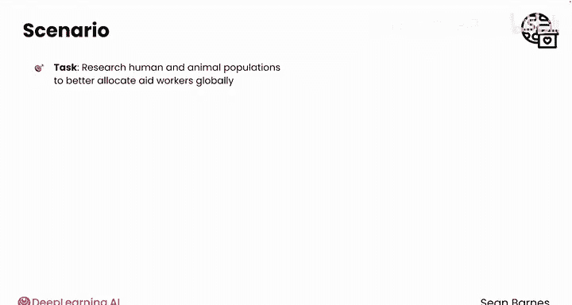
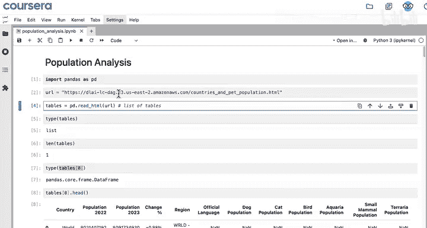
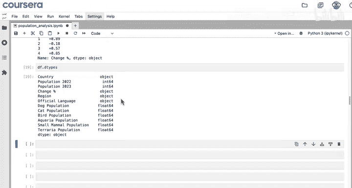
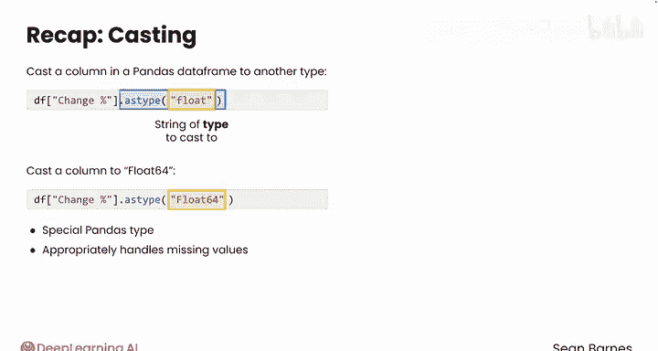

#  010：类型转换 🧩

在本节课中，我们将学习如何在Python数据分析中，将数据从一种类型转换为另一种类型。你将了解到，信息的类型决定了可以对其执行哪些操作。有时数据以一种类型呈现，但你需要以另一种类型处理它。这时，你可以通过“类型转换”来改变数据类型。这是一个常见任务，尤其是在处理网络爬取或文本密集型数据集时。

## 回顾与情境

上一节我们介绍了用于数据清洗的第一个文本处理方法——`replace`。本节中，我们来看看另一个强大的工具：类型转换。

你实际上已经在Python中遇到过类型转换：`pd.to_datetime`函数将字符串转换为日期类型。尽管你完全没有改变信息本身，只是改变了它的类型，但这个函数开启了新的可能性，例如能够使用`weekday`方法来查找日期的星期几。

让我们看看类型转换的实际应用。


简单回顾一下，你作为国际援助组织的数据分析师，任务是研究国际人口和动物种群，以便在全球更好地分配援助人员。你爬取了一个包含世界各国及其人口规模的有用数据框来进行分析。

你一直在本笔记本中工作，爬取了一个世界人口表格并将其保存在变量`df`中。你还从“变化百分比”列中移除了百分号，为类型转换做好了准备。此时，该列中的数据仍然是对象类型（即文本），尝试计算平均百分比变化仍然会产生错误。





## 使用 `astype` 方法进行转换

但是，你可以使用`astype`方法转换这一列。`astype`接受一个参数：一个字符串，代表你想要转换成的目标类型。

对于百分比变化，最合适的类型是浮点数，你可以用字符串`'float64'`来指定。`float64`是pandas中一种特殊的浮点数类型，它也允许缺失值。这在处理网络爬取数据时非常有用，因为缺失值（NaN）非常常见，而`float64`可以妥善处理它们。

像你已经见过的许多方法一样，`astype`不会自动更改原始数据框，因此请确保将转换后的列保存回原始列中。


以下是转换步骤的代码：


```python
df['change_percent'] = df['change_percent'].astype('float64')
```

运行`df['change_percent'].head()`，这些值看起来干净整洁，类型是`float64`（即浮点数）。现在，你可以计算平均增长率了。

```python
average_growth = df['change_percent'].mean()
```

年增长率大约在1%左右。

再次检查数据类型，还有其他列可以转换吗？大部分其他列看起来都很好。唯一可以考虑的是将这些人口列转换为整数而不是浮点数。



## 核心概念总结

在本视频中，你学习了可以使用`astype`方法将pandas数据框中的列转换为另一种类型。该方法接受一个参数：你想要转换成的目标类型的字符串。

你成功地将一列转换为`float64`，这是一种特殊的pandas类型，能够妥善处理缺失值，而你在数据的初步检查中已经识别出了这些缺失值。




## 后续内容预告

在本视频中，你看到在数据预处理过程中规划缺失值至关重要。来自网络的数据通常有很多缺失值。在下一个视频中，你将看到处理缺失数据的常用技术。


## 本节课总结

本节课中，我们一起学习了：
1.  **数据类型的重要性**：数据的类型决定了可对其执行的操作。
2.  **类型转换的概念**：将数据从一种类型（如文本）转换为另一种更合适的类型（如数字）。
3.  **`astype`方法的使用**：通过`df[‘column_name’].astype(‘target_type’)`的语法进行转换。
4.  **`float64`类型的优势**：特别适合处理包含缺失值（NaN）的数据。
5.  **转换后的验证**：转换后应检查数据类型并尝试进行计算，以确保转换成功。

通过掌握类型转换，你能够将原始、杂乱的文本数据转化为可以进行数学计算和深入分析的规整数值数据，这是数据清洗和预处理的关键一步。