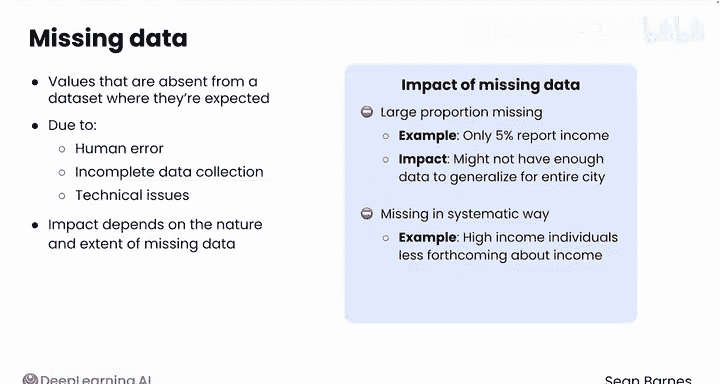
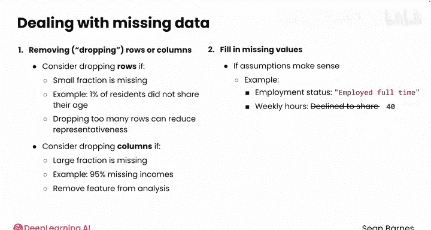
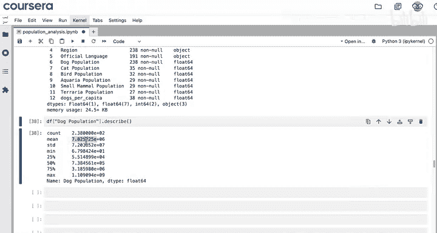
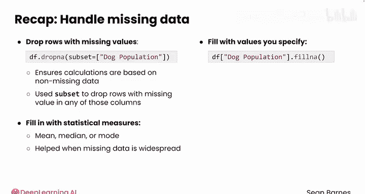

#  011：缺失值处理 🧩

在本节课中，我们将要学习如何处理数据集中常见的缺失值问题。缺失值会影响分析的准确性，因此掌握有效的处理方法至关重要。

在之前的课程中，我们学习了如何从网页抓取的表格中提取信息。然而，提取的数据常常是不完整的。事实上，缺失值是处理真实世界数据集时的一个常见问题。

## 缺失值的影响

缺失数据指的是数据集中预期存在但实际缺失的值。数据缺失的原因可能包括人为错误、数据收集不完整或技术问题。

缺失数据对分析的影响取决于缺失数据的性质和范围。如果缺失的观测值比例很大，分析结果可能无法推广。例如，假设你正在收集城市居民的人口统计数据，但只有5%的受访者报告了他们的收入。即使使用推断统计，你也可能没有足够的数据将结果推广到整个城市。

其次，数据缺失通常是有系统性的，而非随机的。在人口统计数据中，高收入人群往往不太愿意透露自己的收入。因此，你的数据更有可能缺失较高范围的收入，这可能导致你的分析得出城市平均收入低于真实水平的错误结论。

## 处理缺失值的选项




为了处理缺失数据，你有几个选择。

### 选项一：删除缺失值

一种选择是删除包含缺失值的行或列。这个过程通常被称为删除行或列。

以下是考虑删除行或列的情况：
*   **删除行**：如果只有一小部分数据缺失，可以考虑删除行。例如，如果你正在分析人口统计数据，只有1%的居民没有分享他们的年龄，你可以考虑在年龄分析中直接移除这些居民。
*   **删除列**：当某一列有大量数据缺失时，可以考虑删除该列。在95%收入数据缺失的情况下，你可以选择从分析中移除这个特征。

### 选项二：填充缺失值

另一个选择是填充缺失值。你应该谨慎地填充值，并且只在你的假设合理的情况下进行。

例如，在你的人口数据中，假设你询问了就业状况和每周工作时间。如果一个人回答是全职工作但拒绝分享每周工作时间，你可以考虑用40小时来填充缺失值。一个无效的方法是用零来填充这些缺失值，因为这不符合数据本身的逻辑假设。

更复杂的方法是用描述性统计量来填充缺失值，例如均值、众数，甚至使用回归或机器学习来填充最佳值。



## 实战演练：在Notebook中处理缺失值

让我们通过一个Notebook示例来看看如何处理缺失值。

回顾一下，到目前为止，我们已经从网页上抓取了这个人口数据表，并在适当的地方将值转换为浮点数。假设你被要求估算每个县处理犬只数量所需的志愿者人数。

使用 `df.info()` 方法，你已经注意到“犬只数量”这一列有200个缺失值。

**方法一：删除缺失行**

如果你只想分析已有的确切数据，可以使用 `dropna` 方法来删除缺失“犬只数量”的行。你可以使用名为 `subset` 的参数，它应该是一个列名列表。

```python
df_with_dogs = df.dropna(subset=['dog_population'])
```

现在，检查 `df_with_dogs.info()`。你只剩下38个县的数据，并且“犬只数量”列没有缺失值了（尽管其他动物的数量仍有缺失）。你可以从这里继续分析，估算这些县所需的援助人员数量。

这是一种方法。但是，有没有更复杂的方法可以让你为所有县创建估算值呢？

**方法二：填充缺失值**

一个想法是用合理的猜测来填充原始数据集中的这些缺失值。例如，你可以计算每个县的人均犬只数量，然后用该县的人口乘以人均比率来填充缺失值。让我们试一试。

首先，在原始数据框中创建一个新列 `dogs_per_capita`，即犬只数量除以2023年人口。

```python
df['dogs_per_capita'] = df['dog_population'] / df['population_2023']
```

使用 `.describe()` 获取该列的基本统计信息，你会看到人均犬只数量的平均值是0.137。让我们用这个比例来填充缺失值。

```python
df['dog_population'] = df['dog_population'].fillna(df['population_2023'] * 0.137)
```



`fillna` 在这里很有用，因为它会保留任何现有值，只填充缺失的值。

很好，再次查看 `df.info()`，现在“犬只数量”列有238个非空值。通过 `df['dog_population'].describe()`，你可以看到均值和标准差，这可能有助于你估算所需的援助人员数量。

## 总结

在本节课中，我们一起学习了如何处理缺失数据。



*   你可以使用 `dropna` 方法删除包含缺失值的行，这确保了计算基于非缺失数据。你使用了名为 `subset` 的参数并传入列名列表，以删除在指定列中任何有缺失值的行。
*   你也可以用统计量（如均值、中位数或众数）来填充缺失值，这在缺失数据更普遍时很有帮助。你看到 `fillna` 方法只会用你指定的值填充缺失值。

尽管缺失值会使你的分析变得复杂，但你现在已经掌握了几个处理它们的好方法。在下一节课中，你将学习一个新的文本处理方法：`contains`。