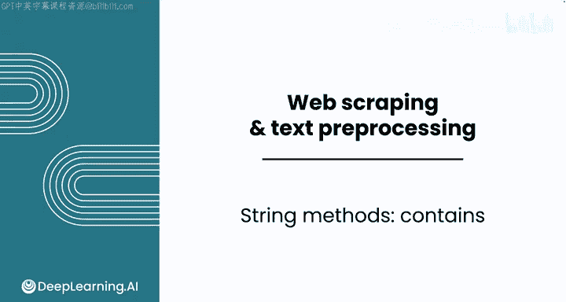
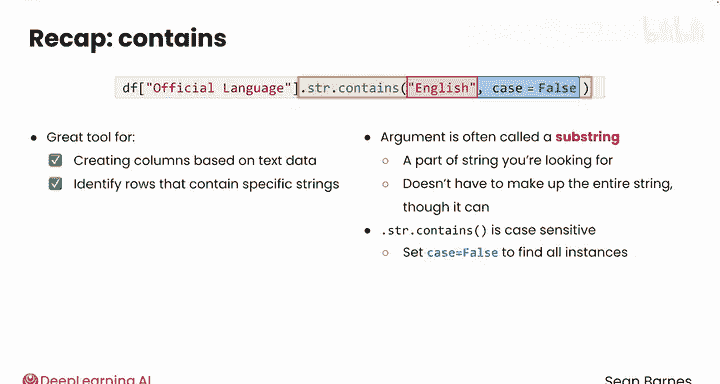

#  012：字符串处理之包含检测 🔍

在本节课中，我们将学习一种常见的数据清洗方法：识别数据中的模式。具体来说，我们将学习如何在文本特征中搜索特定的单词或短语，并以此为基础创建新的数据列或筛选数据。

假设你正在为一个国际援助组织工作，目标是找出最容易部署援助人员的国家。你的援助人员主要会说英语或德语。因此，你希望首先将分析范围限定在那些官方语言中包含英语或德语的国家。我们将通过代码示例来演示如何实现这一目标。

## 回顾与准备

在开始之前，我们先简要回顾一下之前的工作。你已经成功地将一个人口数据表读入变量 `df` 中，适当地转换了数据类型，并填充了“狗数量”列中的缺失值。

上一节我们介绍了数据读取和基础清洗，本节中我们来看看如何基于文本内容进行更精细的筛选。

## 检测字符串包含关系

我们的目标是创建一个名为 `English` 的新列。如果“官方语言”列中包含“English”，则该列的值应为 `True`。

一种简单的方法是检查“官方语言”是否完全等于“English”。让我们先尝试这种方法。



```python
df['English'] = df['official_language'] == 'English'
```

执行这段代码没有报错。然而，我们需要手动验证一下数据。查看 `df.head()` 时，你会发现索引为1的行（对应印度）显示为 `False`，但这并不正确，因为印度的官方语言包含印地语和英语。

因此，我们需要一种策略来检查“English”是否**出现在**这个字符串中，而不仅仅是字符串是否完全等于“English”。

## 使用 `str.contains()` 方法

你可以使用 Pandas 的 `Series.str.contains()` 方法。其用法类似于之前学过的 `Series.str.replace()`。

以下是创建 `English` 列的正确方法：

```python
df['English'] = df['official_language'].str.contains('English')
```

现在再次检查这一列，你会发现印度对应的值变成了 `True`，这符合我们的预期。

接着，你可以用这个布尔列来筛选数据框：

```python
english_df = df[df['English'] == True]
```

这个新数据框 `english_df` 的长度是56，意味着有56个国家的官方语言包含英语。你还可以进行其他有用的操作，例如计算这些国家的总人口：

```python
total_population = english_df['population'].sum()
```

结果显示，超过30亿人生活在以英语为官方语言的国家。

## 关于大小写敏感性的重要说明

需要注意的是，`str.contains()` 默认是**大小写敏感**的。为了演示这一点，你可以分别检查包含大写“English”、小写“english”和全大写“ENGLISH”的国家数量：

```python
# 检查大写 ‘English’
count_upper = df['official_language'].str.contains('English').sum()
# 检查小写 ‘english’
count_lower = df['official_language'].str.contains('english').sum()
# 检查全大写 ‘ENGLISH’
count_all_upper = df['official_language'].str.contains('ENGLISH').sum()
```

在这个数据集中，由于数据相对规整，所以只有大写“English”能匹配到56个国家，其他格式都匹配不到。但为了确保万无一失，你可以添加参数 `case=False` 来忽略大小写：

```python
df['English'] = df['official_language'].str.contains('English', case=False)
```

设置 `case=False` 可以确保你捕获所有格式的“English”实例。再次对 `English` 列求和，结果仍然是56。

## 扩展应用：检测其他语言

使用相同的方法，你可以轻松地创建检测其他语言的列。例如，创建一个检测德语的列：

```python
df['German'] = df['official_language'].str.contains('German', case=False)
```

结果显示，有6个国家的官方语言包含德语。

以下是本课中用到的主要方法总结：



*   **`Series.str.contains(substring)`**：检查序列中的每个字符串是否包含指定的子字符串。
*   **`case=False` 参数**：使检测忽略大小写。

## 课程总结

本节课中我们一起学习了如何使用 Pandas 的 `str.contains()` 方法，这是一个基于文本数据创建新列的强大工具。它允许你识别包含特定子字符串的行。我们还了解到该方法默认区分大小写，但可以通过设置 `case=False` 参数来确保找到所有实例。


通过本课的学习，你为数据清洗工具箱添加了一个强大的文本过滤工具。接下来，我们将更进一步，探索清洗、转换文本数据以及从中提取洞察的更多技巧。