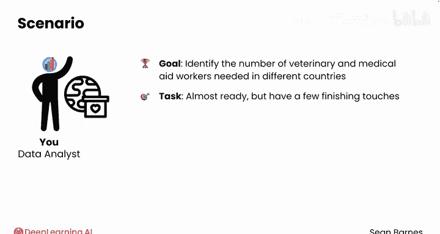
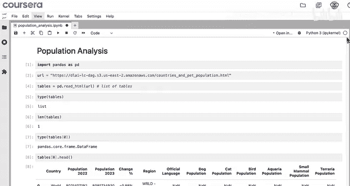
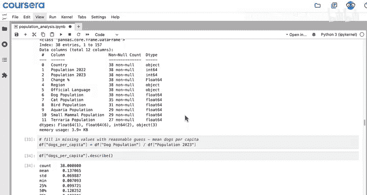
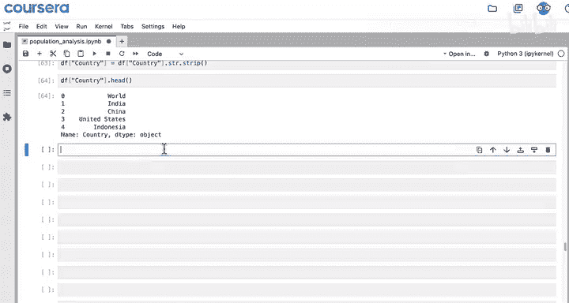
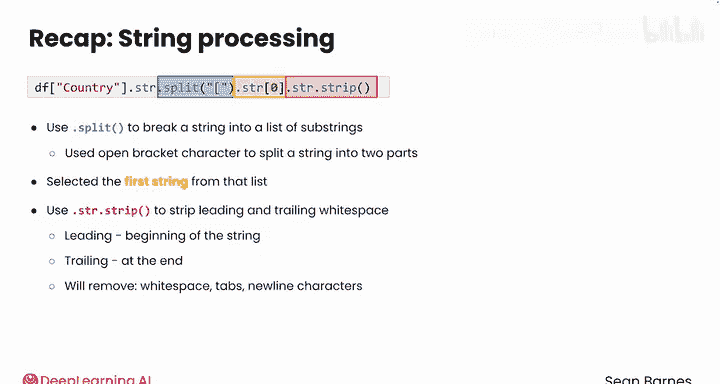

#  013：分割与修剪 📝

在本节课中，我们将学习如何使用Python的`split`和`strip`方法来处理字符串数据。这些技巧在数据清洗中非常实用，能帮助我们清理文本中的多余字符和空白。

---

## 概述

上一节我们介绍了`pandas`的`contains`方法及其在数据清洗中的应用。本节中，我们来看看如何分割字符串以及去除字符串首尾的空白字符。我们将继续使用一个国际援助组织的数据集，目标是清理国家名称列中的脚注引用和多余空格。

## 数据现状回顾


首先，回顾一下我们已经完成的工作。我们读取了人口数据表到变量`df`中，适当地转换了数据类型，并填充了“人口”列中的缺失值。我们还创建了列来标识以英语和德语为官方语言的国家。







现在，查看一下数据的前几行。你注意到索引为2的行（即“国家”列的第三行）有什么问题吗？


“国家”列中多出了一些额外文本，对吧？原始网站包含了一些脚注，用于解释特定国家的特殊情况（例如是否包含某些领土）。这些脚注引用对于我们的分析并非必需，反而会使数据变得杂乱。我们需要清理它们。

## 使用`split`方法分割字符串

你的第一反应可能是尝试使用`str.replace`方法来移除它们，就像在之前的视频中所做的那样。这是一个很好的直觉，但这次的问题更复杂，因为每个脚注引用都是不同的字母。

要清除这些脚注，可以使用`split`方法。该方法在指定的字符处将字符串分割成多个部分。

例如，假设你有一个字符串`"China [a]"`存储在变量`text`中。你可以使用以下命令在开括号字符`[`处进行分割：

```python
substrs = text.split('[')
```

检查`substrs`，你会发现它实际上是一个包含两个元素的列表。字符串被分割了，现在你得到了两个部分。请注意，你用来分割的字符（开括号）已被移除。

那么，要如何访问第一部分“China”呢？你可以使用`substrs[0]`。

## 将`split`应用于整个列

与其他已学的字符串方法（如`replace`和`contains`）一样，你需要使用`.str`访问器。

在将结果保存回列之前，先看看它是什么样子。从`df['country'].str.split('[')`开始，这会为数据中的每一行生成一个列表。

但这并不是我们想要的结果。直接访问索引`0`处的项目，只会给你这一列的第一个值，而这个值本身仍然是一个列表。

这时，我们可以向LLM（大语言模型）寻求帮助。提示可以是：“我正在尝试通过像在开括号处分割`'China [a]'`这样的字符串来移除脚注引用。以下是我的代码。我该如何访问每个列表的第一个值并将其保存回‘country’列？”

LLM的回复指出，你需要再次使用`.str`访问器，并提供了一个代码片段。我们来尝试一下。

## 清理空白字符：`strip`方法

很好，现在让我们先用`.str.contains`检查是否还有括号。尝试检查闭括号`]`，你会发现该列中已经不存在了，这很棒。

最后还有一点收尾工作。再次查看“国家”列，你注意到“China”有什么问题吗？



它多出了一些空白字符，这是在分割字符串时遗留下来的。为了清理这些空白，可以使用`str.strip()`方法，它会移除字符串首尾的空白字符。请务必将结果重新赋值给“国家”列。

现在看起来好多了！你已经从“国家”列中移除了所有的引用脚注。


## 总结

本节课我们一起学习了：
1.  如何使用`split`方法将字符串拆分为子字符串列表。我们使用开括号字符将字符串分割成两部分，然后使用索引`0`从该列表中选取第一个字符串。这个方法使我们能够从“国家”列中移除脚注。
2.  如何使用`str.strip()`方法来去除字符串首尾的空白字符，这是一个常见的文本处理步骤。“首部”指字符串开头，“尾部”指字符串结尾。`.strip()`会移除空格、制表符和换行符。

你在文本处理方面做得非常出色！我们已经在网页抓取的背景下，见识了许多处理Python文本数据的核心方法。

在下一个模块中，你将开始处理从网络上抓取的更复杂的数据。完成本课的练习评估和实践实验室后，希望你能继续加入我的学习。



