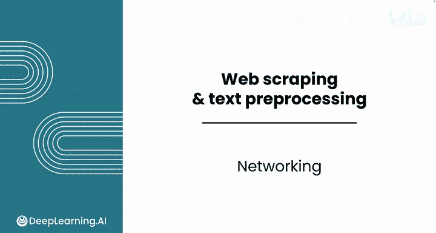
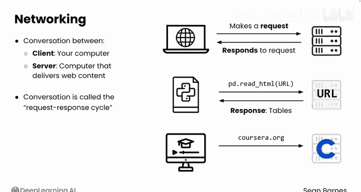
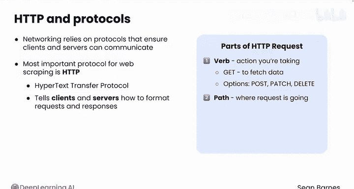
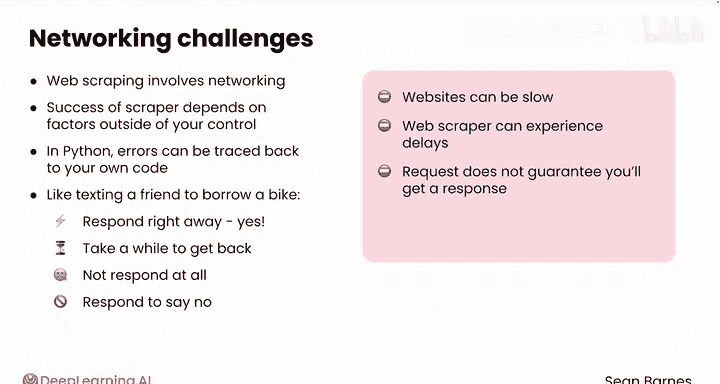
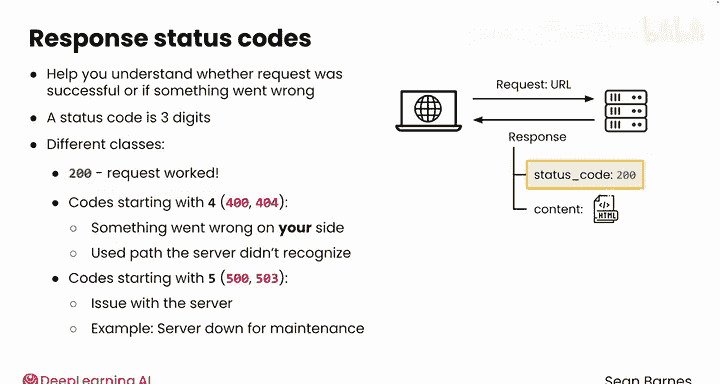

#  014：网络请求基础 🕸️

在本节课中，我们将学习网络请求的基本概念。我们将了解客户端与服务器如何通过“请求-响应”周期进行通信，并探讨在网络爬虫过程中可能遇到的挑战。

---

## 概述

上一节我们介绍了如何从网页抓取数据并进行预处理。本节中，我们将退一步，审视这种涉及网络通信的编程新范式。网络通信类似于你的计算机（客户端）与提供网站内容的服务器之间的对话。理解这个过程对于成功进行网络数据抓取至关重要。

## 客户端与服务器的对话

网络通信可以看作客户端与服务器之间的对话。客户端向服务器发出请求，服务器则对该请求作出响应。这个完整的交互过程被称为“请求-响应”周期。

例如，当你使用 `pd.read_html()` 函数抓取网页时，你的计算机（客户端）会向你指定的URL发送一个请求。服务器则通过返回你请求的表格数据来响应。

这种网络通信不仅发生在Python代码中，也发生在你的浏览器里。当你访问Coursera网站时，你就是在向Coursera的服务器发送请求，而服务器则用其主页内容来响应。

## 通信协议：HTTP

网络通信依赖于协议，即确保客户端和服务器能够通信的标准化规则。对于网络爬虫而言，最重要的协议是**HTTP**（超文本传输协议）。

HTTP协议规定了客户端和服务器应如何格式化请求和响应。一个HTTP请求通常包含两个主要部分。

以下是HTTP请求的两个核心组成部分：

1.  **动词**：定义你要执行的操作。对于网络爬虫，你通常使用 `GET` 来获取数据，但在某些情况下也可能使用 `POST`、`PATCH` 或 `DELETE` 等其他动词。
2.  **路径**：指明请求的目标地址。例如，你作为参数传递给 `pd.read_html()` 函数的URL，就充当了指向你所需数据的路径。

## 网络爬虫的挑战

在你之前的编程中，每个变量和函数都在你的控制之下。然而，网络爬虫涉及与互联网的交互，这个过程引入了新的挑战，因为爬虫的成功与否取决于你无法直接控制的外部因素。

与在Python中编码不同（你可以相当确定程序中的任何错误都可追溯到你自己的代码），网络通信会引入多种挑战。你可以把它想象成发短信向朋友借自行车。

以下是网络请求中可能遇到的几种情况，类似于向朋友借自行车：

*   他们可能立刻热情地回复“可以”。
*   他们可能过一段时间才回复你。
*   他们可能根本不回复。
*   他们可能回复说“不行，我的自行车正在修理”。

你在访问网站时会遇到同样类型的障碍。

## 服务器响应与状态码

网站可能响应缓慢。除了创建非常庞大的可视化图表，你之前的Python代码可能几乎都是瞬间运行的。但你肯定有过访问一个需要很长时间才能加载的网站的经历。网络爬虫也会经历同样的延迟。

更重要的是，发出请求并不保证一定能得到响应。事实上，网站通常会实施不同的措施来保护自己免受不必要的爬取。即使你得到了响应，也可能只是告诉你请求的页面不存在。

当服务器处理你的请求时，它会发回一个包含**状态码**的响应。这些代码帮助你理解你的请求是成功了，还是出了问题。

状态码是一个三位数，分为几类：

*   代码 **200** 表示你的请求成功，你得到了所需的内容。
*   以 **4** 开头的代码（如400或404）表示你这边出了问题，通常是你使用的路径服务器无法识别。
*   以 **5** 开头的代码（如500或503）表示服务器端存在问题，问题不在你。例如，可能在你发送请求时，服务器正因维护而关闭。

## 总结

本节课中，我们一起学习了网络请求的基础知识。我们了解了客户端与服务器通过“请求-响应”周期进行通信，认识了HTTP协议及其请求结构（动词和路径），并探讨了网络爬虫中因依赖外部资源而带来的挑战，如响应延迟和服务器返回的各种状态码。虽然你通常不会手动编写请求-响应周期的每个细节，但理解其工作原理对于有效地进行网络数据抓取非常重要。

请跟随我到下一个视频，开始一项涉及更复杂网络爬虫的新任务。