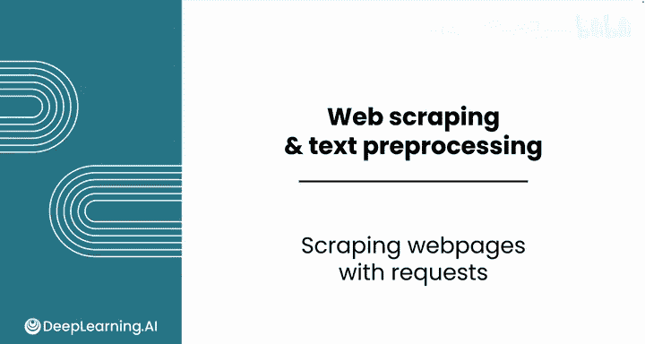
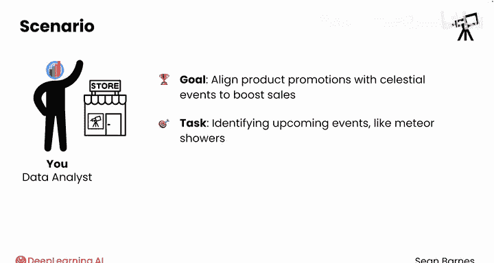
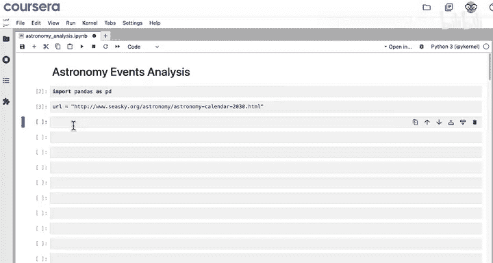
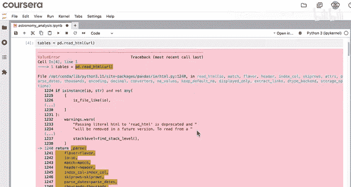
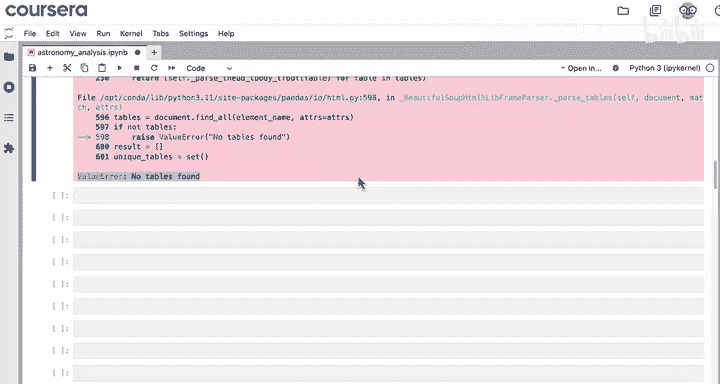
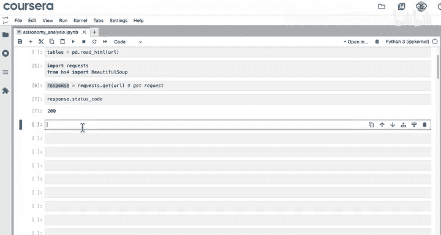
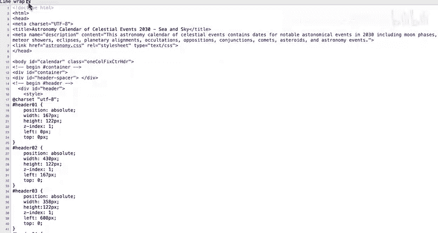
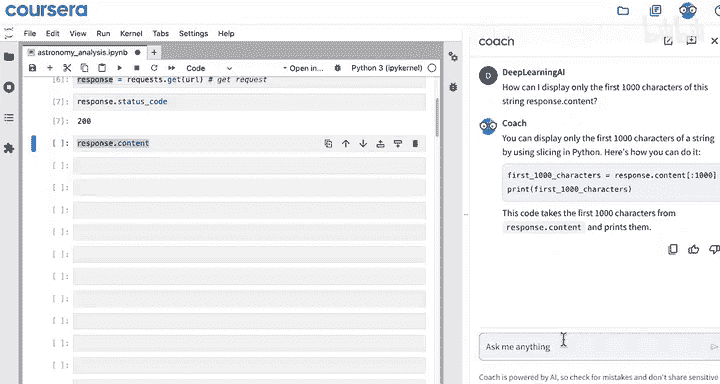
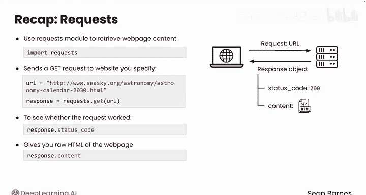

#  015：使用requests库抓取网页 🌐

在本节课中，我们将学习如何使用Python的`requests`库从互联网上获取网页内容。这是进行网络数据抓取的第一步，为后续从复杂网页结构中提取所需信息打下基础。

## 概述

上一节我们介绍了从网页中预处理数据的基础。但现实中，所需的数据通常不会像之前看到的表格那样规整。因此，我们需要掌握从复杂格式中提取信息的创造性方法。

本节中，你将扮演一家专营天文设备（如望远镜）的零售商的数据分析师。公司希望根据天文事件来规划产品促销，以提升2030年的销售额。你的任务是识别即将到来的事件（例如流星雨），以便为每个事件设计主题优惠券。在搜索中，你发现了这个网站：一个包含2030年大量天文事件的日历。

像一月的流星雨这类事件非常适合营销推广。你的目标是从该网站提取日期、事件和描述信息，并将其导入Python笔记本进行处理。

## 获取网页内容





首先，导入`pandas`库。你可以使用练习项目来跟随演示。

```python
import pandas as pd
```

保存目标网站的URL。

```python
url = "https://www.seasky.org/astronomy/astronomy-calendar-2030.html"
```



你可能会首先尝试使用`pd.read_html`。

```python
tables = pd.read_html(url)
```

但你会遇到一个错误。请务必滚动到错误信息的底部查看最新问题，你会看到`ValueError: No tables found`。这是预料之中的，因为检查网站后你会发现页面上并没有表格。所以，`pd.read_html`在处理表格时很好用，但没有表格时就几乎无用。对于这个网站，你需要进行适当的网络抓取。



## 引入新的工具



为了抓取所需数据，你需要两个新模块：
*   `requests`：用于获取网页。
*   `beautifulsoup4`：用于解析网页（“解析”意味着查找并格式化正确的信息）。

之前，Pandas为你同时完成了这两个步骤（请求页面和解析）。现在，你需要自己分别完成这些步骤。

导入这些模块：

```python
import requests
from bs4 import BeautifulSoup
```

现在，你可以使用`requests`模块向这个URL发送一个GET请求。GET请求意味着你要求返回一些信息。将响应保存在一个变量中，例如`response`。你可以为这个变量取任何你觉得有意义的名称。

```python
response = requests.get(url)
```

运行单元格没有产生任何错误。但请记住，网络请求可能以各种方式失败。使用`response.status_code`直接检查状态码。注意，状态码是一个属性，而不是一个方法。

```python
print(response.status_code)
```

结果是状态码`200`，这表示你成功收到了响应，没有任何错误。

现在，你可以打印`response.content`来查看网站发回了什么信息。





```python
print(response.content)
```

输出内容非常多。这本质上与你回到原始页面点击“查看源代码”时看到的网站代码相同。

## 理解响应内容

在这段文本中，埋藏着你需要的所有数据。注意，这个`response.content`以`<!DOCTYPE html>`这样的文本和尖括号开头。这个响应是一个HTML文档。换句话说，它是一个`.html`文件的内容。



**一个小提示**：如果你对笔记本中显示的大量文本感到困扰，可以随时向AI助手寻求缩短显示的建议，例如：“如何只显示这个字符串`response.content`的前1000个字符？”

## 本节回顾

总结一下，你已经了解了如何使用`requests`模块检索网页内容。

以下是关键步骤：
1.  使用`requests.get()`函数向指定的网站URL发送GET请求。
2.  将网站的URL作为字符串输入，函数会返回一个响应对象。
3.  使用响应对象的`.status_code`属性来检查请求是否成功。
4.  最后，使用`.content`属性获取网页的原始HTML，这本质上是完整的网站代码。



现在你已经看到了如何使用`requests`模块获取网站内容，接下来需要更好地理解这些内容是如何组织的。网络抓取通常涉及处理HTML文件。请跟随下一节视频学习它们的工作原理。

## 总结

本节课我们一起学习了网络数据抓取的第一步：使用`requests`库获取网页的原始HTML内容。我们了解了如何发送GET请求、检查响应状态码，并认识到原始HTML是后续信息提取的基础。在下一节中，我们将学习如何解析这些HTML内容以提取出我们真正需要的数据。