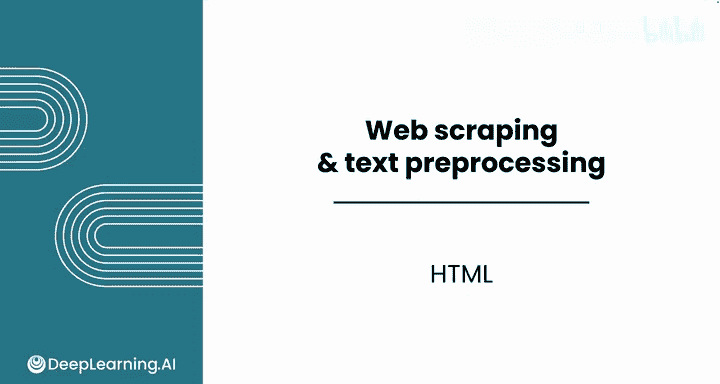
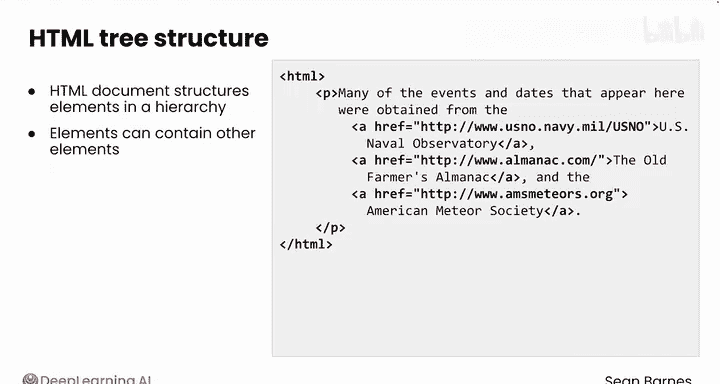
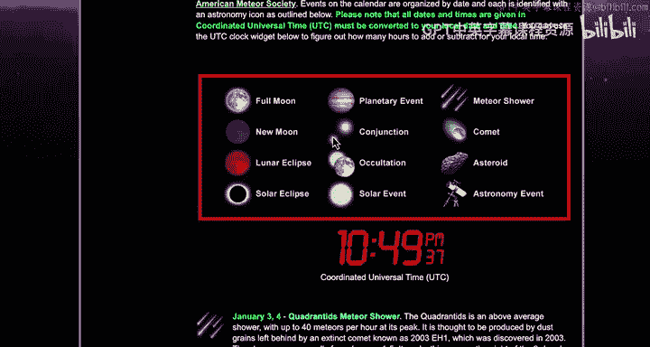
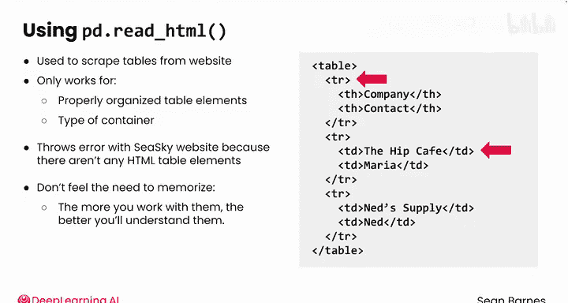

#  016：HTML基础 🏗️

在本节课中，我们将学习超文本标记语言（HTML）的基础知识。HTML是构成网页的骨架，理解其结构对于后续进行网页数据抓取至关重要。

## 概述

上一节我们介绍了如何使用 `requests` 模块获取网页，得到的是一个HTML文档。本节中，我们将深入探索HTML如何用于构建网页结构，以及这种结构如何影响网络爬虫的工作。

## HTML元素与标签

几乎所有网页都使用超文本标记语言。你可以将HTML理解为通过标签增强的文本，这些标签提供了额外的信息。标签通常成对出现，包裹着某些内容。

例如，上一节视频中看到的C sky网站包含页面标题“Astronomy Calendar of Celestial Events for Calendar Year 2030”。这段文本被包裹在 `<h1>` 标签中。`<h1>` 表示一级标题，是最大的标题类型，因此浏览器知道将其格式化为大标题。注意，闭合标签包含一个斜杠 `/`。整个包含标签和内容的块被称为一个**元素**。所以这个标题就是一个 `<h1>` 元素。

常见的元素包括：
*   `<h1>` 到 `<h6>`： 用于标题。
*   `<p>`： 用于段落。
*   `<a>`： 代表“锚点”，用于链接到其他页面。




大多数元素像上面那样同时拥有开始和结束标签。HTML也包含一些**自闭合标签**，它们不需要单独的结束标签。最常见的自闭合标签是 ``，用于图像。

## HTML属性

HTML标签还可以拥有**属性**，这些属性提供了关于元素的额外信息，如大小、颜色、位置或内容来源。属性位于开始标签的尖括号内。

最常见的属性之一是 `<a>` 标签中的 `href`。`href` 属性代表“超文本引用”，它指定了点击该元素时，链接应跳转到的URL地址。

例如，C sky网站上的这个 `<a>` 标签包含内容“US Naval Observatory”，并链接到其网站 `usno.navy.mil`。如果没有 `href` 属性，这个 `<a>` 标签将无法链接到任何地方。

```html
<a href="https://www.usno.navy.mil">US Naval Observatory</a>
```

让我们看看C sky网站上的这个图像标签。它包含四个属性：`src`、`alt`、`width` 和 `height`。

```html

```

*   `src` 代表“源”，指定了要显示的图像的URL或文件路径。此图像显示来自C sky网站的 `calendar-legend.jpeg`。
*   `alt` 代表“替代文本”，是图像加载失败时显示的文本。
*   `width` 和 `height` 告诉浏览器显示图像的尺寸。

## HTML类

HTML类是一种特殊类型的属性，允许你将元素分组，并对它们应用一致的样式或功能。类使用 `class` 属性在HTML标签内定义，通常分配给多个元素。

例如，注意C sky网站上的每个日期都以粗体和绿色格式化。网站没有为每个单独的元素设置颜色和样式，而是将这些元素分组到同一个类 `date-text` 中。

```html
<span class="date-text">January 1</span>
```

使用类来分组元素可以使某些网页抓取任务更容易。在这种情况下，你可以使用一个类属性 `date-text` 来查找该网站中的每个日期（假设格式正确）。

## HTML文档结构

虽然HTML标签描述了视觉元素的目的和外观，但整个HTML文档将各个视觉元素组织在一个**层次结构**中。许多元素可以包含其他元素。例如，一个段落元素 `<p>` 可能包含几个用于链接的锚元素 `<a>`。

HTML的结构就像一棵树，元素被组织在其他元素内部。在树的根部，你会找到 `<html>` 标签，它包含特定网页的所有HTML内容。这种组织结构很重要，因为如果你在寻找一个特定的元素（比如包含天体事件的段落），你需要知道它在HTML树中的位置。




看看C sky网站的组织结构。它被组织成：
*   顶部的页眉用于导航。
*   左侧的边栏包含不同的天文页面。
*   右侧是主要内容区域。

在这个主要内容区域内，有页面标题、指向不同年份的链接、总体描述，然后是不同类型事件的图例，最后才是各个事件本身。

## 容器元素

HTML包含几个**容器元素**，旨在通过分组其他元素来逻辑地组织内容。你会看到的最常见的容器是 `<div>`，是“division”（分区）的缩写。它是一个灵活的容器，充当存储多个元素的空盒子。一个 `<div>` 创建一个块，该块从新行开始，并占据页面上全部的可用宽度。

你还会看到：
*   `<ul>`：无序列表元素，本质上是项目符号列表。
*   `<ol>`：有序列表元素，即编号列表。
*   这些列表都包含多个 `<li>`（列表项）元素。

你还会遇到 `<span>`，它通常用于组织小段文本。它的作用类似于 `<div>`，像一个存储多个元素的空盒子，但它不从新行开始，也不占据全部可用宽度。



## HTML表格

在上一课中，你使用了 `pd.read_html()` 来从网站抓取表格。这个函数只适用于正确组织的 `<table>` 元素，这是一种容器。


以下是具有类似内容的HTML表格可能的样子：

```html
<table>
  <tr>
    <td>Date</td>
    <td>Event</td>
  </tr>
  <tr>
    <td>Jan 1</td>
    <td>New Moon</td>
  </tr>
</table>
```

注意它相当复杂，行由 `<tr>` 指定，数据由 `<td>` 指定。`pd.read_html()` 在C sky网站上会报错，因为即使信息组织良好，但其中没有任何HTML表格元素。

## 总结

本节课中，我们一起学习了HTML如何构成网页的基础。你无需记忆本视频中看到的每个元素，随着你更多地使用它们，你会更好地理解它们。你随时可以与你的大语言模型交流，以帮助你回忆细节。




在下一节视频中，我们将学习如何使用 `BeautifulSoup` 来解析HTML，敬请关注。