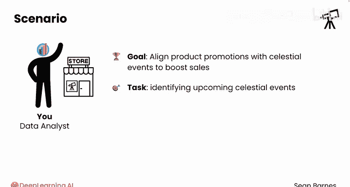
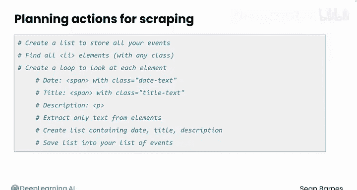

#  017：HTML解析规划 📋

## 概述

在本节课中，我们将学习如何规划网页数据的解析过程。我们将分析一个天文事件网站的HTML结构，并制定一个清晰的步骤计划，以便后续使用代码提取所需信息。

上一节我们介绍了网站如何使用HTML构建结构。本节中我们来看看如何利用这些知识来规划数据解析任务。

## 分析HTML结构

你是一家天文设备零售商的数据分析师。公司希望根据天象事件来规划2030年的产品促销活动，以提升销量。为此，你的经理要求你识别即将发生的天象事件。

在开始解析网页之前，查看HTML结构有助于规划后续操作。右键点击页面并选择“检查”，然后导航到右侧栏的内容元素。

当你将鼠标悬停在每个元素上时，网页上对应的部分也会高亮显示。第三个`div`容器元素包含一个格式统一的事件无序列表。

每个事件都位于一个列表项标签内的段落标签中，该列表项包含多个元素。右键点击并选择“查看网页源代码”，然后导航到右侧栏内容元素。你也可以使用Ctrl+F搜索该元素在源代码中的位置。

首先，是一个带有`date-text`类的`span`标签，它包含事件日期。

其次，是另一个带有`title-text`类的`span`标签，包含事件名称。

最后是事件描述，它没有自己的容器标签。

## 规划解析逻辑

这个结构非常重要，因为它明确指出了每个信息片段的位置。由于每个事件都遵循相同的模式，你可以规划遍历右侧栏内容元素下的所有列表项标签。

从那里，你将通过定位它们各自的标签和类来提取日期、事件标题和描述。提前了解结构能使解析过程更高效，并确保在使用该结构解析数据时不会遗漏任何细节。

利用这个结构，让我们写出一些代码注释，来规划抓取这个网站时需要采取的行动。

以下是解析步骤的规划：

1.  **创建存储列表**：首先创建一个列表来存储所有事件。初始时它是空的。
2.  **定位列表项**：需要找到HTML中的所有列表项（`li`元素）。为了更精确，最好只查找带有任何类名的项，因为你看到这些列表项有诸如`B9`等类名。
3.  **遍历元素**：创建一个循环来逐个检查这些项。
4.  **提取日期**：识别带有`date-text`类的`span`标签，并将其保存到一个变量中。
5.  **提取标题**：识别带有`title-text`类的`span`标签。
6.  **提取描述**：识别段落（`p`）标签。
7.  **获取纯文本**：最后，从每个元素中提取纯文本，丢弃HTML标签和属性。
8.  **组合并存储**：创建一个包含该事件的日期、标题和描述的列表，并将其保存到你的事件总列表中。

这个过程初看起来可能很复杂，但随着你更多地使用HTML解析，你会越来越得心应手。

## 总结

在本节课中，我们一起学习了如何为复杂的数据预处理任务规划解析方法。我们分析了一个具体网页的HTML结构，识别了数据所在的关键标签和类，并据此制定了一个从查找元素到提取文本的完整步骤计划。

在开始编码前规划我们的方法对于复杂的预处理任务至关重要。请跟随我到下一个视频，在那里你将使用BeautifulSoup库来实现这个计划。