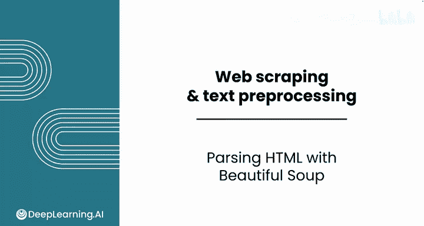
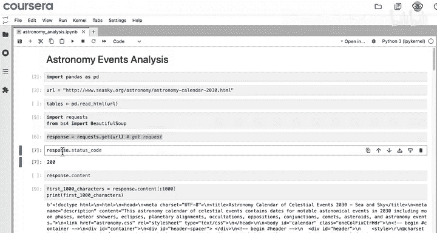
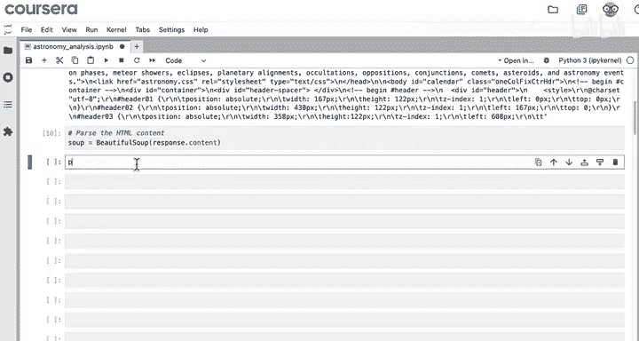
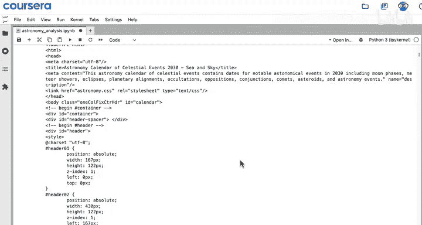
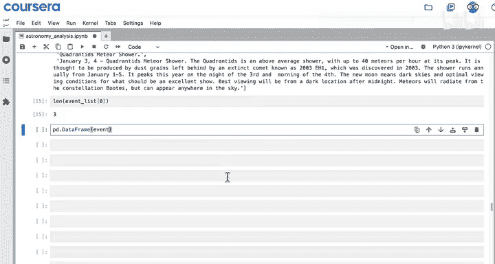
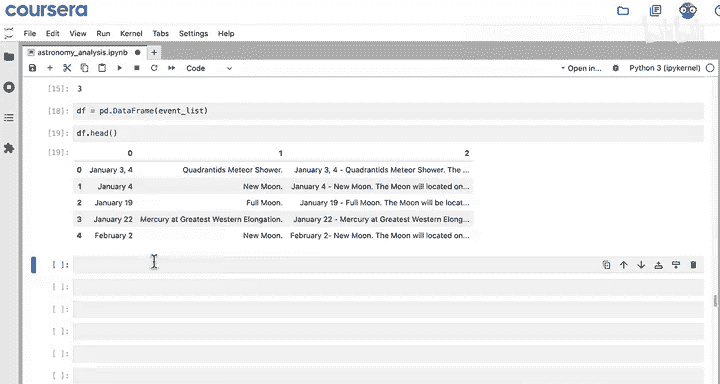
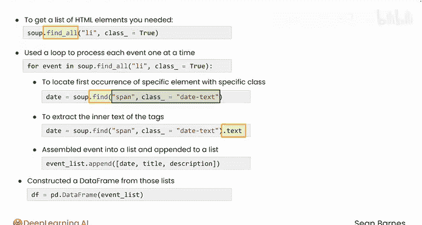

#  018：使用Beautiful Soup解析HTML 🕸️

在本节课中，我们将学习如何实现HTML解析计划，使用Beautiful Soup库从网页中提取结构化数据，并将其整理成可供分析的DataFrame。

---

上一节我们介绍了如何根据网站结构制定解析计划。本节中，我们来看看如何用代码实现这个计划。





首先，我们已使用`requests`模块获取了网站内容，并存储在变量`response`中。下一步是解析HTML。解析意味着找到并格式化所需的信息。

以下是实现步骤：



1.  创建Beautiful Soup对象来解析HTML。
2.  使用`soup.find_all`方法定位包含目标数据的HTML元素。
3.  遍历这些元素，提取每个事件的具体信息（如日期、标题、描述）。
4.  将提取的文本信息整理成列表，最终转换为Pandas DataFrame。



让我们开始编写代码。

首先，调用Beautiful Soup并传入`response.content`作为参数。

```python
from bs4 import BeautifulSoup
soup = BeautifulSoup(response.content, 'html.parser')
```

将解析后的内容存储在变量（如`soup`）中。打印`soup`，你会看到以更有序方式呈现的HTML。

使用这个`soup`对象，我们来实施上一视频中的计划。以下是用于构建代码的注释框架：

```python
# 创建一个空列表来存储所有事件
# 使用soup.find_all找到所有具有特定class的列表项（li）元素
# 遍历找到的每个事件元素
#   在每个事件元素中，找到日期、标题和描述对应的标签
#   提取这些标签内的文本
#   将文本组成一个列表，代表一行数据
#   将这行数据添加到总事件列表中
# 将总事件列表转换为DataFrame
```

首先，创建一个名为`event_list`的空列表来存储事件。

然后，使用Beautiful Soup查找所有`class`属性为`truth`的列表项（`li`）元素。代码是`soup.find_all('li', class_='truth')`。注意，`class`后面需要加下划线（`class_`），因为`class`是Python的保留字。

现在，遍历这些元素：
```python
for event in soup.find_all('li', class_='truth'):
```

在循环内部，你现在处理的是每个独立的事件。如果运行这个循环并打印每个`event`，你会得到包含日期、标题和描述的每个事件块。

接下来，移除打印语句。在编写代码时，可以参考HTML的结构。

创建一个新变量`date`来保存日期。在这个列表项内，使用`event.find('span', class_='date-text')`来找到日期的`span`标签。

对于标题，使用`event.find('span', class_='title-text')`。

最后，对于描述，没有比直接获取整个没有`class`的段落（`p`）标签更好的方法了，可以使用`event.find('p')`。



在提取文本之前，让我们看看如果直接将这些标签添加到列表中会发生什么。

创建一个新列表，称为`event_row`，因为它对应DataFrame中的一行。创建一个包含`date`、`title`和`description`的新列表来代表你的事件。最后，将这个列表追加到代表整个DataFrame的事件总列表中。

运行此代码并查看第一个事件。你会注意到有三个元素：日期文本、标题文本和描述。但是，你并不希望DataFrame中包含这些额外的HTML标签。

与其直接将标签添加到DataFrame，你可以在每个`find`调用后使用`.text`属性来只获取文本内容。

好的，现在运行那个循环。再看看第一个元素。太棒了，你现在只有页面每个组成部分的内部文本。



作为最后一步，你可以使用`pd.DataFrame()`将这些列表转换为DataFrame，并将结果保存到变量`df`中。

```python
import pandas as pd
df = pd.DataFrame(event_list, columns=['Date', 'Title', 'Description'])
```

这样就得到了一个格式良好的DataFrame。当然，还有很多预处理工作要做，但你已经抓取并解析了所需的核心信息。

最后一点说明：你在这个视频中看到了很多Beautiful Soup代码。你不需要记住所有这些步骤。实际上，大部分工作是在上一个视频中规划方法时完成的。

不相信吗？我来展示一下。打开你的LLM聊天机器人，使用以下提示词：
> “根据以下注释为`soup`变量编写代码。目标是从这些抓取的数据中创建一个DataFrame。”

然后粘贴进你的代码注释。复制生成的代码并尝试一下。你可以移除那些`import`语句，因为已经导入了这些模块。

看，这很有效。重点是，你不需要记住所有命令，因为LLM可以帮助你编写具体代码，但你应该理解如何规划方法以及如何解释这段代码。

让我们快速回顾一下：
1.  首先使用`soup.find_all`获取你需要的HTML元素列表。第一个参数是你要查找的HTML标签（本例中是`‘li’`），然后使用`class_`命名参数设置为`‘truth’`，以仅查找具有该`class`属性的元素。
2.  使用循环逐个处理每个事件。
3.  在该循环内，使用`event.find`方法定位具有指定`class`的特定元素的第一个出现。`.find`的参数与`.find_all`相同。例如，你用它来查找第一个具有特定`class`（如`date-text`）的`span`标签。
4.  然后使用`.text`属性提取你找到的标签的内部文本。
5.  最后，你将每个事件组装成一个列表，将该项追加到事件列表中，并从这些列表构建DataFrame。
6.  你还看到了如何使用LLM根据注释生成代码。

规划你的抓取方法至关重要。一旦计划就绪，你可以借助LLM来配对代码，以获得你想要的结果。这非常棒。



---

在本视频中，你已经看到，解析HTML就是将用于人类浏览的内容重塑成可供分析的东西。

在下一个视频中，请跟随我，你将运用文本处理技能来清理刚刚创建的这个DataFrame。