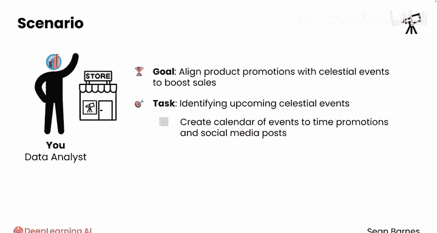
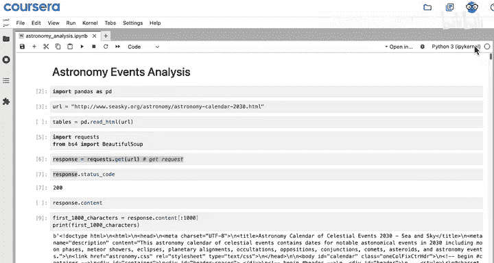
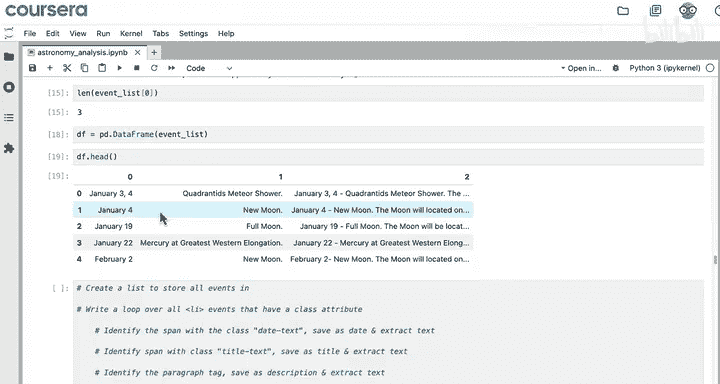
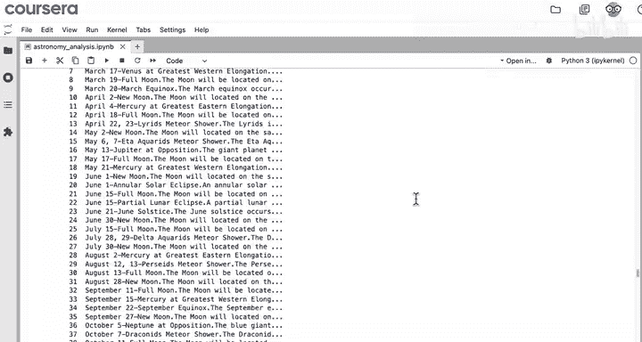
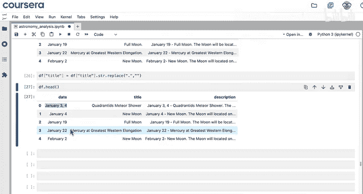
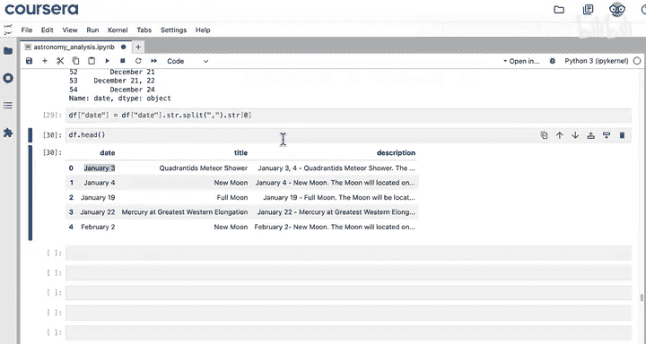
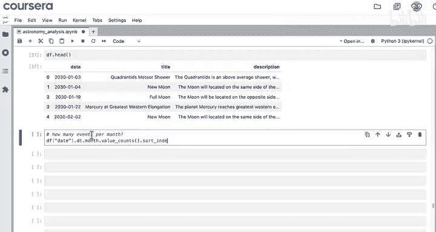
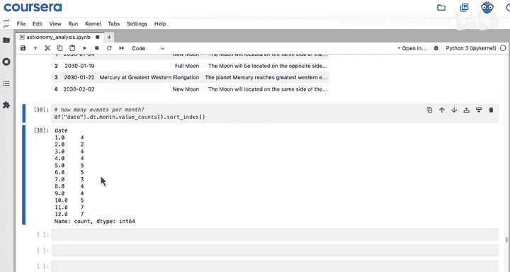
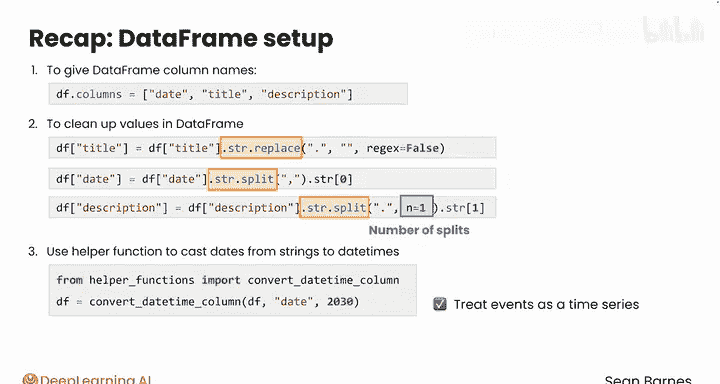

#  019：数据框设置与预处理 🛠️

在本节课中，我们将学习如何对从网页抓取到的原始数据进行整理和预处理，使其成为整洁、可用于分析的数据框。我们将涵盖重命名列、清理文本数据、分割字符串以及转换日期格式等关键步骤。

---

在上一节中，我们使用 Beautiful Soup 解析了一个网页。虽然成功将数据提取到了数据框中，但结果仍然比较杂乱，不符合我们的分析需求。本节中，我们来看看如何对这类抓取数据进行关键的预处理。

简单回顾一下背景：你是一家天文设备零售商的数据分析师。公司希望根据天文事件来安排产品促销以提升销量。为了规划2030年的活动，你的经理要求你识别即将到来的天文事件。你的最终目标是创建一个事件日历，以便营销团队能据此安排促销和社交媒体发帖时间。


在之前的笔记本中，我们使用 `requests` 模块获取了“In-The-Sky”网站的数据，然后使用 Beautiful Soup 将原始 HTML 转换成了一个名为 `df` 的数据框。这个数据框有三列（日期、标题、描述），每一行代表一个事件。







首先，我们需要给这些列赋予有意义的名称，而不是数字索引。



以下是设置列名的步骤：

1.  将 `df.columns` 属性设置为一个列表：`['date', 'title', 'description']`。
2.  使用 `df.head()` 查看结果。



代码示例：
```python
df.columns = ['date', 'title', 'description']
df.head()
```
现在列名已经设置好了。接下来，我们注意到标题列中包含了一个不必要的句点。我们可以使用 `.str.replace()` 方法来移除它。

以下是清理标题的步骤：



1.  对 `df['title']` 列使用 `.str.replace('.', '')` 来移除所有句点。
2.  再次查看 `df.head()` 以确认更改。

代码示例：
```python
df['title'] = df['title'].str.replace('.', '')
df.head()
```
很好。现在请注意，有些日期包含了日期范围（例如 “January 3, ...”）。我们可以通过分割字符串来只保留起始日期，以便将来将此列视为日期类型。

以下是处理日期范围的步骤：

1.  对 `df['date']` 列使用 `.str.split(',')`，这将根据逗号进行分割并移除逗号。
2.  使用 `.str[0]` 来选取结果列表中的第一个元素（即起始日期）。

代码示例：
```python
df['date'] = df['date'].str.split(',').str[0]
```
现在查看描述列。以第一个值为例，我们实际需要的描述内容是在第一个句点之后的部分。但由于描述由多个句子组成，存在多个句点。我们可以使用 `.str.split()` 并指定分割次数来实现。

以下是提取有效描述的步骤：

1.  对 `df['description']` 列使用 `.str.split('.', n=1)`。参数 `n=1` 表示只分割一次，即在第一个句点处将字符串分成两部分。
2.  使用 `.str[1]` 来选取第二部分（索引为1），并将其保存回描述列。

代码示例：
```python
df['description'] = df['description'].str.split('.', n=1).str[1]
df.head()
```
运行代码后，日期和标题等无关信息已从描述中移除。最后一步，当我们最初抓取数据时，Python 将日期视为纯文本（可以通过 `df.dtypes` 查看）。这种格式使得基于日期的分析或排序变得困难。

这个步骤可能有点复杂，因此我们使用一个名为 `convert_date_column` 的辅助函数。从 `helper_functions` 中导入它，然后按如下方式使用：

代码示例：
```python
from helper_functions import convert_date_column
df = convert_date_column(df, 'date', 2030)
```
如果你好奇，可以随时查看 `helper_functions.py` 文件本身，或者让大语言模型（LLM）带你逐步理解代码。现在查看 `df.head()`，可以看到日期已经转换成了日期时间格式。

既然本分析的目标是找出如何最好地营销天文设备，那么了解天文事件最常发生在何时会很有帮助。这些信息可以帮助你有效地安排营销活动，使其与天文活动的高峰期保持一致。

首先，你需要分析每个月列出的事件数量。为此，你可以使用 `.dt.month` 从日期列中提取月份数字，然后使用 `.value_counts()` 方法来计算每个月关联的事件数量。为了确保月份顺序正确，还可以加上 `.sort_index()`。

代码示例：
```python
monthly_counts = df['date'].dt.month.value_counts().sort_index()
monthly_counts
```
计算结果显示，大多数事件发生在十二月和十一月。这将是推广天文设备的理想时间。为了可视化这些结果，你还可以添加 `.plot(kind='bar')`。

代码示例：
```python
monthly_counts.plot(kind='bar')
```





---

## 总结

本节课中，我们一起学习了在数据框中组织抓取数据的几种新技术：



1.  首先，通过设置 `df.columns` 为一个字符串列表来为数据框的列命名。
2.  然后，使用 `.str.replace` 和 `.str.split` 来清理数据框中的值。
3.  我们了解了 `split` 方法中的命名参数 `n`，它用于指定希望进行的分割次数。
4.  最后，我们使用辅助函数将日期从字符串转换为日期时间格式，从而能够将这些事件视为时间序列进行处理。

干得漂亮。正如你所见，Beautiful Soup 是一个强大的工具，能将杂乱的网络数据转换为可供分析的整洁格式。接下来，你将学习如何搜索灵活的文本模式以精确提取所需内容。希望你能继续学习。