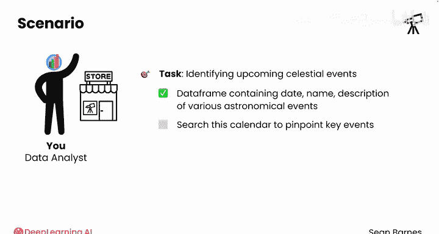
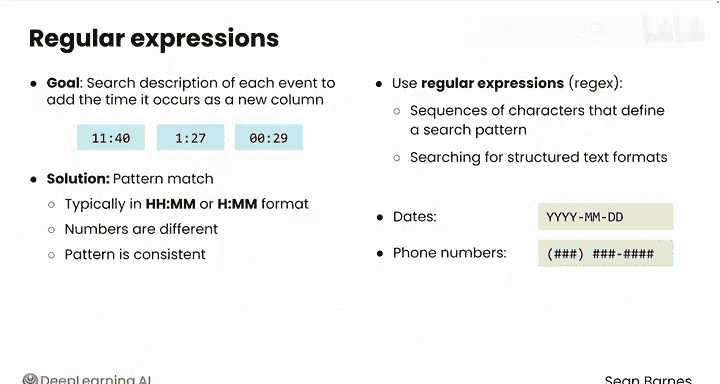
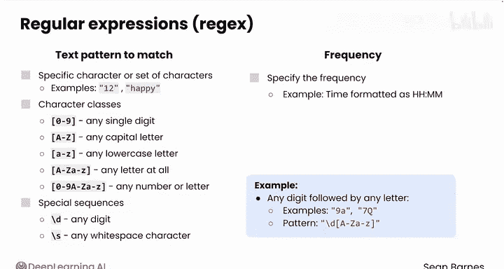
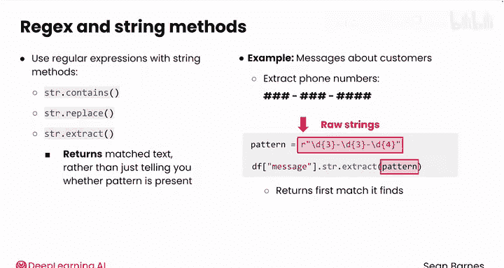

#  020：正则表达式 🧩

在本节课中，我们将学习如何使用正则表达式进行灵活的文本模式匹配。正则表达式是一种强大的工具，特别适用于从非结构化文本（如网页抓取的数据）中提取结构化信息。

## 概述

从网络抓取的许多数据以纯文本格式呈现。在之前的视频中，我们创建了一个包含各种天文事件的日期、名称和描述的数据框。然而，为了营销活动，我们需要搜索这个日历来定位关键事件。例如，我们可能希望搜索每个事件的描述，以提取事件发生的时间并添加为新列。由于没有特定的单一时间可寻，我们需要一种模式匹配的方法。

## 正则表达式简介

正则表达式（简称 regex）是定义搜索模式的字符序列。它们对于搜索结构化文本格式（如日期、电话号码）特别有用。




正则表达式模式由两个主要组件构成：**要匹配的文本模式**和**该模式出现的频率**。

### 文本模式匹配

文本模式可以是特定字符、字符集合或字符类。

*   **特定字符**：例如 `12` 或 `happy`。
*   **字符类**：
    *   `[0-9]` 匹配任意单个数字。
    *   `[A-Z]` 匹配任意大写字母。
    *   `[a-z]` 匹配任意小写字母。
    *   `[A-Za-z0-9]` 匹配任意字母或数字。
*   **特殊序列**：
    *   `\d` 匹配任意数字（等价于 `[0-9]`）。
    *   `\s` 匹配任意空白字符（如空格、制表符）。

例如，要匹配任意数字后跟任意字母（如 `9a` 或 `7Q`），可以使用模式：`\d[A-Za-z]`。

### 频率指定



频率指定模式应重复的次数。

*   **花括号 `{n}`**：精确匹配 `n` 次。
    *   例如，`\d{2}:\d{2}` 匹配任意两个数字，后跟一个冒号，再跟任意两个数字（如 `12:30`）。这正是 `HH:MM` 时间格式的模式。
*   **加号 `+`**：匹配 **1 次或多次**。
    *   例如，`\d+` 匹配一个或多个数字序列。
*   **星号 `*`**：匹配 **0 次或多次**。
    *   例如，`\d{3}\s*\d{4}` 可以匹配一个电话号码：三个数字，后跟零个或多个空白字符，再跟四个数字。

## 在 Pandas 中应用正则表达式



我们可以将正则表达式与之前学过的 Pandas 字符串操作结合使用，例如 `.str.contains()` 和 `.str.replace()`。

另一个强大的方法是 `.str.extract()`，它会返回匹配到的文本，而不仅仅是像 `.contains()` 那样告知模式是否存在。

### 示例：提取电话号码

假设我们有一个数据框，包含销售团队关于客户订购望远镜的消息。我们希望从该列中提取电话号码，格式为：三位数字、一个短横线、三位数字、一个短横线、四位数字（例如 `123-456-7890`）。

在 Python 中，匹配模式通常写作**原始字符串**（使用 `r` 前缀）。原始字符串让程序按字面意义处理反斜杠 `\`，而不是将其视为换行符 `\n` 等转义序列的一部分。

对应的匹配模式是：`r'\d{3}-\d{3}-\d{4}'`

使用 `.str.extract()` 方法：
```python
df['message'].str.extract(r'(\d{3}-\d{3}-\d{4})')
```
此代码将返回该列中每个单元格找到的第一个匹配项（即使存在多个匹配，也仅返回第一个）。该方法主要参数就是匹配模式。



## 总结

本节课我们一起学习了正则表达式的基础知识。我们了解到，正则表达式允许我们进行非常灵活的模式匹配，这对于从文本中提取特定格式的信息至关重要。虽然手动编写复杂的匹配模式可能有些繁琐，但掌握其基本原理有助于我们进行问题排查。在接下来的视频中，我们将探索如何利用大语言模型（LLM）来辅助编写正则表达式模式。