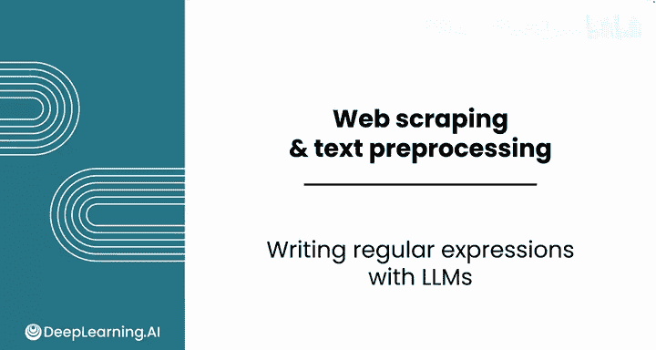
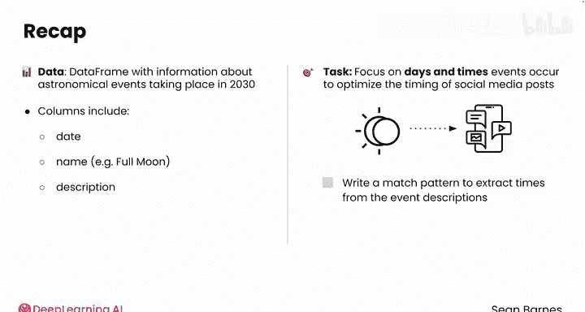
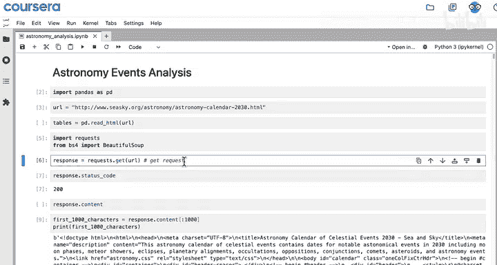
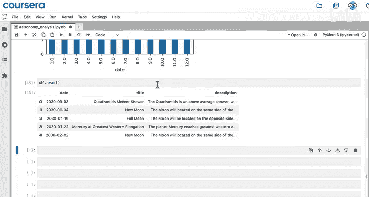
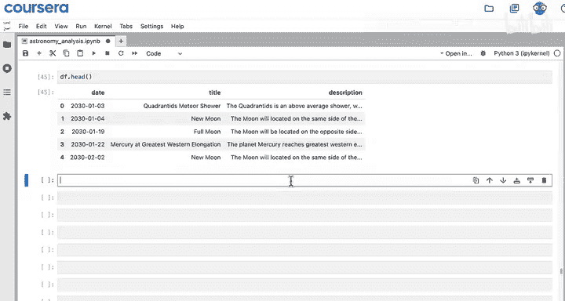
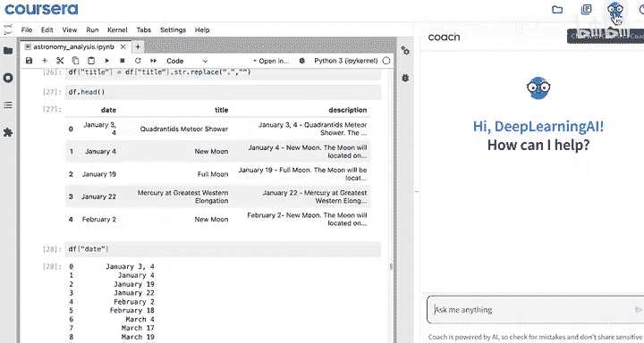
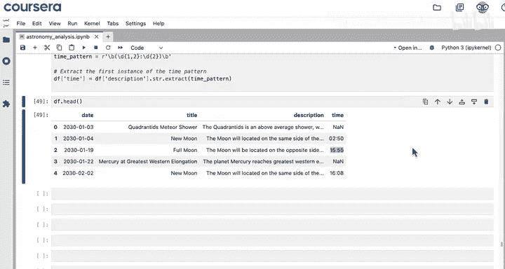

#  021：使用LLM编写正则表达式 📝

在本节课中，我们将学习如何利用大型语言模型（LLM）辅助编写正则表达式，以从文本数据中提取特定信息。我们将基于一个天文事件数据集，演示如何提取事件描述中的时间信息。

---

## 概述

上一节我们介绍了正则表达式的基础操作及其在灵活匹配文本中的应用。本节中，我们来看看如何与LLM协作，共同编写匹配模式，以解决实际的数据提取问题。

我们当前处理的数据集包含2030年的天文事件信息，列包括事件的完整日期、事件名称（例如“满月”）以及事件的详细文本描述。假设我们希望专注于这些事件发生的具体日期和时间，以优化社交媒体帖文的发布时间安排。为此，我们可以编写一个匹配模式来从事件描述中提取时间信息。

## 从数据集中提取时间信息

以下是我们在Python笔记本中暂停时的工作进度。我们使用Beautiful Soup抓取了数据，创建了规整的列，并将所有数据保存在变量`Df`中。其前几行数据如下所示。

检查索引0处的事件描述，它不包含时间信息。但索引1处的描述则包含时间信息。








## 请求LLM生成匹配模式


现在，我们请求LLM编写一个合适的匹配模式。关键在于指令要非常明确。


我们向LLM提供以下指令：
> 编写一个正则表达式模式，用于匹配 `hour hour minute minute` 或 `hour minute minute` 格式的时间，允许其周围存在任意数量的空白字符或其他字符。然后编写代码，使其在给定字符串中仅匹配该模式的第一个实例。以向量化方式将此匹配模式应用于pandas数据框的 `Df['description']` 列，并将结果保存到名为 `Df['time']` 的新列中。请确保此正则表达式格式正确，可与 `.str.extract` 方法配合使用。

请注意，我们为LLM提供了解决问题所需的全部信息，因此可以忽略顶部不必要的示例数据框。

LLM生成的代码将模式保存为原始字符串变量，然后提取第一个匹配的时间，并将其存入新列。实际上，我们也不需要打印整个数据框。

让我们尝试运行这两行代码。



## 检查提取结果

现在，让我们查看 `Df.head()` 的输出。运行此代码时期望的结果是什么？

索引0的行不应有时间，而索引1的行应包含时间 `2:50`。太棒了，这个正则表达式生效了。手动编写这样的模式会非常麻烦。


以下是使用LLM生成模式并进行提取的核心代码示例：

```python
# LLM生成的正则表达式模式，用于提取时间
pattern = r'\b(\d{1,2}:\d{2})\b'
# 应用提取模式
Df['time'] = Df['description'].str.extract(pattern)
```

## 重要提示

请务必始终将LLM的输出与你的期望进行核对。如果第一次尝试未能得到正确的模式，不要害怕进行迭代调整。

## 总结

本节课中，我们一起学习了如何利用LLM辅助编写正则表达式，从而从文本中提取可操作的数据。在最终的视频中，我们将通过探讨网络抓取的伦理问题来结束本系列课程。



