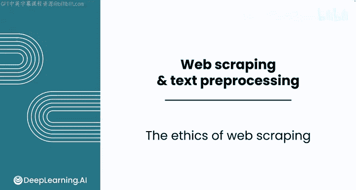
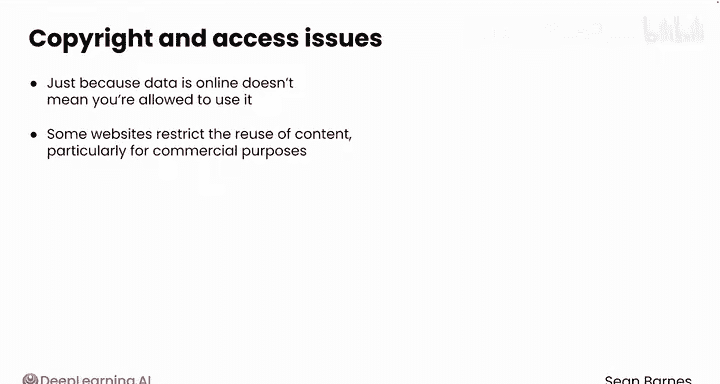
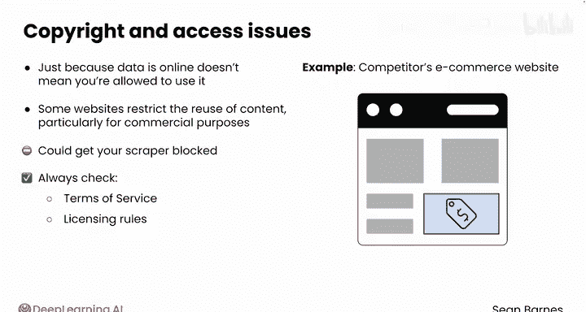
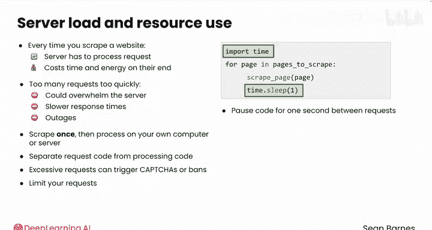
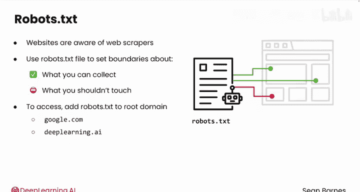
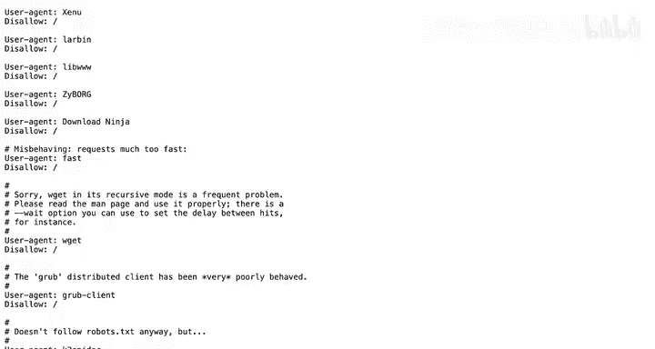
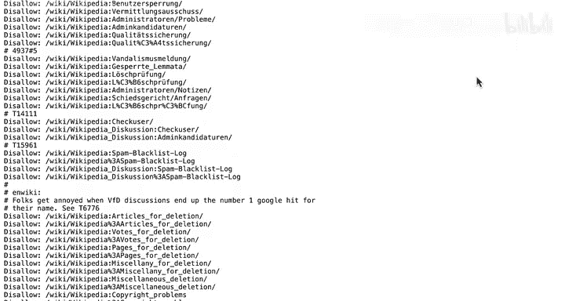
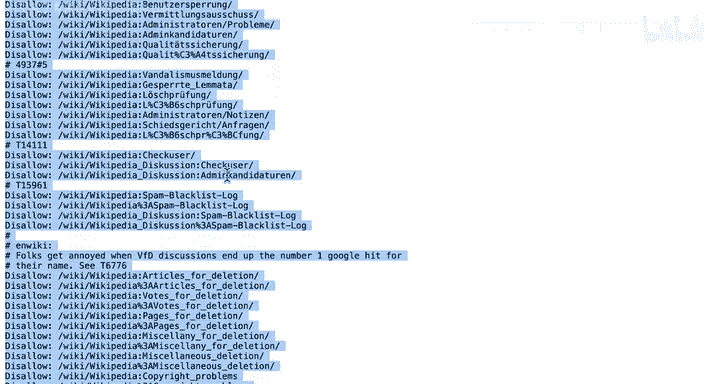
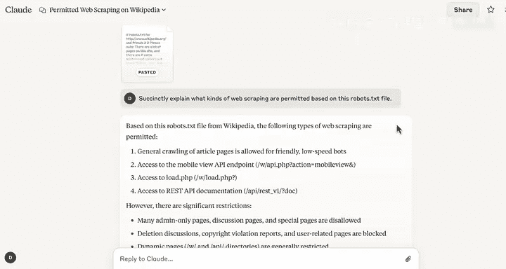

#  022：网络爬虫伦理 ⚖️

在本节课中，我们将要学习网络爬虫所涉及的伦理与法律考量。你将了解到使用他人网站数据时需要注意的关键事项，包括版权、服务器负载以及如何通过 `robots.txt` 文件了解网站的爬取规则。

---

## 概述

在本模块中，你一直在使用网络爬虫来获取他人网站上创建的数据。但这个过程伴随着伦理和法律方面的考量，这些是你进行数据分析工作时必须牢记在心的。

## 法律与版权考量

首先，网络爬虫可能会遇到版权或访问权限问题。数据在线并不代表你可以随意将其用于你的项目。一些网站限制其内容的再利用，特别是用于商业目的。

这里需要区分根据当地法律什么是合法的，以及什么构成了违约或违反了网站的服务条款。例如，爬取竞争对手电子商务网站的每一个页面以获取其产品价格，可能会导致你的爬虫被屏蔽。即使最终没有面临直接的法律诉讼，你也应该始终检查网站的**服务条款**或**许可规则**是否允许你打算进行的操作。

> **请注意**：我不是律师，这也不是法律建议。







## 服务器负载考量

你还应考虑你的请求对网站造成的负担。每次你爬取网站，他们的服务器都必须处理你的请求，即使是为了拒绝。这种处理会消耗他们的时间和资源。

如果你发送请求的速度过快，可能会压垮服务器，导致响应时间变慢，甚至对你和其他用户造成服务中断。因此，只爬取页面一次，然后在自己的计算机或服务器上进行所有处理，而不是为了获取特定数据而发出许多小请求，这是一种良好的做法。

例如，你可以将请求代码与处理代码分开，这样如果你需要修改，就不必重新获取数据。你可能已经注意到，在之前的演示中，你只对整个页面设置了一次请求，然后在 Python 笔记本中完成了预处理步骤。

## 限制请求频率

过多的请求可能会触发验证码或导致封禁。如果你计划爬取许多页面，你应该限制请求频率。你可以在 Python 中使用 `time` 模块来实现这一点，它允许你在请求之间暂停。

例如，在这段代码中，`time.sleep(1)` 将在每个请求之间暂停代码一秒钟。



```python
import time
# 假设在一个循环中发送请求
for url in list_of_urls:
    # 发送请求的代码...
    time.sleep(1)  # 暂停1秒
```

## 理解 robots.txt 文件

网站了解网络爬虫的存在，并经常使用 `robots.txt` 文件来设定你可以收集什么以及不应触碰什么的界限。要访问此文件，只需在网站的根域名后添加 `/robots.txt`。根域名是网站地址的主要部分，例如 `google.com`、`deeplearning.ai` 或 `wikipedia.org`。

以下是查看 `robots.txt` 文件的方法：
*   `deeplearning.ai/robots.txt`
*   `wikipedia.org/robots.txt`

例如，`deeplearning.ai` 的 `robots.txt` 文件很短，因为它允许你自由爬取所有页面的信息。然而，看看维基百科的 `robots.txt` 文件，许多 `robots.txt` 文件看起来又长又复杂。

## 使用LLM解读规则

为了快速了解允许和禁止的内容，你可以使用大型语言模型。让我们使用 `Claude 3.7`。请注意，你可能可以使用更高级的模型。





你可以编写一个提示词，要求它根据这个 `robots.txt` 文件简要解释允许哪些类型的网络爬虫，然后粘贴维基百科的文件内容。







**提示词示例**：
```
请根据以下维基百科的 robots.txt 文件内容，简要总结允许和禁止哪些网络爬虫行为。
```
（然后粘贴文件内容）

LLM 会总结出你可以做和不可以做的事情。它会告诉你，你可以对文章页面进行常规爬取，也可以访问一些不同的 API。但它也会告诉你存在一些限制：许多仅限管理员访问的页面、讨论页面和特殊页面是被禁止的。你无法访问已删除的讨论、版权侵权报告或用户相关页面。

最后，快速或激进的爬取是被禁止的，并明确警告访问可能会被阻止。这就是你需要使用 `time.sleep()` 函数的原因，以避免被屏蔽。

---

## 总结

本节课中我们一起学习了网络爬虫的伦理与法律边界。我们探讨了尊重版权和服务条款的重要性，了解了如何通过控制请求频率来减轻服务器负担，并学会了如何查找和解读网站的 `robots.txt` 文件来合规地进行数据采集。记住，负责任的数据获取是数据分析师的基本素养。

本模块的学习到此结束。你现在已掌握完成关于分析科技行业工作的评分作业和实验所需的所有知识。完成作业和实验后，请跟随我进入下一个关于使用 API 收集和预处理数据的模块。我们那里见。😊