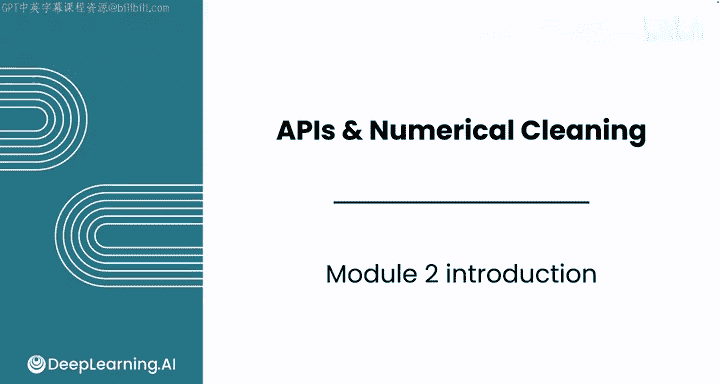
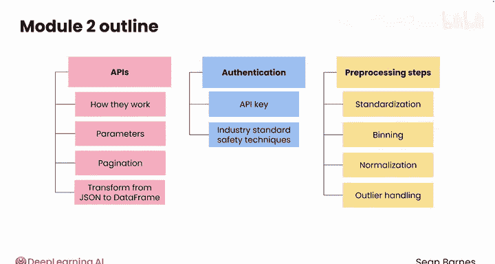

#  023：模块2 简介 🚀

在本节课中，我们将要学习吴恩达课程《数据输入／输出与预处理（Python 和 SQL）》的模块2。这个模块的核心是掌握如何从网络获取结构化数据，并进行预处理，为后续分析做好准备。我们将重点学习应用程序编程接口（API）的使用以及数值数据的清洗技术。

## 概述

模块2的主题是“API与数值数据清洗”。本模块旨在使你掌握访问和预处理网络结构化数据所需的技能，以便进行分析。你将学习如何从应用程序编程接口（API）检索数据，并准备数值数据用于深入分析。

## 课程内容详解

上一节我们概述了本模块的目标，本节中我们来看看具体的学习路径。整个模块包含三个核心课程。

以下是三个课程的主要内容：

1.  **第一课：探索API**
    你将了解API的工作原理及其众多自定义选项，包括参数和分页。你将学习如何将特殊JSON格式的数据转换为用于分析的数据框。

2.  **第二课：API身份验证**
    你将通过使用API密钥访问数据来提升API技能。你将学习行业标准的安全技术，以保护你的密钥（类似于密码）的安全。

3.  **第三课：数值数据预处理**
    你将处理关键的预处理步骤，如**标准化**、**分箱**、**归一化**和**异常值处理**。这些技术对于处理数值数据至关重要，能确保你的数据无论原始格式如何，都为分析做好了准备。你还将探索如何从四个维度评估数据质量。

## 模块目标总结

本节课中我们一起学习了模块2的框架。到本模块结束时，你将掌握从API检索、清洗和准备数据的基础技能，这是任何数据分析师的关键能力。

让我们开始学习吧。