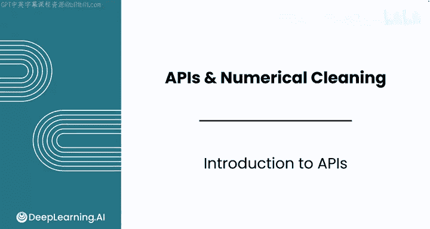
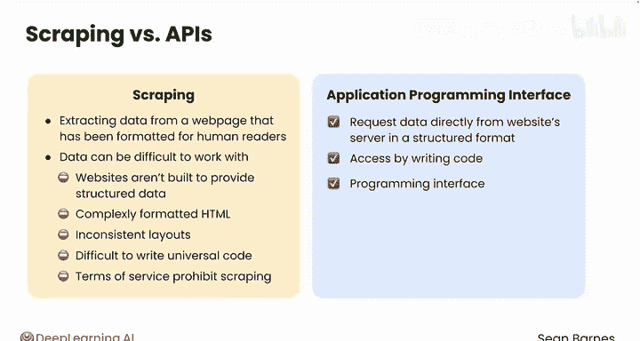
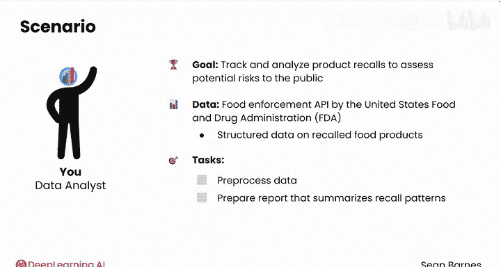
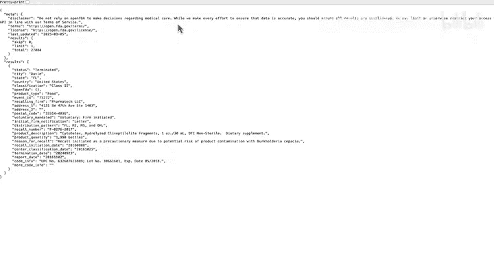
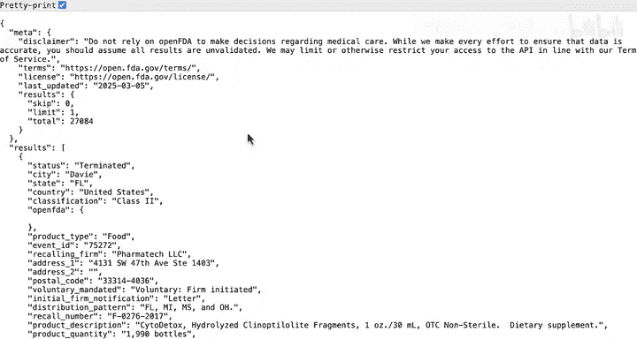
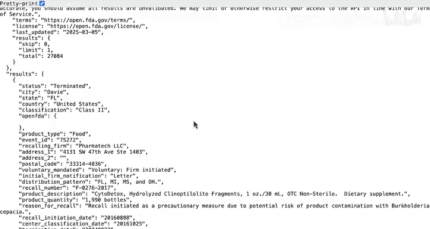
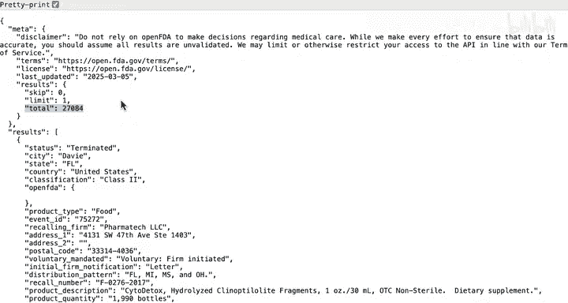
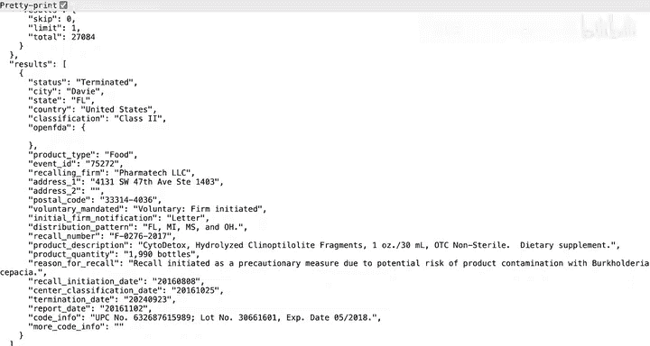

#  024：API 介绍 🚀

在本节课中，我们将要学习什么是应用程序编程接口（API），以及它如何作为一种比网络爬虫更高效、更可靠的方式，从互联网上获取结构化的数据。我们将以美国食品药品监督管理局（FDA）的食品召回数据API为例，了解其基本用法和数据格式。

---

在之前的模块中，你看到了网络爬虫如何成为从网站收集数据的一种有用方法。

实际上，你还有另一个非常有用的选项可以从互联网上收集结构化数据。网络爬虫涉及从为人类读者而非为你的Python代码格式化的网页中提取数据。正如你在上一个模块中看到的，从网络爬虫收集的数据可能难以处理，主要是因为网站并非为提供结构化数据而构建。因此，你经常需要从格式复杂、包含大量额外文本和代码的HTML中提取所需内容。你还看到网站的布局不一致，同一网站的不同页面可能遵循略有不同的结构。

这种不一致性使得编写一个适用于所有情况的爬虫代码变得困难。此外，你还会遇到服务条款禁止爬取的网站，这使你的数据获取工作复杂化。然而，有方法可以从互联网上获取格式良好、用于分析的结构化数据。为此，你可以使用应用程序编程接口，简称API。

一个API允许你直接从网站服务器请求结构化的数据。你通过编写代码来访问API，因此得名“编程接口”，即代码访问某种东西的方式。API是专门为提供数据而构建的，因此当它们可用时，与网络爬虫相比，它们是访问信息更可靠、更高效的方式。你可能只有在所需数据无法通过API获得时，才会使用网络爬虫。

API也使用你在上一个模块中学到的相同网络范式：你的计算机作为客户端，向服务器发送请求，服务器处理请求并发回响应。在本模块中，你将通过一个API数据的案例研究进行实践，该案例涉及为消费者权益保护组织完成一项分析任务。你将跟踪和分析食品召回事件，以评估对公众的潜在风险。了解食品从市场下架的频率和原因，有助于为政策建议提供信息。

在本课中，你将使用美国食品药品监督管理局（FDA）提供的食品执法API。使用此API，你可以获取关于召回食品产品的结构化数据。然后，你将预处理这些数据，并准备一份总结产品召回模式的报告。

---

在编写代码使用API之前，让我们先查看其文档。

FDA维护着这个网站，列出了其所有API并解释了它们的工作原理。如果你正在寻找关于食品召回执法的数据，可以从左侧列表中选择“食品API端点”。然后选择“召回执法报告”，再选择“概述”。它会给你一些关于此数据的信息：它包含提交给FDA的召回事件信息，涵盖从2004年至今的数据。这是此API相比平面文件的一个主要优势：数据是最新的。当你看到这些时，你将拥有比这里显示的更最新的信息。

现在，看看如何使用这个API。

向下滚动到“进行简单的API调用”部分。你可以从网络浏览器进行API调用，并且它给出了一个示例。让我们暂时忽略搜索和限制参数，只看用蓝色标记的基础端点。

打开一个新标签页，这就是数据。复制基础端点并将URL粘贴到搜索栏中。

这只是**一个**结果。如果你查看花括号、方括号和缩进，这个结果不是HTML。它是一种称为JSON的格式，你将在下一个视频中探索它。

现在，你可以浏览一下这个结果。顶部有一些元信息，解释了上次更新时间、结果数量以及总共有多少可用结果。然后你在下方得到那个显示的结果，它是一个结果列表。这是一起来自美国佛罗里达州的已终止召回。召回来自Pharmach LOC公司，涉及某种类型的膳食补充剂。

因此，在编写代码使用新API之前，探索文档并了解你将处理的数据结构是极好的做法，就像你在进行网络爬取之前所做的那样。在本视频中，你在浏览器中检查了API的一个结果。API结果通常以JSON格式返回，这是一种存储结构化数据的常见方式。请继续观看下一个视频以了解其工作原理。

---

本节课中我们一起学习了API的基本概念及其相对于网络爬虫的优势。我们通过FDA食品召回API的实例，查看了如何通过浏览器直接访问API端点并初步了解其返回的JSON数据结构。在开始编码前查阅和理解API文档是至关重要的准备工作。