#  025：JSON格式入门 🗂️

在本节课中，我们将学习JSON格式的基础知识，包括其结构、与Python字典的关系，以及如何从嵌套的JSON数据中提取所需信息。

---

## 概述

上一节我们介绍了API，并学习了如何在浏览器中使用API获取结构化数据。本节中，我们将深入了解API返回结果通常采用的格式——JSON。我们将学习JSON的结构，它如何与Python字典对应，以及如何通过链式索引访问嵌套数据。

---

## 什么是JSON？

JSON，全称JavaScript Object Notation（JavaScript对象表示法），是一种常用于应用程序之间传输数据的格式。它以结构化的方式组织数据。

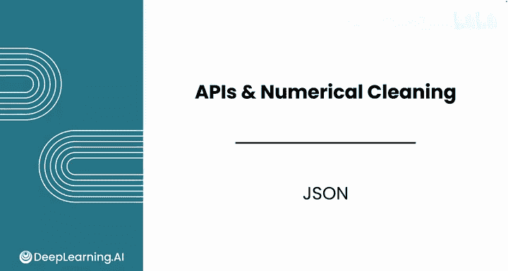

这种格式起源于网络世界，其中JavaScript是一种常见的编程语言，因此JSON模仿了JavaScript的书写方式。

JSON是一个由**键值对**组成的集合。每个键用于访问一个值。

回想一下Python中的列表，它是一种有序集合，使用索引（如0, 1, 2...）来访问值。而JSON使用**键**来访问值，键必须是带引号的字符串。

如果你还记得上一门课程中简要接触过的Python数据结构——字典，你可能会注意到JSON的结构与字典非常相似。一旦将JSON加载到Python中，它就会被表示为一个字典。

**公式/代码表示：**
一个简单的JSON对象看起来像这样：
```json
{
  "key1": "value1",
  "key2": 123,
  "key3": true
}
```

---

## JSON的结构特点

以下是JSON结构的几个核心特点：

*   **键值对**：JSON数据由成对的键和值组成。例如，在 `"name": "Andromeda Galaxy"` 中，`"name"` 是键，`"Andromeda Galaxy"` 是值。
*   **花括号**：整个JSON对象被一对花括号 `{}` 包围。
*   **嵌套结构**：与HTML元素可以包含其他元素类似，JSON的值也可以是嵌套的。这意味着数据可以分层组织，一些值可能是简单的数字或字符串，而另一些值可能是列表或其他JSON对象，从而形成信息的多层结构。

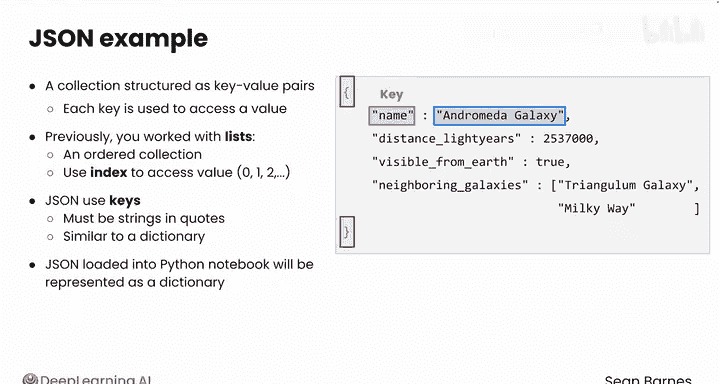

例如，考虑以下关于一个遥远星系的数据：
```json
{
  "name": "Andromeda Galaxy",
  "distance_ly": 2537000,
  "visible_from_earth": true,
  "neighboring_galaxies": ["Triangulum Galaxy", "Milky Way"]
}
```
这个JSON对象包含4个键值对。其中，`"neighboring_galaxies"` 的值是一个嵌套的列表。

处理JSON时，通常需要先浏览整个结果，以了解有哪些可用数据以及需要访问哪些部分。与表格中所有数据都整齐排列在行和列中不同，JSON结构可能更复杂，需要你导航不同的层级才能获取所需数据。

---

## JSON与Python字典

如前所述，在Python中，JSON被表示为字典，两者看起来极其相似。字典也用花括号书写，同样表示键值对。

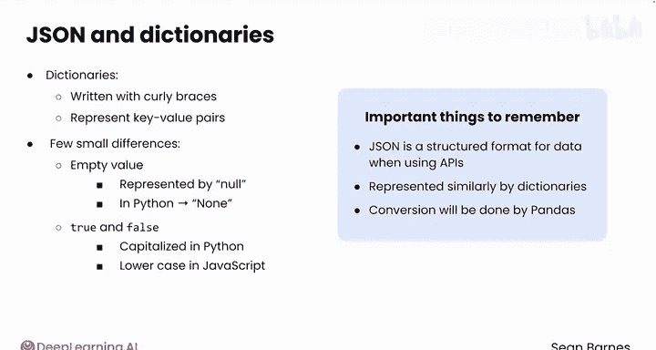

不过，两者存在一些细微差别：
*   在JSON中，空值用 `null` 表示；在Python中，用 `None` 表示。
*   在JSON中，布尔值 `true` 和 `false` 是小写；在Python中，它们是首字母大写的 `True` 和 `False`。

你不需要记忆这些差异。重要的是记住：JSON是使用API时会遇到的一种数据结构格式，它在Python中与字典的表示方式非常相似。`pandas` 等库会自动为你完成这种转换。

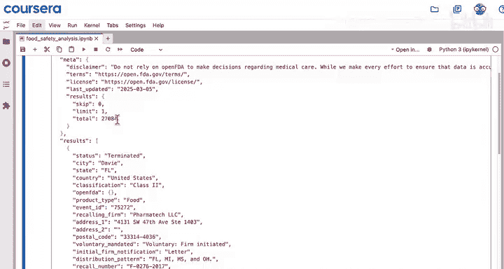

---

## 访问嵌套的JSON数据

现在，让我们通过代码示例看看如何实际操作JSON（字典）数据。

假设我们有一个Python字典，它代表了从FDA执法API获取的响应数据。

首先，我们可以查看这个字典的键，以了解有哪些可用信息。

**代码示例：**
```python
# 假设 `data` 是包含API响应的字典
print(data.keys())  # 输出：dict_keys(['meta', 'results'])
```
注意，`keys()` 是一个方法（因为它有括号），而不是属性。这里我们得到了两个键：`'meta'` 和 `'results'`。这是嵌套的第一层。

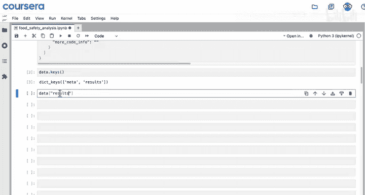

接下来，查看 `'results'` 部分。我们可以通过 `data['results']` 来访问这个键的值。这可能返回一个包含召回报告信息的列表。

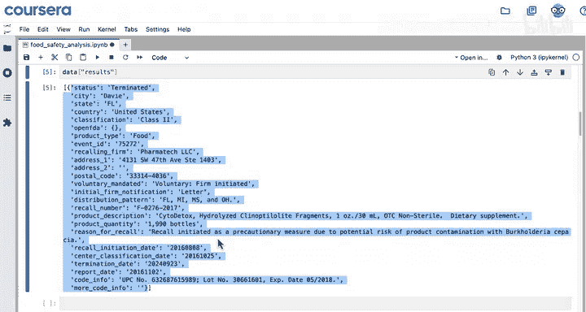

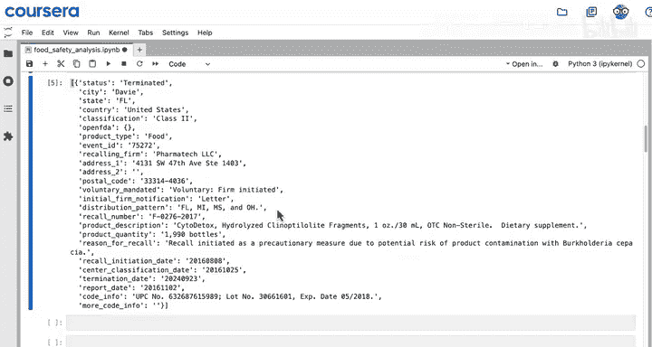

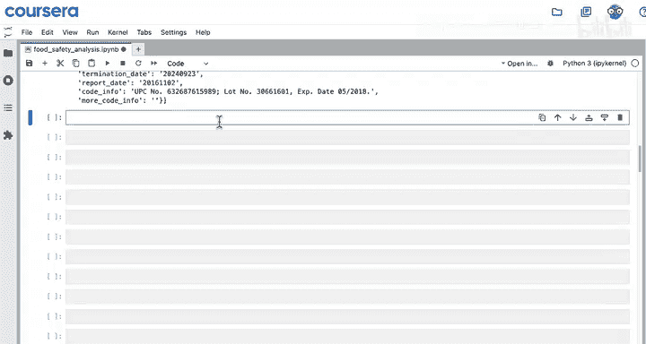

这个字典（API响应）的巧妙之处在于，你可以深入到更深的嵌套层级。例如，`data['results']` 可能返回一个列表（可以通过方括号 `[]` 识别），因为一次可以返回多个结果。

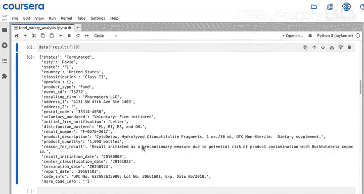

如果你想获取列表中的第一个结果，可以使用 `data['results'][0]`。现在，你深入了一层，得到了一个字典。所以，现在的结构是：**字典内嵌套了一个列表，列表内又嵌套了一个字典**。

假设我们想从这个字典中获取产品数量 `product_quantity`。

**代码示例：**
```python
# 链式索引访问深层数据
product_qty = data['results'][0]['product_quantity']
print(product_qty)  # 输出可能是：1990 bottles
```
你通过 `data['results'][0]['product_quantity']` 解包了所有这些层级，最终获取到了需要的数据。

---

## 总结

本节课中，我们一起学习了如何操作JSON数据。

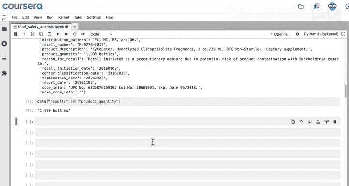

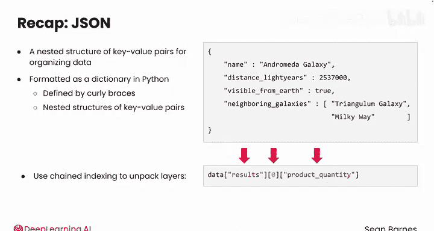

*   JSON定义了一种用于组织数据的、嵌套的键值对结构。
*   我们了解到，JSON在Python中被格式化为字典，字典由花括号定义，同样也是嵌套的键值对结构。
*   我们看到了如何使用**链式索引**来解包字典的各个层级，以获取所需数据。例如，通过先访问 `results` 列表，再获取该列表的第一项，最后从代表该召回事件的字典中访问 `product_quantity`，从而获取了第一个召回结果的产品数量。

现在你已经更深入地理解了JSON的结构，准备好从数据中提取所需的关键信息了。希望你能在下一节课中继续与我一同学习。