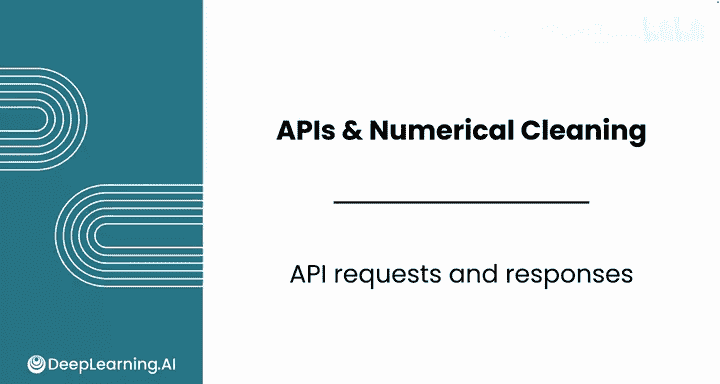
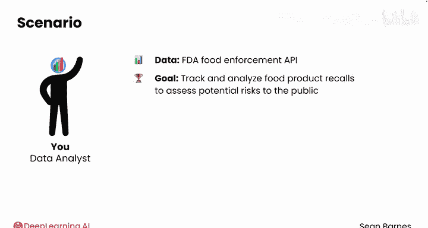
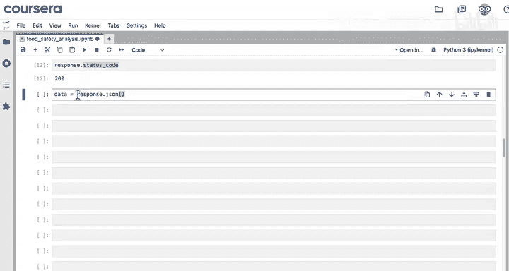
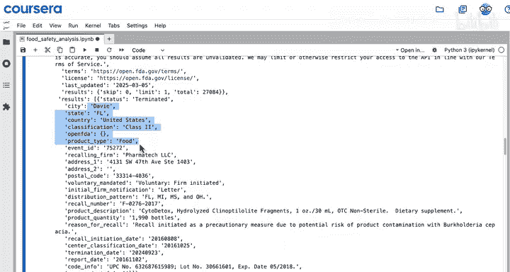
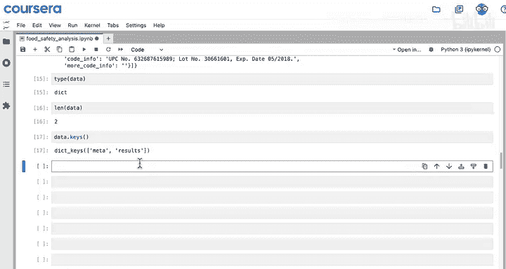
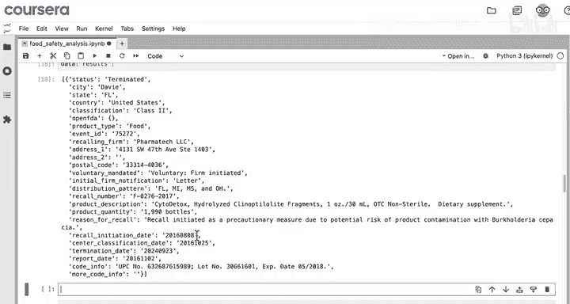
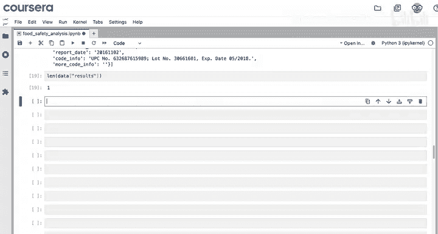
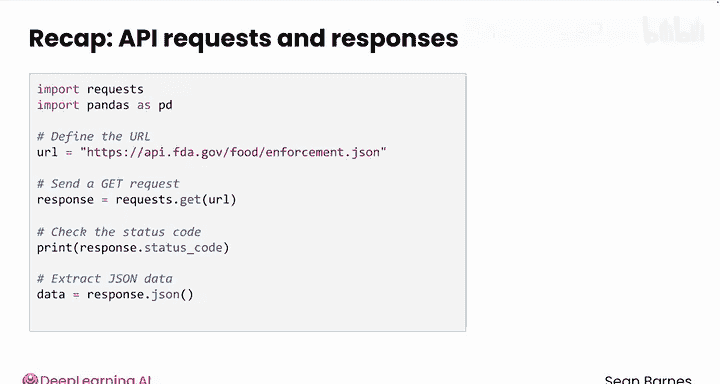

#  026：使用Python发起API请求与处理响应 🚀

在本节课中，我们将学习如何使用Python代码从API获取数据。你将看到，这与网络爬虫有许多相似之处。我们将使用`requests`库向FDA食品执法API发送请求，并处理返回的JSON格式响应数据。

## 准备工作

在开始编写代码之前，我们需要导入必要的Python模块。

以下是所需的导入语句：

```python
import requests
import pandas as pd
```

> 提示：你可以使用练习实验室项目来跟随演示进行操作。

## 发起GET请求

上一节我们介绍了API的基本概念，本节中我们来看看如何用代码发起请求。首先，你需要定义要从中获取数据的API端点URL。

```python
url = "https://api.fda.gov/food/enforcement.json"
```

这个URL是FDA执法API的“基础端点”，你将在后续视频中了解更多关于端点的知识。



接下来，我们向这个URL发送一个GET请求。GET请求就像是向服务器询问：“你好，我可以获取这些数据吗？”



```python
response = requests.get(url)
```

与爬取网页数据时一样，在进一步处理之前，你应该先检查状态码，以确认请求是否成功。

```python
print(response.status_code)
```

如果状态码是`200`，则表示成功。这意味着请求已通过，并且你很可能已经获得了所请求的数据。

## 提取与处理响应数据





成功收到响应后，我们需要从中提取出有用的数据。响应对象内部存储了许多信息，状态码就是其中之一。

以下是提取JSON数据的新代码行：

```python
data = response.json()
```

使用`response.json()`方法可以从响应中获取JSON格式的数据。

现在，让我们查看一下获取到的数据。瞧，这里就有来自佛罗里达州的召回信息。😊



为了验证数据的有效性，我们可以进行一些快速检查。



以下是几个有用的数据检查步骤：

1.  **检查数据类型**：确认`data`是一个Python字典。这符合我们之前所学：JSON数据在Python中通常以字典形式存储。
2.  **检查字典长度**：使用`len(data)`查看返回的键的数量。你也可以使用`.keys()`方法来访问这些键。
3.  **检查结果列表**：访问`data[‘results’]`（你在上一个视频中见过这个键），并检查其列表长度。这能告诉你收到了多少个具体的结果项。

例如：
```python
print(type(data))  # 应输出 <class 'dict'>
print(len(data))   # 检查键的数量
print(len(data[‘results’]))  # 检查结果列表中的项目数
```

在这个例子中，结果列表的长度为1，表示只有一个召回结果。在收到API响应后，进行此类检查是确认数据正确性的良好实践。

## 课程总结

本节课中，我们一起学习了如何从API实时获取数据。

你做得很好！你使用Python的`requests`库发送了GET请求，并通过检查状态码确保请求成功，这与网页爬虫的步骤类似。随后，你使用`.json()`方法将响应中的JSON数据提取为Python字典，以便进行后续操作。





到目前为止，你在API使用方面表现优异。请跟随我进入下一个视频，学习如何定制你的API请求。