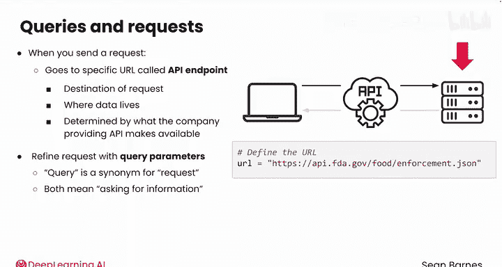
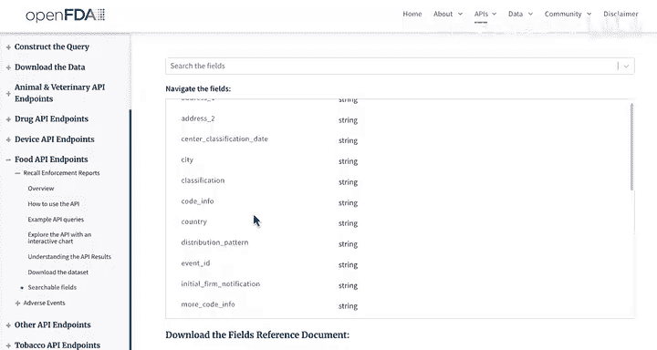
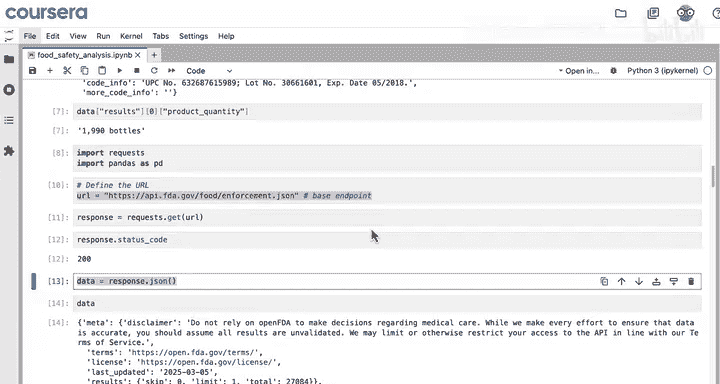
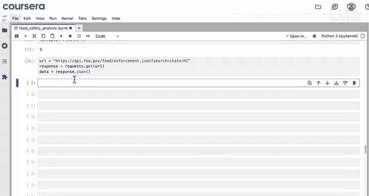
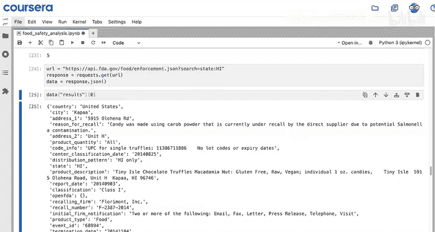
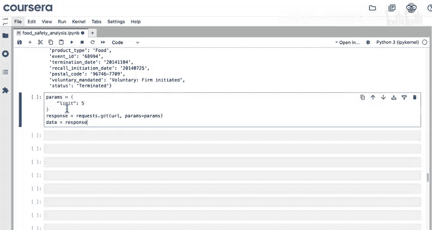
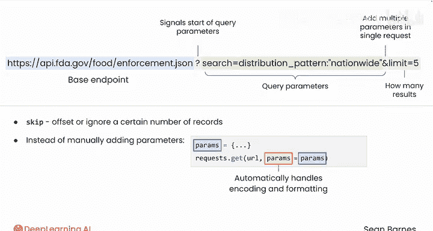

#  027：API查询参数详解 🔍

在本节课中，我们将学习如何通过添加查询参数来精确控制从API获取的数据。你将了解查询参数的作用、常见类型以及如何在代码中优雅地使用它们。

---

## 概述

上一节我们介绍了如何使用代码从API获取响应。本节中，我们来看看在向API请求数据时，还有哪些选项可以优化我们的请求。

当你发送一个请求时，它会指向一个特定的URL，这个URL被称为**API端点**。例如，在上一个视频中，你向FDA食品执法API的**基础端点**发送了请求。可以将端点视为你请求的目的地，它是数据所在的位置。你可以使用的端点由提供API的公司决定。

但你并不总是希望获得该端点的默认响应。例如，你的一次API调用只收到了一个召回事件。如果你希望通过一次请求就收到多个事件，该怎么办？你可以通过添加额外的细节（称为**查询参数**）来优化你的请求。

“查询”是“请求”的同义词，两者都表示请求信息。就像端点一样，可用的参数取决于你使用的API。了解可用选项的最佳途径是查阅API文档。

---

## 查询参数基础

以下是查询参数的基本概念和用法。

### 参数结构与语法




查询参数附加在基础端点URL之后。一个问号 `?` 标志着查询参数的开始。参数使用 `key=value` 的格式，类似于函数中的命名参数。`&` 符号允许你在单个请求中添加多个参数。

例如，考虑以下基础端点：
```
https://api.fda.gov/food/enforcement.json
```

要添加一个查询参数来搜索全国分布的召回事件，URL会变成：
```
https://api.fda.gov/food/enforcement.json?search=distribution_pattern:nationwide
```

你可以使用 `&` 添加另一个参数，例如 `limit`，来限制返回结果的数量：
```
https://api.fda.gov/food/enforcement.json?search=distribution_pattern:nationwide&limit=5
```

在这个例子中，你请求的是5个结果，而不是默认的1个。

### 查找可用参数

要了解FDA食品执法API的可用参数，你可以访问其官方文档页面。通常，文档会有一个“可搜索字段”页面，列出所有可能的过滤选项，例如按城市、召回原因和状态进行过滤。

---

## 在代码中使用查询参数

让我们回到代码中，看看如何实际操作。



### 方法一：手动拼接URL



假设你之前已经向基础端点发送了请求，并将响应保存在变量 `data` 中。如果只查询基础端点而不带任何参数，你只会得到一个结果。

如果你想获取五个结果，可以在基础端点后添加 `?limit=5`：

```python
import requests



url = “https://api.fda.gov/food/enforcement.json?limit=5”
response = requests.get(url)
data = response.json()
```

检查 `data[‘results’]`，你会得到一个包含五个项目的更长列表。

如果你想只关注夏威夷的召回事件，可以按照FDA网站所示的格式添加 `search` 参数：

```python
url = “https://api.fda.gov/food/enforcement.json?search=state:HI&limit=5”
```

### 方法二：使用 `params` 参数（推荐）

当API有很多参数时，不断将它们拼接到URL中会显得很混乱。`requests` 模块提供了一种更清晰的方法：你可以将查询参数作为一个字典，通过 `params` 参数传递给 `requests.get()` 函数。

例如，如果你想将响应数量限制为5，可以创建一个字典：



```python
parameters = {‘limit’: 5}
```



然后，在调用 `requests.get()` 时，添加一个新的命名参数 `params=parameters`：

```python
url = “https://api.fda.gov/food/enforcement.json”
parameters = {‘limit’: 5}
response = requests.get(url, params=parameters)
data = response.json()
```

请注意，将变量命名为与函数中的命名参数相同是完全可行的。运行这段代码，你将得到与之前相同的响应，包含5个事件而不是1个。

使用 `params` 字典的优势在于，它使你的代码更整洁、更易于管理，并且 `requests` 库会自动处理参数的编码和格式化，减少了API请求中出错的可能性。

---

## 常见查询参数

许多API共享一些常见的查询参数，以下是最有用的两个：

*   **`limit`**：控制你获得的结果数量。
*   **`skip`**：允许你在返回结果之前偏移或忽略一定数量的记录，常用于分页。

---



## 总结

本节课中，我们一起学习了API查询参数。我们了解到，通过使用查询参数，你可以精确地获取所需的数据，不多不少。我们从查询参数的基础语法讲起，学习了如何手动将它们添加到URL中，并重点介绍了更优雅、更不易出错的方法——使用 `requests.get()` 的 `params` 参数来传递参数字典。

在下一个视频中，你将使用参数来扩展你的API请求，并以一种能使数据洞察更清晰的方式格式化数据。