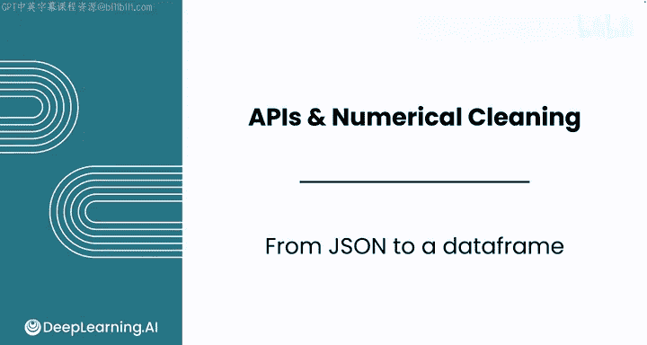
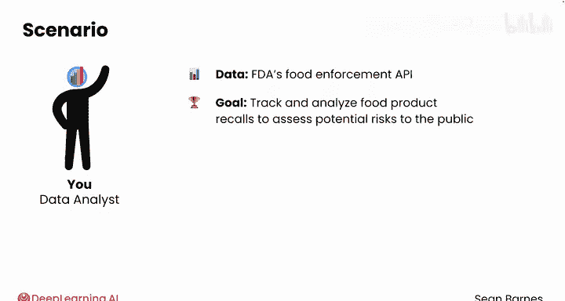
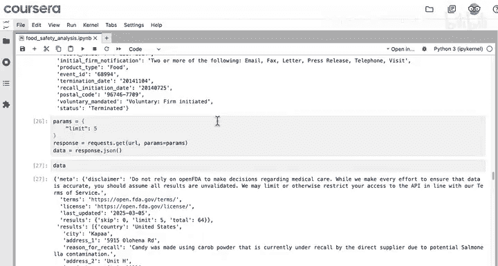
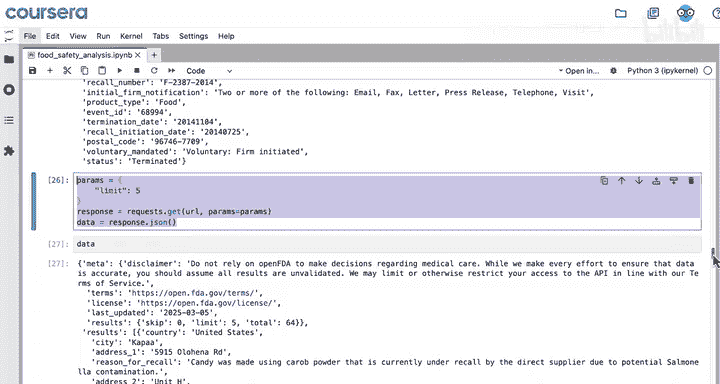
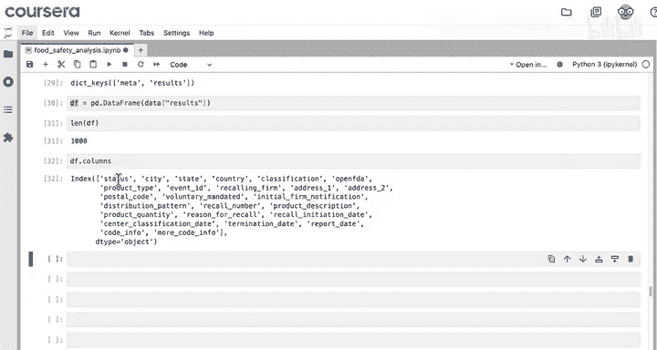
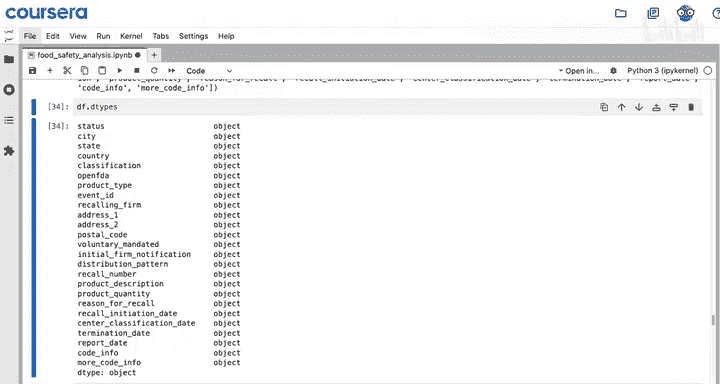
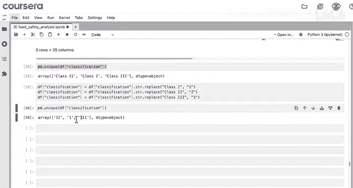
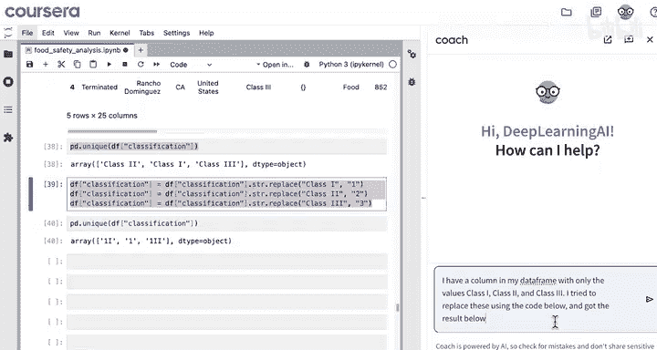
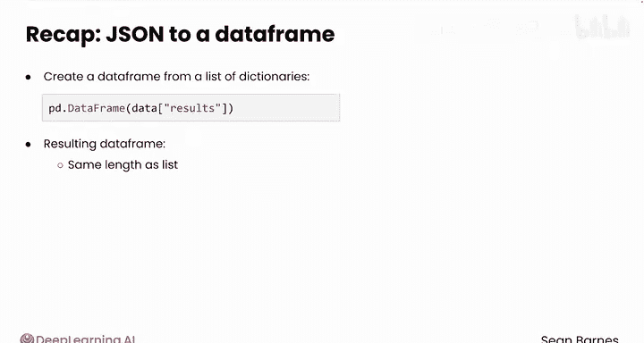

#  028：从JSON到数据框 📊➡️📈

在本节课中，我们将学习如何将从API获取的JSON数据转换为Pandas数据框，并进行初步的数据验证与预处理。这是数据分析流程中从数据获取到实际分析的关键一步。

---

在上一节视频中，我们学习了如何为API请求添加参数。一旦我们请求到正确的数据，就需要将其转换为数据框，以便开始预处理和分析。

回顾一下，我们正在为一个消费者权益组织执行一项分析任务。我们使用FDA食品执法API来追踪和分析食品召回事件，以评估其对公众的潜在风险。到目前为止，我们只从FDA API请求了最多5条结果。如果我们想分析更广泛的产品召回趋势，这个数量远远不够。

让我们更进一步，请求**1000条**结果，这是该特定API单次请求所能获取的最大数量。API通常会设置请求限制以保护服务器资源。

请注意，这次请求完成所需的时间稍长一些。

现在，Pandas提供了一个方法，可以将这个字典（JSON数据）转换为数据框。

再次查看返回数据的键（keys），你认为应该将哪个键对应的值转换为数据框？

答案就是 `results` 键对应的列表。

你只需要使用 `pd.DataFrame(data[‘results’])` 即可完成转换。

将结果保存到一个变量中，我们称之为 `df`。

在进行任何预处理步骤之前，应该先进行一些数据验证。

这个数据框应该有多少行？

**1000行**。你可以用 `len(df)` 来检查，结果完全正确。

那么列呢？列应该是每个执法事件的所有特征，例如状态（status）、城市（city）、召回编号（recall_number）等等。是的，列表 `data[‘results’]` 中每个字典的键（keys）就成为了数据框的列。

查看 `df.dtypes`，你会发现所有列的数据类型都是 `object`。

正如之前所学，Python默认将所有内容视为对象（基本上是文本）。然而，有些列应该是数值型或日期型。

例如，`recall_initiation_date`、`center_classification_date`、`termination_date` 和 `report_date` 应该被视为日期。

这些日期的格式看起来是一致的，因此你可以尝试使用 `pd.to_datetime()` 将它们转换为日期时间类型。

现在，当你查看 `df.head()` 时，可以看到它们已格式化为包含年、月、日的日期。

你还看到了哪些数据预处理的机会？

如果你查看 `classification` 列的唯一值，会发现只有三个值：`Class 1`、`Class 2`、`Class 3`。

我们可以用数字替换这些值，以便进行数值化处理。但这实际上取决于你的分析方向，在某些情况下，保留原样也可以。

以下是替换步骤：
首先，尝试将 `Class 1` 替换为字符串 `‘1’`，对 `Class 2` 和 `Class 3` 也进行同样的操作。

现在检查唯一值以进行验证。等等，这看起来不对。你能看出发生了什么问题吗？

看起来所有包含 `‘Class 1’` 的实例都被替换了，甚至当它是字符串 `‘Class 2’` 或 `‘Class 3’` 的一部分时也被替换了。

让我们向大语言模型（LLM）咨询如何解决这个问题：“我的数据框中有一个列，只有 `Class 1`、`Class 2` 和 `Class 3` 这三个值。我尝试使用下面的代码进行替换，但得到了下面的错误结果。” 附上你的代码和奇怪的结果。

大语言模型建议使用正则表达式，这是一个选择。但你也可以问：“有没有更简单的方法？” 它可能会建议使用 `map` 方法，你当然可以尝试。或者，更简单的思路是：先替换 `Class 3`，然后替换 `Class 2`。不过，我们按照模型的建议试试看。

现在，由于你已经修改了数据框，你需要从原始的JSON数据重建它，否则你的处理将基于这些错误的值开始。

尝试运行大语言模型提供的代码，成功了！现在值是 `2`、`1` 和 `3`。

最后，使用 `.astype(‘int64’)` 保存这个结果。

太好了，这大大简化了这个数据框。

---

## 总结 📝

本节课中我们一起学习了：
1.  如何使用 `pd.DataFrame()` 从字典列表中创建数据框。
2.  生成的数据框长度与列表相同，列名是列表中每个字典的键。
3.  进行了初步的数据验证（检查行数、列类型）。
4.  将日期字符串列转换为日期时间类型。
5.  处理了分类数据的数值化替换，并注意了替换顺序可能带来的问题。

干得漂亮！你刚刚基于字典创建了一个数据框。

在下一个视频中，你将使用一种称为“分页”（Pagination）的技术来获取25,000条结果，而不仅仅是1000条。我们下节课见。