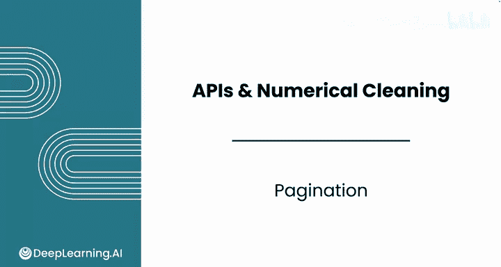
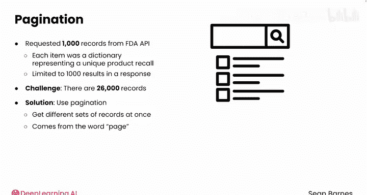
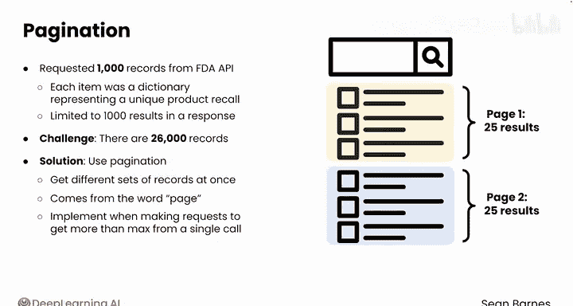
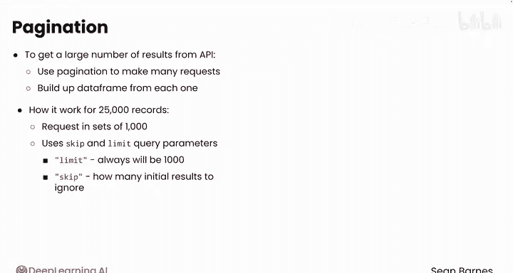
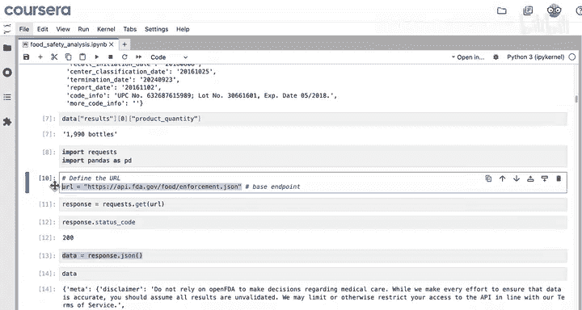
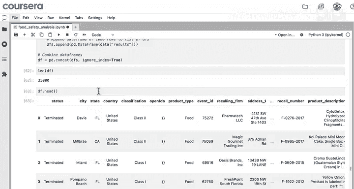
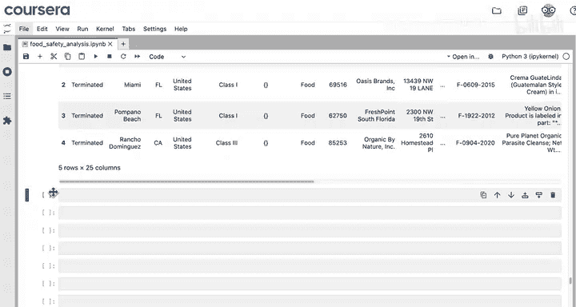
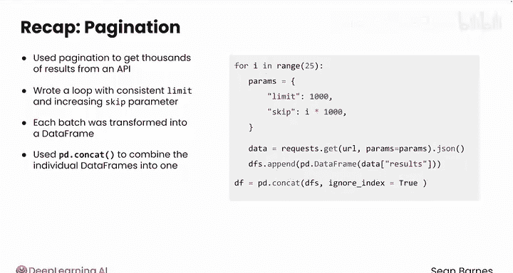

#  029：分页处理 📄

在本节课中，我们将学习如何使用分页技术从API获取大量数据。当单次API调用无法返回所有所需数据时，分页允许我们分批请求数据，并将结果合并成一个完整的数据集。

上一节我们介绍了如何通过单次API调用获取和处理数据。然而，许多API对单次请求返回的数据量有限制。本节中我们来看看如何突破这个限制，获取全部数据。

## 什么是分页？



分页是一种分批获取数据集的技术。这个词来源于“页面”。想象一下在谷歌上搜索：第一页显示25个结果，点击“下一页”会再获取25个结果。对API的请求也可以实现类似的技术，以获取超过单次调用上限的结果数。

如果你想从API获取大量结果，可以使用分页技术发起多次请求，并将每次的结果逐步构建成一个数据框。

以下是其工作原理：

如果存在25000条记录，你可以每次请求1000条。该技术使用 `skip` 和 `limit` 查询参数。

*   **`limit`** 参数始终设为 `1000`，因为你希望每次获取1000条记录。
*   **`skip`** 参数会变化。它告诉服务器在本次请求中要跳过开头的多少条结果。
    *   第一次请求，`skip` 设为 `0`，获取前1000条结果。
    *   第二次请求，`skip` 设为 `1000`，跳过已获取的前1000条，获取接下来的1000条记录。
    *   你将不断将 `skip` 参数增加 `1000`，直到获取所有记录。

## 实现分页数据收集

首先，创建一个空列表。你将把每批1000条结果转换成的数据框追加到这个列表中，最后再合并所有结果。



现在开始编写循环，向API请求数据。







你的计划是编写代码来检索25000条记录。由于每次只能获取1000条，你需要发起25次API调用。真正新增的代码只有几行。

以下是实现步骤：

1.  **启动循环**：`for i in range(25):`。这意味着循环将运行25次，每次 `i` 的值增加1。
2.  **定义参数**：使用字典来保持代码整洁。你需要两个参数：`limit` 和 `skip`。
    *   `limit` 始终为 `1000`。
    *   `skip` 等于 `i * 1000`。
        *   开始时 `i` 为 `0`，`skip` 为 `0`。
        *   然后 `i` 为 `1`，`skip` 为 `1000`，接着是 `2000`，依此类推。
3.  **请求数据**：像往常一样请求数据并提取JSON。
4.  **创建并存储数据框**：从结果创建一个pandas数据框，然后将这个数据框追加到你的数据框列表中。稍后再将它们全部合并。

```python
import pandas as pd
import requests

base_url = "你的API基础端点URL"
dfs = [] # 空列表，用于存储每个批次的数据框

for i in range(25):
    params = {
        'limit': 1000,
        'skip': i * 1000
    }
    response = requests.get(base_url, params=params)
    data = response.json()
    df_batch = pd.DataFrame(data['results']) # 假设数据在‘results’键下
    dfs.append(df_batch)
```

## 合并数据框

在循环结束后，你需要将这些数据框合并成一个大的数据框。

在循环外，使用 `pd.concat()` 函数。第一个参数是 `dfs`，即你想要合并的数据框列表。你还需要参数 `ignore_index=True`。否则，你将得到25组索引从0到999的行。

```python
final_df = pd.concat(dfs, ignore_index=True)
```



运行这段代码可能需要几秒钟时间，这是网络请求的正常耗时。

你期望得到多少行？应该是25,000行。列应该和之前视频中的一致，即召回事件的每个特征。

现在，你可以像之前一样，对所有数据执行相同的预处理步骤，包括类型转换，我们将在下一个视频中继续讲解。

## 总结

本节课中我们一起学习了如何使用分页从API获取成千上万条结果。





*   你编写了一个循环，使用固定的 `limit` 和递增的 `skip` 参数来分批获取记录。
*   从API获取的每批数据都被转换为一个pandas数据框。
*   然后你使用 `pd.concat` 将单个数据框合并成一个。
    *   `concat` 函数本质上是将数据框按行堆叠起来，并自动按列名匹配列。因此，即使列顺序不一致，最终的数据框也会保持规整。
    *   设置 `ignore_index=True` 会为合并后的数据框中的行索引重新编号，从0开始。

干得漂亮！你已经将大量的API数据整合到一个数据框中，以便进行分析。在下一个视频中，你将学习更高级的技术来预处理和分析这个合并后的数据。希望你能继续学习。