#  030：组合数据分析 📊

在本节课中，我们将学习如何对从API批量获取并组合好的数据进行预处理和分析。我们将处理一个包含FDA食品召回记录的数据集，识别并修复数据问题，计算召回事件的持续时间，并通过可视化分析其趋势。

---

## 概述

上一节我们介绍了如何使用分页技术从API批量请求数据。现在，我们已经将所有数据合并到一个单一的DataFrame中，是时候对其进行预处理和分析了。

我们正在为一个消费者权益组织进行一项分析任务，使用FDA食品执法API来追踪和分析食品召回事件，以评估潜在的公共风险。目前，我们有一个包含25000条记录的DataFrame。

## 数据预处理

首先，我们需要执行与之前视频中相同的预处理步骤。


以下是第一步，将`classification`列转换为数值类型。

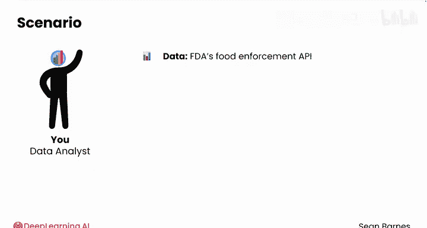

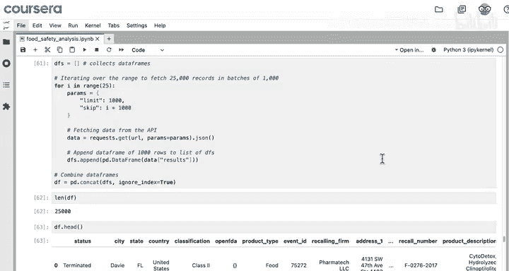

```python
# 将classification列转换为数值类型
df['classification'] = pd.to_numeric(df['classification'])
```

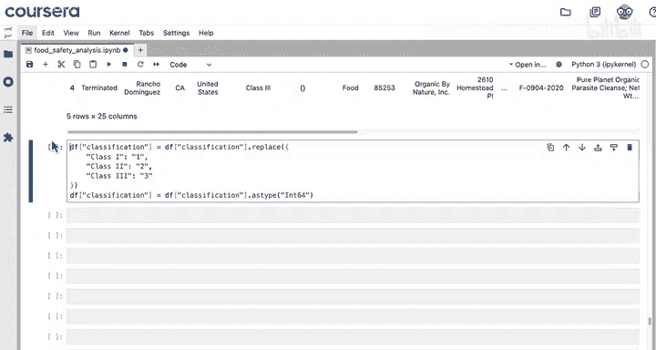

所有步骤合并执行后，数据看起来不错。接下来，将日期列转换为`datetime`类型。

```python
# 将日期列转换为datetime类型
date_columns = ['recall_initiation_date', 'termination_date']
for col in date_columns:
    df[col] = pd.to_datetime(df[col])
```


## 处理数据异常

转换过程中出现了问题。让我们滚动到错误底部查看详情：`out of bound timestamp 0, 2, 1, 2, 1207`。

看起来有人可能错误地将召回日期输入为212年。这很可能是一个异常值。通过检查最早的日期可以确认这一点。

```python
# 查看最早的召回日期
df['recall_initiation_date'].sort_values()
```

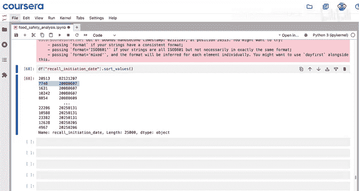

结果显示，除了这个212年的异常值，其他日期最早可追溯到2008年。

我们需要修复这个时间戳。以下是修复代码，将DataFrame中位置20513行的`recall_initiation_date`列值设置为`212-12-07`。

```python
# 修复异常时间戳
df.at[20513, 'recall_initiation_date'] = '212-12-07'
```


现在再次尝试运行日期时间转换。

```python
# 再次尝试转换日期列
for col in date_columns:
    df[col] = pd.to_datetime(df[col])
```

运行成功，没有错误。检查`df.dtypes`以确认所有日期列都已正确转换为`datetime`类型。

## 计算召回持续时间

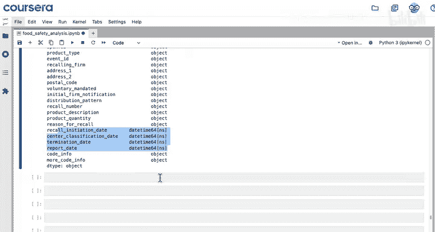

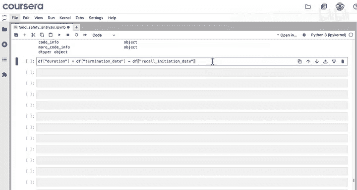

现在，我们可以开始进行分析，以实现分析随时间变化的召回率这一最终目标。我们可以研究召回事件平均解决速度，以及这个速度是变快了还是变慢了。

首先，创建一个新列，计算`termination_date`减去`recall_initiation_date`，得到从事件开始到解决的持续时间。

```python
# 计算召回持续时间
df['duration'] = df['termination_date'] - df['recall_initiation_date']
```


请注意，检查`df.info()`会发现只有大约23700个非空持续时间值。这是因为查看`status`的唯一值时，发现有些案例仍在进行中，因此没有终止日期。

处理这些缺失值有几种方法，其中一种选择是创建一个新的DataFrame `duration_df`，并删除这些行。

```python
# 删除duration列为空的行
duration_df = df.dropna(subset=['duration'])
```

记住，`subset`参数必须指定为列表。现在检查`duration_df.info()`，可以看到有23755行。

## 数据分析


现在，我们可以按`recall_initiation_date`升序对数据框进行排序，这样数据就从2008年开始，一直到2024年。

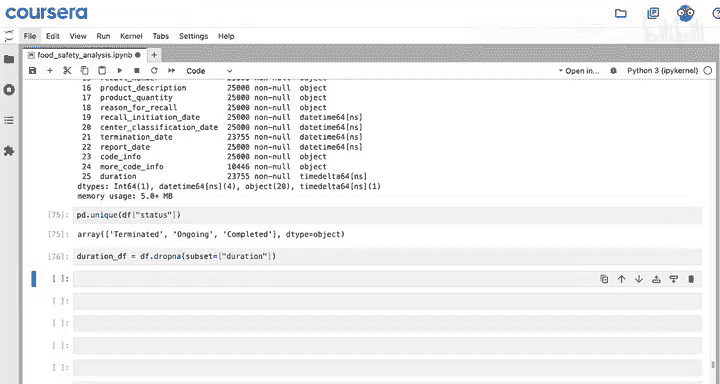

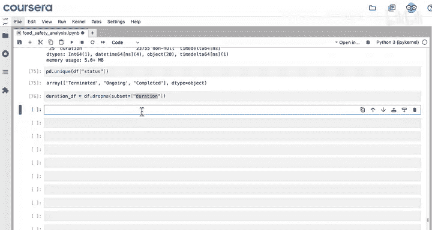

```python
# 按召回开始日期排序
duration_df = duration_df.sort_values('recall_initiation_date')
```

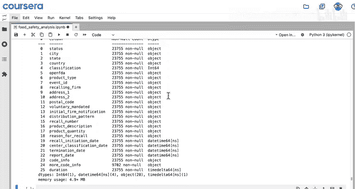

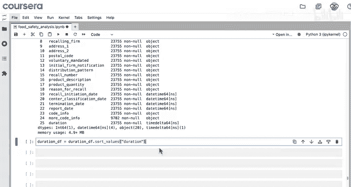

检查前几行，发现有些案例仅在一周内就关闭了。


平均持续时间略低于一年。有一个案例在近10年后才关闭。但75%的召回在500天内得到解决。

## 数据可视化

现在，我们可以为报告做一些绘图。导入`matplotlib`。

以下是绘制请求持续时间的代码。不必过于担心代码细节，可以专注于洞察。

```python
import matplotlib.pyplot as plt

# 绘制持续时间直方图
plt.hist(duration_df['duration'].dt.days, bins=50)
plt.xlabel('Duration (days)')
plt.ylabel('Number of Recalls')
plt.title('Distribution of Recall Durations')
plt.show()
```

数据强烈右偏。大多数案例在500天内解决，但仍有一些事件超过500天仍未解决。

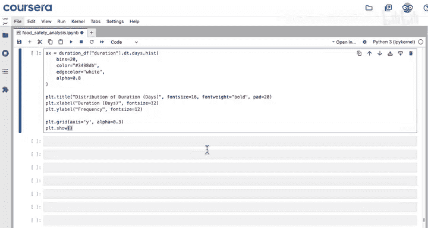

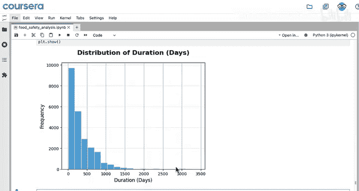

为了展示召回持续时间如何随时间变化，可以创建一个折线图，绘制每个季度开始的召回平均持续时间。这需要对数据进行分组。

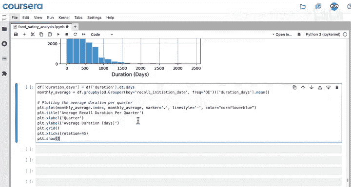

```python
# 按季度分组并计算平均持续时间
duration_df['quarter'] = duration_df['recall_initiation_date'].dt.to_period('Q')
avg_duration_by_quarter = duration_df.groupby('quarter')['duration'].mean()

# 绘制折线图
plt.plot(avg_duration_by_quarter.index.astype(str), avg_duration_by_quarter.dt.days)
plt.xlabel('Quarter')
plt.ylabel('Average Duration (days)')
plt.title('Average Recall Duration Over Time')
plt.xticks(rotation=45)
plt.show()
```


如图所示，从2008年到2024年，召回持续时间显著减少。2024年最近的下降可能部分是由于删除了未结案例的行，但总体趋势非常清晰。这是一个很好的洞察，可以与消费者分享，帮助他们理解FDA的辛勤工作。

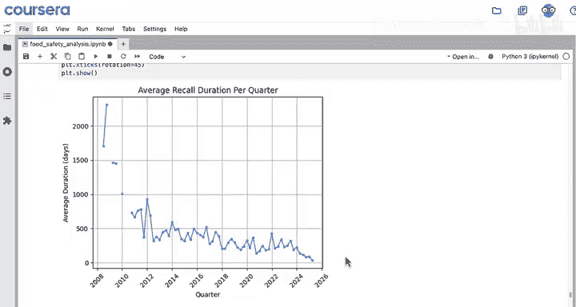


## 总结

本节课中，我们一起学习了如何从API请求结构化数据、将JSON转换为DataFrame、处理数据异常、计算关键指标（如召回持续时间）以及通过可视化分析趋势。网络爬虫和API请求对于任何数据分析师来说都是极其宝贵的技能。

接下来，请完成练习作业。完成后，请跟随我进入下一课：API密钥。