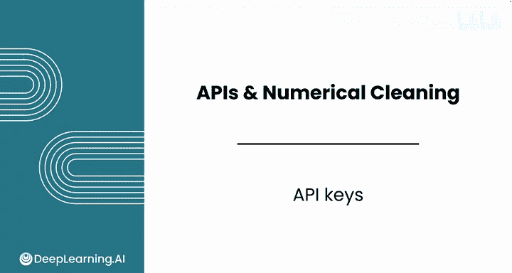
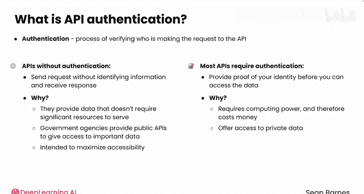
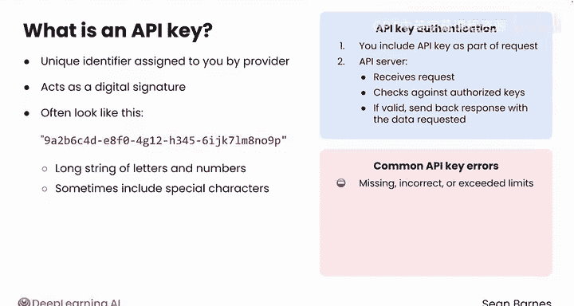

#  031：API密钥 🔑

在本节课中，我们将要学习API密钥的概念、作用以及为何大多数API都需要它。我们将探讨认证的重要性，并了解API密钥如何作为访问受保护数据的“数字钥匙”。

---

在上一节课中，我们学习了如何使用API从网络收集结构化数据。

然而，你会发现现实世界中的许多API都需要一个称为“密钥”的特殊字符串才能访问。

作为一名数据分析师，你必须应对这一安全层。之前你使用的API不需要认证。认证是验证谁在向API发出请求的过程。

每次登录音乐或电影流媒体账户时，你都在执行认证。平台需要知道是谁在登录，以便向你展示个性化推荐，并确保你对自己的账户保持控制权。

无需认证即可访问API，意味着你可以在不提供任何身份信息的情况下发送请求，并且仍然能收到响应。

不需要认证的API相对罕见。FDA发布食品执法API并使其公开可访问，这很好，但大多数API都需要认证。

一些API不使用认证有几个关键原因。

首先，有些API不需要跟踪单个用户，因为它们提供的数据不需要大量资源来服务。

例如，一群爱好者可能维护一个小型API，用于访问他们最喜欢的电子游戏的数据。他们每月可能只收到几百个请求，维护成本很低。

其次，许多政府机构提供公共API，让公众能够访问重要数据，例如公共卫生记录。这些API旨在最大限度地提高可访问性，因此使用限制会与最终目标背道而驰。

然而，大多数API确实需要认证。在访问数据之前，你需要提供身份证明。

API要求认证有几个原因。

首先，运行API需要计算能力，因此需要花钱。你请求的数据越多，使用的计算能力就越多。公司通常会跟踪API使用情况，以便根据你的使用情况向你收费。

其次，许多API提供对私有数据的访问。例如，Google提供了Google Drive API，你可以通过它访问自己的文件。认证确保每个用户只能访问自己的信息。

第三，认证可以防止恶意请求。没有认证，用户可能会淹没一个API。

过多的请求，恶意行为者可以更容易地被识别和阻止。

认证API请求最常见的方法之一是使用API密钥。API密钥是API提供商在你注册时分配给你的唯一标识符。这个密钥充当数字签名，证明你的请求来自授权来源。

API密钥通常看起来像这样：一长串字母和数字，有时包含特殊字符。不同的API对密钥的格式有不同的要求。

当你向需要认证的API发送请求时，你需要将你的API密钥作为请求的一部分包含进去。API服务器收到你的请求，并根据其授权的密钥列表进行检查。如果你的密钥有效并且你拥有必要的权限，服务器将发回包含你所请求数据的响应。

然而，如果你的API密钥缺失、不正确或已超过其使用限制，服务器将拒绝你的请求，而不是返回数据。响应可能包含类似“无效API密钥”的错误消息，具体取决于具体问题。

现在你已经了解了API密钥的目的以及它们如何工作，接下来请观看下一个视频，学习如何编写代码来使用API密钥。

---

本节课中，我们一起学习了API密钥的核心概念。我们了解到，API密钥是访问大多数受保护API的必备“通行证”，它用于身份验证、控制访问权限、管理资源使用和防止滥用。记住，保护好自己的API密钥就像保管好家门钥匙一样重要。